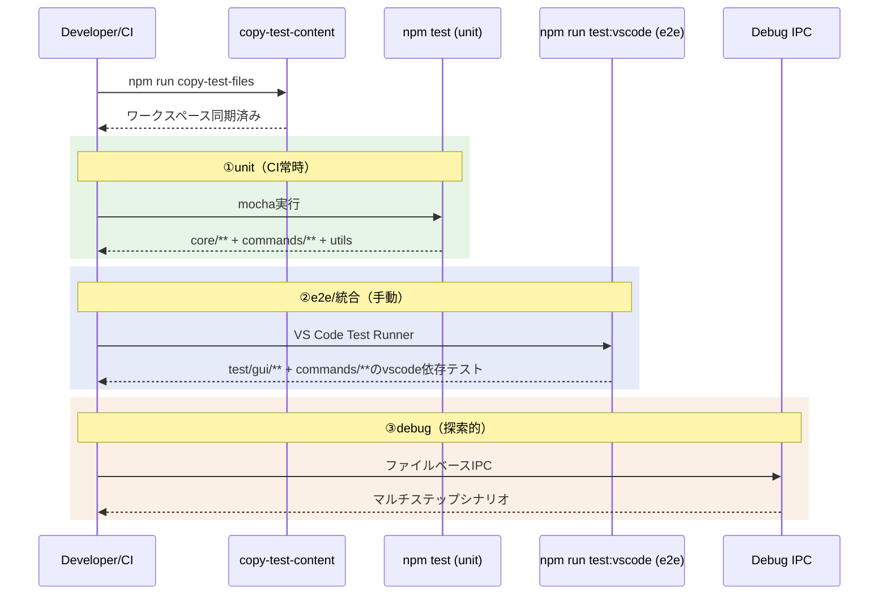

# Test

> [architecture](../design.md) > **Test**

## このドキュメントの責務

テスト層は、コアロジックの信頼性とVS Code統合の動作確認を両立させ、継続的なリリースを支えます。サンプルコンテンツを使ったリグレッションチェックで翻訳差分を再現性高く検証します。

---

## テスト戦略

### テスト層の概要

| 層 | 名前 | 対象 | 実行 | CI |
|---|------|------|------|-----|
| ①unit | 単体テスト | Core層 + VS Code非依存のCommandロジック + AI 受け皿（shim）自身 | `npm test` | 常時 |
| ②e2e | 統合テスト | VS Code統合（StatusTree, コマンドフロー, UI）+ VS Code依存のCommandテスト | `npm run test:vscode` | 手動 |
| ③lab | 探索的検証 | マルチステップE2Eシナリオ / sync 冪等性 / プロバイダ層 / UI の見え方 | `scripts/lab/lab.mjs`（`test:explore` / `test:byok:e2e`） | 一部常時 |

### 単体テスト（`npm test`）

**対象**: 
- Core層の純粋な関数（`src/test/unit/core/**`）: 正規化、ハッシュ計算、Markdownパーサー、差分生成、TM、ユニットレジストリ等
- Commandロジック（`src/test/unit/commands/**` のうちVS Code非依存分）: marker-sync、section-matcher、sync-frontmatter、term-result-provider、terms-repository、tm-entry-generator、translator-retry、output-sanitizer、response-validator等。DI化によりConfiguration/PromptProviderの直接参照を排除したモジュールを含む
- vscodeモック経由のCommandテスト: PlainFileHandler等、vscode APIに依存するがモック注入で単体テスト可能なモジュール。モックは`src/test/unit/__mocks__/register-vscode-mock.js`で`.mocharc.json`のrequireフックとして登録。テスト側で`global.__vscodeMockWorkspaceRoot`を設定してワークスペースパスを制御する
- AI 受け皿（shim）自身（`scripts/lab/ai/test/**`）: 開発用ツールの単体テスト。外につながず、翻訳役の`claude`コマンドも偽物を使うため、CIでそのまま走る。`npm test`から`npm run test:byok`として呼ばれる（mocha 39件）

**スタイル**: `suite`/`test`のTDDスタイル

**実行**: CIで常時実行（`npm test` = `test:unit` → `test:byok`）

**設計意図**: Core層とCommandビジネスロジック層をVS Code APIから独立させているため、副作用のない処理の入出力を高速に検証できます（[design.md](../design.md) P5参照）。

- **パターンテスト**: fixture駆動でMarkdown特殊構文と見出しレベル分割を網羅的に検証（`src/test/unit/core/markdown/parser-patterns.test.ts`）

### 統合テスト（`npm run test:vscode`）

**対象**: 
- GUI統合テスト（`src/test/gui/**`）: コマンドE2E、StatusTreeProvider、UI表示
- VS Code依存のCommandテスト（`src/test/gui/commands/**` のうちimportチェーンでvscodeに到達するもの）

**実行**: VS Code Test Runnerを使用し、E2Eを検証

**頻度**: 手動実行（CI統合は将来検討）

**設計意図**: VS Code環境でのみ発生するバグ（UI更新、コマンド実行フロー等）を検出します。

### 探索的検証（mdait Lab / `scripts/lab/`）

**対象**: マルチステップの E2E シナリオ（sync → trans → TM → 改訂 → re-sync → re-trans）、`sync` の冪等性とマーカー整合、プロバイダ層（リトライ・タイムアウト・`ai-stats.log`）、UI の見え方。

**やり方**: 入口は `node scripts/lab/lab.mjs` 1つ。**ホスト**（mdait をどこで走らせるか）と**AI の相手**（誰が翻訳を返すか）を選び、命令はどのホストでも同じファイル IPC（`.mdait/debug/command.json` → `result.json`）で送る。テスト用ワークスペースは既定でリポジトリの外（`/tmp/mdait-lab/ws`）に作られるため、リポジトリを汚さない。

| ホスト | 何が動くか | 使いどころ |
|---|---|---|
| `headless` | `out/` のコマンド層を vscode モック越しに Node から駆動（常駐） | 既定。機構の決定的な検証。クラウドでも動く |
| `code-server` | ブラウザ版 VS Code の実 Extension Host＋Playwright | ツリー・CodeLens・通知の見え方。IPC で命令し、画面は撮って見る |
| `desktop` | 本物の VS Code（`@vscode/test-electron` のキャッシュを優先） | 実 `vscode.lm`、ブレークポイント。手元でのみ |

| AI の相手 | 誰が答えるか | 費用 | 決定的 |
|---|---|---|---|
| `echo` | shim が機械的に作る（`--delay` で遅らせられる） | 0 | はい |
| `live` | 人／エージェントがファイルの郵便受けで答える | 0 | いいえ |
| `script` | 台本（429・500・遅延・壊れた JSON） | 0 | はい |
| `replay` | 録音の再生 | 0 | はい |
| `agent` | `claude` コマンドを翻訳役として起動 | かかる | いいえ |
| `none` | 受け皿を立てない（実プロバイダを使う） | — | — |

AI の相手はどれも **OpenAI 互換のローカルサーバー**（`scripts/lab/ai/`。`ai.openai.baseURL` の差し替えで届く）の裏側にいる。つまり**どのモードでもプロバイダ層は本物が走る**。`AIService` の実装ごと差し替える偽物（かつての `fake-ai.js`）は廃止した（ADR-260823-02）。

**入口**:

- `npm run test:explore` → `lab sweep`: `sample-content` 全ファイルに対する機構の決定的検証（マーカー整合・need フラグのライフサイクル・**sync 冪等性**・trans/revise の sync 側挙動）。判定は FAIL（本物のバグ）と INFO（偽物の限界）に分ける
- `npm run test:byok:e2e` → `lab regress`: 録ってある実機の12往復を再生し、`trans` が同じ結果になることを確かめる。LLM は1回も呼ばない。要求が録音と1文字でも違えば 409 で止まるので、**指示文の組み立てが変わったことに気づける**
- `npm run test:byok`: shim 自身の単体テスト（CI 常時。①に含まれる）
- `lab probe`: 頑健性プローブ（編集・章の挿入/削除/並べ替え・リネーム・移動・削除・外部変更を embedded と external の両方で流す）。判定はせず観察結果を出し、前回の run との差分を取る
- `lab resilience`: AI を使う9経路に8種の壊れた応答を当て、原稿・用語集・翻訳メモリが壊れないかを見る（1周20〜30分・CI 対象外）
- `lab ux`: **実 UI にしか無いもの**（ツリーの行とアイコン・確認ダイアログ・翻訳中の回転・CodeLens・通知）を code-server ホストで撮り、`ux.json` に文字でも落とす。画像だけでは前回と比べられないため（設営に数分・CI 対象外）

**設計意図**: 検証の道具が4つに分かれていたものを1つに束ねた（ADR-260823-01）。命令の経路・結果の形・AI の偽物・ワークスペースの置き場をすべて1つにしたので、ホストを変えても書き方は変わらない（パスの解決も IPC の入口で揃えた — ADR-260824-03）。①②で埋まらない穴（プロバイダ層、UI の見え方、多段シナリオ）がここで埋まる。

**頻度**: `test:explore` と `test:byok:e2e` は手動。土台が生きていることを守る最小のスモークは CI に置く。

**使い方**: `.claude/skills/mdait-lab/` の `mdait-lab` スキルを参照。

### サンプルワークスペース

**場所**: `src/test/unit/sample-content/`

**セットアップ**: `copy-test-files`スクリプトで`sample-content`から`workspace/content`へ同期

**更新**: テストケース追加時は`sample-content`を更新

**設計意図**: テスト前の初期状態を保証し、リグレッションチェックの再現性を担保します。

---

## 実行シーケンス



---

## テスト実践のプラクティス

### テスト名は日本語で期待値を明示

```typescript
test("正規化後のハッシュは常に同じ値を返す", () => { ... });
```

**理由**: テスト失敗時に、何が期待されていたかが一目で分かります。

### VS Code依存のテストは`this.timeout()`を調整

```typescript
test("syncコマンドは全ファイルを同期する", function() {
  this.timeout(10000); // 10秒
  ...
});
```

**理由**: 環境差によるタイムアウトを防ぎます。

### 大規模入力の回帰は`sample-content`を更新

新しいエッジケースを発見したら、`sample-content`にテストケースを追加します。

**理由**: リグレッションテストでカバレッジを確保します。

---

## 参照

- スクリプト: `package.json`
- UI検証: [ui.md](ui.md)