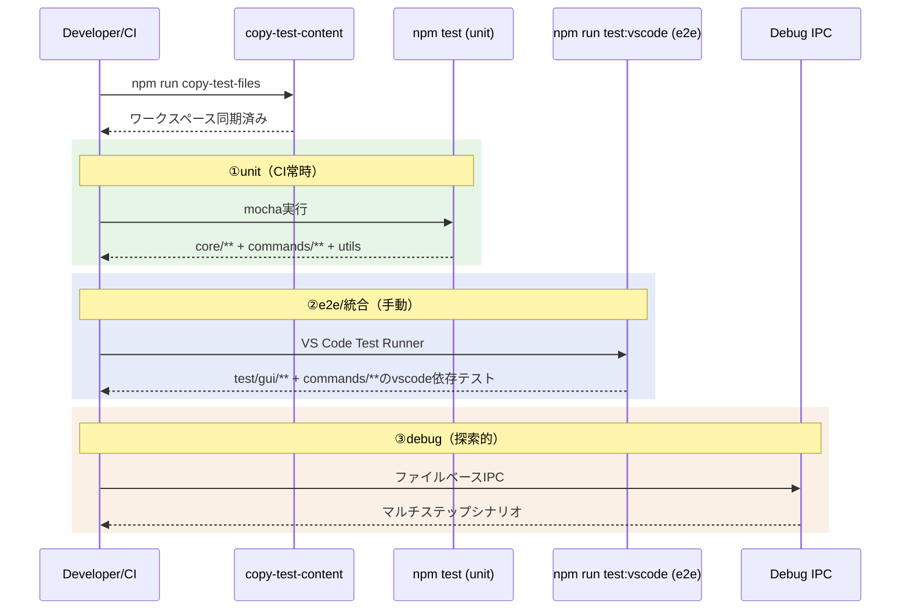

# Test

> [architecture](../architecture.md) > **Test**

## このドキュメントの責務

テスト層は、コアロジックの信頼性とVS Code統合の動作確認を両立させ、継続的なリリースを支えます。サンプルコンテンツを使ったリグレッションチェックで翻訳差分を再現性高く検証します。

---

## テスト戦略

### テスト層の概要

| 層 | 名前 | 対象 | 実行 | CI |
|---|------|------|------|-----|
| ①unit | 単体テスト | Core層 + VS Code非依存のCommandロジック | `npm test` | 常時 |
| ②e2e | 統合テスト | VS Code統合（StatusTree, コマンドフロー, UI）+ VS Code依存のCommandテスト | `npm run test:vscode` | 手動 |
| ③debug | 探索的テスト | マルチステップE2Eシナリオ | ファイルベースIPC | 手動 |

### 単体テスト（`npm test`）

**対象**: 
- Core層の純粋な関数（`src/test/unit/core/**`）: 正規化、ハッシュ計算、Markdownパーサー、差分生成、TM、ユニットレジストリ等
- Commandロジック（`src/test/unit/commands/**` のうちVS Code非依存分）: marker-sync、section-matcher、sync-frontmatter、term-result-provider、terms-repository、tm-entry-generator、translator-retry、output-sanitizer、response-validator等。DI化によりConfiguration/PromptProviderの直接参照を排除したモジュールを含む
- vscodeモック経由のCommandテスト: PlainFileHandler等、vscode APIに依存するがモック注入で単体テスト可能なモジュール。モックは`src/test/unit/__mocks__/register-vscode-mock.js`で`.mocharc.json`のrequireフックとして登録。テスト側で`global.__vscodeMockWorkspaceRoot`を設定してワークスペースパスを制御する

**スタイル**: `suite`/`test`のTDDスタイル

**実行**: CIで常時実行（`npm run test`）

**設計意図**: Core層とCommandビジネスロジック層をVS Code APIから独立させているため、副作用のない処理の入出力を高速に検証できます（[architecture.md](../architecture.md) P5参照）。

- **パターンテスト**: fixture駆動でMarkdown特殊構文と見出しレベル分割を網羅的に検証（`src/test/unit/core/markdown/parser-patterns.test.ts`）

### 統合テスト（`npm run test:vscode`）

**対象**: 
- GUI統合テスト（`src/test/gui/**`）: コマンドE2E、StatusTreeProvider、UI表示
- VS Code依存のCommandテスト（`src/test/gui/commands/**` のうちimportチェーンでvscodeに到達するもの）

**実行**: VS Code Test Runnerを使用し、E2Eを検証

**頻度**: 手動実行（CI統合は将来検討）

**設計意図**: VS Code環境でのみ発生するバグ（UI更新、コマンド実行フロー等）を検出します。

### 探索的テスト（デバッグIPC）

**対象**: マルチステップ統合シナリオ（sync → trans → TM → 改訂 → re-sync → re-trans等）

**実行**: `MDAIT_DEBUG_IPC=1`環境変数でDebugCommandHandlerを有効化し、ファイルベースIPCで実行

**設計意図**: エージェントが自律的にE2Eシナリオを実行・検証するための基盤。

### 探索的スイープ（Extension Host 非依存 / `npm run test:explore`）

**対象**: `sample-content` 全ファイルに対する commands 層の「機構」の決定的検証（マーカー整合・need フラグのライフサイクル・**sync 冪等性**・trans/revise の sync 側挙動）

**実行**: `scripts/exploratory/run-sweep.js`。`out/` のコンパイル済みコマンドを、`src/test/unit/__mocks__` の vscode モックを増補した薄いシム（`scripts/exploratory/vscode-shim.js`）越しに Node から直接駆動する。LLM は決定的モック（sync は AI 非使用で完全決定的、trans/revise は構造化フェイク `fake-ai.js` で正常系のみ）。

**設計意図**: VS Code をヘッドレス起動できない環境（クラウド等）でも、UX/挙動系のリグレッション（特に sync の冪等性）をエージェントが自律的に炙り出せるようにする。訳質や revise パッチ適用は実LLMが要るため対象外（INFO として記録）。

> このスイープは frontmatter マーカー同期の非冪等バグ2件（末尾改行の無限増加 / front マーカーの1回遅れ）を検出した。根本修正の回帰は `src/test/unit/core/markdown/frontmatter-idempotency.test.ts` で単体固定している。

### サンプルワークスペース

**場所**: `src/test/unit/sample-content/`

**セットアップ**: `copy-test-files`スクリプトで`sample-content`から`workspace/content`へ同期

**更新**: テストケース追加時は`sample-content`を更新

**設計意図**: テスト前の初期状態を保証し、リグレッションチェックの再現性を担保します。

---

## 実行シーケンス



---

## テスト実践のプラクティス

### テスト名は日本語で期待値を明示

```typescript
test("正規化後のハッシュは常に同じ値を返す", () => { ... });
```

**理由**: テスト失敗時に、何が期待されていたかが一目で分かります。

### VS Code依存のテストは`this.timeout()`を調整

```typescript
test("syncコマンドは全ファイルを同期する", function() {
  this.timeout(10000); // 10秒
  ...
});
```

**理由**: 環境差によるタイムアウトを防ぎます。

### 大規模入力の回帰は`sample-content`を更新

新しいエッジケースを発見したら、`sample-content`にテストケースを追加します。

**理由**: リグレッションテストでカバレッジを確保します。

---

## 参照

- スクリプト: `package.json`
- UI検証: [ui.md](ui.md)