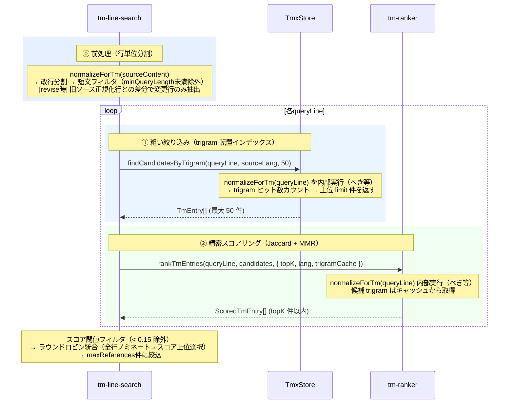
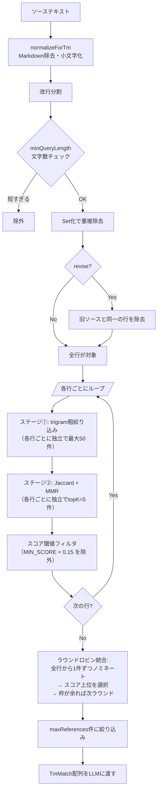

# TM スコアリングエンジン — アルゴリズム解説

翻訳メモリ（TMX）から「今翻訳しようとしている文に近い過去訳例」を取り出すための 2 段階パイプラインを解説する。

> **ワークフロー位置:** [tm-commit](command_tm.md)（蓄積） → **TM retrieval（本稿）** → [trans](command_trans.md)（LLMへの参考訳注入）

---

## 1. なぜハッシュ exact match では不十分か

以前の実装は `tuid = hash(normalized sentence)` でエントリを一意に識別し、文全体のハッシュ一致だけで参考訳を引いていた。

```
クエリ: "The configuration is stored in mdait.json."
TM 内: "The configuration is stored in .mdait/mdait.json." → 別ハッシュ → ヒット 0
```

**問題点：** 原文が 1 文字でも変われば完全不一致。翻訳メモリに過去訳が豊富にあっても、利用率が低い。

---

## 2. アルゴリズム概説

### 2.1 trigram とは何か

**trigram（文字 3-gram）** とは、テキストを 1 文字ずつスライドしながら 3 文字ずつ切り出した集合のこと。

```
"hello"  →  { "hel", "ell", "llo" }
"hello!" →  { "hel", "ell", "llo", "lo!" }
```

翻訳メモリに向いている理由：
- 語形変化・語順変化に頑健（部分一致で類似度が高まる）
- 日本語・英語・多言語に均一に適用できる
- 少し変わった文でも、共通 trigram が多く残る

**mdait での正規化手順：**

```
rawText
  → Markdown 記法を除去（`normalizeForTm`）
  → 小文字化 → トリム
  → 3 文字スライド（Unicode 対応）
```

### 2.2 Jaccard 類似度

2 つの trigram 集合 A・B の「どれだけ重なっているか」を 0〜1 で表す指標。

$$
\text{Jaccard}(A, B) = \frac{|A \cap B|}{|A \cup B|}
$$

**具体例：**

```
A = "The config is in mdait.json"
  → trigrams (例): { "the", "he ", "e c", "con", "onf", …, "son" }  (20 個と仮定)

B = "The config is in .mdait/mdait.json"
  → trigrams: { "the", "he ", "e c", "con", "onf", … }            (25 個と仮定)

重なり (∩) = 18 個  →  Jaccard = 18 / (20 + 25 − 18) = 18/27 ≈ 0.67
```

ハッシュ one-hot（一致: 1, 不一致: 0）と比べ、**部分変更に連続的なスコアを付けられる**のが強み。

### 2.3 MMR（Maximal Marginal Relevance）

LLM に渡す参考訳は 5 件程度に限られる。単純に Jaccard 上位を選ぶと「ほぼ同じ例ばかり」が集まり、多様な用語・文体の参考にならない。

**MMR の考え方：** 次に選ぶ候補を「クエリに近い（良い）」かつ「既に選んだものと違う（多様）」のバランスで選ぶ。

$$
\text{MMR}(c) = \lambda \cdot \text{Jaccard}(c, \text{query}) - (1 - \lambda) \cdot \max_{s \in \text{selected}} \text{Jaccard}(c, s)
$$

| λ の値 | 挙動 |
|--------|------|
| `1.0` | 完全に類似度順（Jaccard 降順と同等） |
| `0.7`（デフォルト） | 関連度 70% + 多様性 30% のバランス |
| `0.0` | 既選候補と最も異なるものを選ぶ |

greedy で `topK` 件に達するまでループを繰り返す。最初の1件は常に Jaccard 最高得点候補が選ばれる。

---

## 3. 2 段階パイプライン設計



> **行単位分割の意義：** TMエントリは文単位（tm-commit時にLLMで文ペアアライメント済み）であるため、行（≒文/段落）単位のクエリの方がJaccard類似度の感度が高い。ユニット全体では長文のtrigram集合が膨れ上がり、類似文があっても共通trigram比率が希薄化する。

> **ラウンドロビン統合：** 行数がmaxReferencesを超える場合、行の出現順で先頭行だけが優遇されるのを防ぐ。まず全行から1件ずつベストエントリをノミネートし、ノミネート全体をスコア降順でソートして上位を選択する。枠が余れば各行の次候補で再ラウンド。これにより「どの行にも均等なチャンス＋スコアの高いものが優先」のバランスを実現する。

> **スコア閾値（0.15）：** ステージ②のMMRスコアが0.15未満のエントリは、ラウンドロビン統合に入る前に除外される。共通trigramが助詞・冠詞レベルしかないノイズマッチがLLMに渡されるのを防ぐ。

> **revise時の差分フィルタ：** revise時は旧ソースと新ソースの正規化テキストを行分割して集合比較し、変更のある行のみをクエリとする。既に訳出済みの未変更行がTMに再ヒットするノイズを防ぐ。

> **normalizeForTmのべき等性：** `normalizeForTm` = `stripMarkdown` + `toLowerCase` + `trim` は、正規化済みテキストに再適用しても結果が変わらない。これにより、行単位分割後の正規化済みテキストを既存APIにそのまま渡せる（内部の再正規化が無害）。

### 3.1 ステージ①：粗い絞り込み（TmxStore）

**目的：** 全 TM エントリー（数千件規模）から、後続の Jaccard 計算対象を高速に絞り込む。

`TmxStore` はロード時に **trigram 転置インデックス** と **trigramCache** を構築する。

```
trigramIndex: Map<lang, Map<trigram, Set<tuid>>>
trigramCache: Map<"${tuid}:${lang}", Set<trigram>>
```

`findCandidatesByTrigram(rawText, lang, limit)` は内部で `normalizeForTm(rawText)` を実行し、呼び出し元が Markdown を事前除去する必要はない。`getTrigramCache()` で trigramCache の読み取り専用ビューを返し、ランカーに渡す。

**なぜ言語別か：** ソース言語・ターゲット言語それぞれの variant テキストでインデックスを持つことで、「sourceLang の variant を持つエントリのみ」という絞り込みをインデックス段階で行える。英語で検索しているときに日本語のみの TU がノイズとして混入しない。

### 3.2 ステージ②：精密スコアリング（tm-ranker）

[`tm-ranker.ts`](../../src/core/tm/tm-ranker.ts) が入力の 50 件から topK 件を選ぶ。

1. `normalizeForTm(rawText)` でクエリを正規化し trigram を生成
2. 各候補の trigram を `options.trigramCache`（`TmxStore.getTrigramCache()` から渡される）から取得。キャッシュなしの場合は `computeTrigrams(normalizeForTm(text))` でフォールバック
3. Jaccard でクエリとの類似度 `querySim` を計算
4. MMR greedy ループで topK 件を選択し、最終 MMR スコアを `score` として付与

---

## 4. パラメーター説明

| パラメーター | デフォルト | 型 | 役割 |
|---|---|---|---|
| `lambda` | `0.7` | `0.0 〜 1.0` | MMR の関連度/多様性バランス。上げると類似例重視、下げると多様性重視 |
| `topK` | `5` | 正の整数 | LLM プロンプトに渡す参考訳の最大件数 |
| `limit` | `50` | 正の整数 | trigram 絞り込みの上限。MMR の入力候補数 |
| `minQueryLength` | `10` | `1 〜 100` | 行単位分割後、この文字数未満の行はTM検索対象から除外 |
| `MIN_SCORE_THRESHOLD` | `0.15` | `0.0 〜 1.0` | Jaccard + MMRスコアがこの値未満のエントリはノイズとして除外 |

**`limit` の根拠：** 行単位クエリはtrigram集合がユニット全体に比べて小さいため、候補50件で十分な再現率が得られる。MMR の計算コストは O(`topK` × `limit`) ≈ O(250)（デフォルト時）。

**`MIN_SCORE_THRESHOLD` の根拠：** 0.15未満のマッチはtrigram共通部が少なく翻訳参考として価値が低い。特にtrigramの偶然一致（共通の助詞・冠詞など）によるノイズをここで除外する。

---

## 5. 設計ノート

### exact match との関係

セグメント全体のハッシュが一致するエントリは trigram 類似度も高く（Jaccard ≒ 1.0）、MMR でも最優先で選ばれる。2 段階パイプラインはハッシュ exact match の上位互換である。

### `primary` をインデックス対象にする理由

`TmxStore.indexEntry()` は `variant.text`（全言語）を lang 別にインデックスするが、trigram 粗絞り込みのスコアは variant テキストのヒット数で判定される。インデックス構築時と Jaccard 計算時の trigram を統一するため、`indexEntry` で `normalizeForTm + computeTrigrams` した結果が `trigramCache` に保存され、`tm-ranker` はこれを参照する。キャッシュなしの場合でも同じ `normalizeForTm` を適用することで一貫性を保証する。

### ソースリンク

| モジュール | ファイル |
|---|---|
| trigram 生成・正規化 | [`src/core/tm/tm-text-normalizer.ts`](../../src/core/tm/tm-text-normalizer.ts) |
| 転置インデックス・粗絞り込み | [`src/core/tm/tmx-store.ts`](../../src/core/tm/tmx-store.ts) |
| Jaccard + MMR スコアリング | [`src/core/tm/tm-ranker.ts`](../../src/core/tm/tm-ranker.ts) |
| 行単位検索オーケストレータ | [`src/core/tm/tm-line-search.ts`](../../src/core/tm/tm-line-search.ts) |

---

## 6. 具体例

以下の実例で、テキストがどう分割され、どのようにマッチングし、何件がLLMに渡されるかを示す。

### 処理フロー概要



### 6.1 新規翻訳（3行のユニット）

**入力ユニット（Markdown）：**

```markdown
## APIの認証

このAPIはリクエストの認証を行います。
認証にはOAuth 2.0トークンが必要です。
トークンの有効期限は1時間です。
```

**ステップ1: 正規化・分割**

`normalizeForTm` でMarkdown構造を除去し、改行で分割：

| 行番号 | 正規化後のテキスト | 文字数 | 検索対象？ |
|--------|-------------------|--------|-----------|
| 1 | `apiの認証` | 6 | ❌（minQueryLength=10未満） |
| 2 | `このapiはリクエストの認証を行います。` | 19 | ✅ |
| 3 | `認証にはoauth 2.0トークンが必要です。` | 19 | ✅ |
| 4 | `トークンの有効期限は1時間です。` | 15 | ✅ |

見出し「APIの認証」は正規化後6文字となり、`minQueryLength=10`でフィルタされる。

**ステップ2: 行ごとのTM検索**

検索対象の3行それぞれに、2段階パイプライン（セクション3参照）を適用する。

**ステージ①: trigram粗絞り込み** — 各行のtrigramでTMの逆引きインデックスを引き、trigramのヒット数が多い順にTMエントリを並べる。`limit=50`なので上位50件を取得する（行単位クエリはtrigram集合が小さいため50件で十分）。TMの総エントリ数が50件未満であれば50件に満たない。この段階は「似ているかもしれない候補」を高速に絞り込む。

**ステージ②: Jaccard + MMR精密スコアリング** — ステージ①の候補に対し、行とのJaccard類似度を計算（trigram集合の重複率）。さらにMMR（λ=0.7）で「既に選ばれた候補と似すぎるもの」にペナルティを課し、topK=5件を選択する。MMRスコアは「関連度70% − 既選択候補との類似度30%」で決まる。

以下は3行それぞれの検索結果（主要なものを抜粋）：

**行2: 「このapiはリクエストの認証を行います。」**

ステージ①でtrigramヒット数上位50件を取得。ステージ②でJaccardを計算し、MMRで5件を選択：

| 候補 | Jaccard | MMRスコア | 選出理由 |
|------|---------|-----------|---------|
| TM-A: 「このapiはリクエストの認証を処理します。」 | 0.78 | 0.78 | 最初の選出（Jaccard最高）。「行います→処理します」の差のみ |
| TM-B: 「apiはリクエストの検証を行います。」 | 0.52 | 0.35 | Jaccard 0.52だがTM-Aと似ているためMMRで減点される |

**行3: 「認証にはoauth 2.0トークンが必要です。」**

| 候補 | Jaccard | MMRスコア | 選出理由 |
|------|---------|-----------|---------|
| TM-C: 「認証にはapiキーが必要です。」 | 0.41 | 0.41 | 最初の選出。「oauth 2.0トークン→apiキー」の差 |
| TM-A: 「このapiはリクエストの認証を処理します。」 | 0.25 | 0.18 | 「認証」というtrigramが共通するが弱いマッチ |

**行4: 「トークンの有効期限は1時間です。」**

| 候補 | Jaccard | MMRスコア | 選出理由 |
|------|---------|-----------|---------|
| TM-D: 「セッションの有効期限は30分です。」 | 0.38 | 0.38 | 「有効期限は」「時間です」のtrigramが共通 |

**ステップ3: スコア閾値フィルタ**

各行の結果から `MIN_SCORE_THRESHOLD=0.15` 未満のエントリを除外。この例では全候補が0.15以上のため全件残る。

**ステップ4: ラウンドロビン統合**

全行から1件ずつベストをノミネートし、スコア順で選択する：

| ラウンド1ノミネート | 行 | スコア | 選択？ |
|-------------------|-----|--------|--------|
| TM-A | 行2 | 0.78 | ✅ |
| TM-C | 行3 | 0.41 | ✅ |
| TM-D | 行4 | 0.38 | ✅ |

3件 < `maxReferences=5` → ラウンド2：

| ラウンド2ノミネート | 行 | スコア | 選択？ |
|-------------------|-----|--------|--------|
| TM-B | 行2 | 0.35 | ✅ |
| TM-A (重複) | 行3 | 0.18 → skip | — |

**最終結果: 4件がLLMに渡される**（`maxReferences=5`だが候補が4件で打ち止め）。

**従来方式との比較：** ユニット全体（約60文字）をクエリにした場合、TM-A（約20文字）とのJaccardは約0.25まで薄まり、TM-C・TM-Dはさらに低スコアになっていた。行単位分割により各TMエントリの本来の関連度が正確に反映される。

### 6.2 revise（部分改訂）

**旧ソース（正規化後）：**

```
このapiはリクエストの認証を行います。
認証にはoauth 2.0トークンが必要です。
トークンの有効期限は1時間です。
```

**新ソース（正規化後）：**

```
このapiはリクエストの認証と認可を行います。
認証にはoauth 2.0トークンが必要です。
トークンの有効期限は24時間です。
```

**差分検出（集合差分）：**

| 行 | 旧に存在？ | 検索対象？ |
|----|-----------|-----------|
| `このapiはリクエストの認証と認可を行います。` | ❌（変更あり） | ✅ |
| `認証にはoauth 2.0トークンが必要です。` | ✅（一致） | ❌ |
| `トークンの有効期限は24時間です。` | ❌（変更あり） | ✅ |

**結果：** 変更のあった2行のみがTM検索される。「認証にはoauth 2.0トークンが必要です。」はTMにすでに登録済みのためノイズにならない。LLMにはdiffと合わせて、変更箇所に関連するTM参考訳のみが渡される。

### 6.3 テーブルを含むユニット

**入力：**

```markdown
| パラメータ | デフォルト | 説明 |
|-----------|----------|------|
| topK | 5 | LLMに渡す参考訳の最大件数 |
| lambda | 0.7 | 関連度と多様性のバランス |
```

**正規化・分割後：**

| 正規化後のテキスト | 文字数 | 検索対象？ |
|-------------------|--------|-----------|
| `パラメータ` | 5 | ❌ |
| `デフォルト` | 5 | ❌ |
| `説明` | 2 | ❌ |
| `topk` | 4 | ❌ |
| `5` | 1 | ❌ |
| `llmに渡す参考訳の最大件数` | 13 | ✅ |
| `lambda` | 6 | ❌ |
| `0.7` | 3 | ❌ |
| `関連度と多様性のバランス` | 12 | ✅ |

テーブルはセルごとに分離され、大半がminQueryLengthでフィルタされる。説明列の長い文だけがTM検索対象になる。
