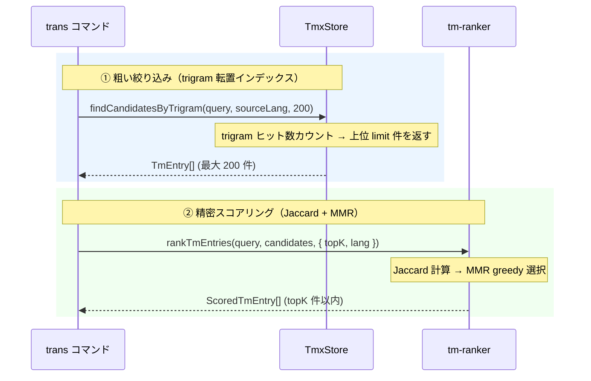

# TM スコアリングエンジン — アルゴリズム解説

翻訳メモリ（TMX）から「今翻訳しようとしている文に近い過去訳例」を取り出すための 2 段階パイプラインを解説する。

> **ワークフロー位置:** [tm-commit](command_tm.md)（蓄積） → **TM retrieval（本稿）** → [trans](command_trans.md)（LLMへの参考訳注入）

---

## 1. なぜハッシュ exact match では不十分か

以前の実装は `tuid = hash(normalized sentence)` でエントリを一意に識別し、文全体のハッシュ一致だけで参考訳を引いていた。

```
クエリ: "The configuration is stored in mdait.json."
TM 内: "The configuration is stored in .mdait/mdait.json." → 別ハッシュ → ヒット 0
```

**問題点：** 原文が 1 文字でも変われば完全不一致。翻訳メモリに過去訳が豊富にあっても、利用率が低い。

---

## 2. アルゴリズム概説

### 2.1 trigram とは何か

**trigram（文字 3-gram）** とは、テキストを 1 文字ずつスライドしながら 3 文字ずつ切り出した集合のこと。

```
"hello"  →  { "hel", "ell", "llo" }
"hello!" →  { "hel", "ell", "llo", "lo!" }
```

翻訳メモリに向いている理由：
- 語形変化・語順変化に頑健（部分一致で類似度が高まる）
- 日本語・英語・多言語に均一に適用できる
- 少し変わった文でも、共通 trigram が多く残る

**mdait での正規化手順：**

```
rawText
  → Markdown 記法を除去（`normalizeForTm`）
  → 小文字化 → トリム
  → 3 文字スライド（Unicode 対応）
```

### 2.2 Jaccard 類似度

2 つの trigram 集合 A・B の「どれだけ重なっているか」を 0〜1 で表す指標。

$$
\text{Jaccard}(A, B) = \frac{|A \cap B|}{|A \cup B|}
$$

**具体例：**

```
A = "The config is in mdait.json"
  → trigrams (例): { "the", "he ", "e c", "con", "onf", …, "son" }  (20 個と仮定)

B = "The config is in .mdait/mdait.json"
  → trigrams: { "the", "he ", "e c", "con", "onf", … }            (25 個と仮定)

重なり (∩) = 18 個  →  Jaccard = 18 / (20 + 25 − 18) = 18/27 ≈ 0.67
```

ハッシュ one-hot（一致: 1, 不一致: 0）と比べ、**部分変更に連続的なスコアを付けられる**のが強み。

### 2.3 MMR（Maximal Marginal Relevance）

LLM に渡す参考訳は 5 件程度に限られる。単純に Jaccard 上位を選ぶと「ほぼ同じ例ばかり」が集まり、多様な用語・文体の参考にならない。

**MMR の考え方：** 次に選ぶ候補を「クエリに近い（良い）」かつ「既に選んだものと違う（多様）」のバランスで選ぶ。

$$
\text{MMR}(c) = \lambda \cdot \text{Jaccard}(c, \text{query}) - (1 - \lambda) \cdot \max_{s \in \text{selected}} \text{Jaccard}(c, s)
$$

| λ の値 | 挙動 |
|--------|------|
| `1.0` | 完全に類似度順（Jaccard 降順と同等） |
| `0.7`（デフォルト） | 関連度 70% + 多様性 30% のバランス |
| `0.0` | 既選候補と最も異なるものを選ぶ |

greedy で `topK` 件に達するまでループを繰り返す。最初の1件は常に Jaccard 最高得点候補が選ばれる。

---

## 3. 2 段階パイプライン設計



### 3.1 ステージ①：粗い絞り込み（TmxStore）

**目的：** 全 TM エントリー（数千件規模）から、後続の Jaccard 計算対象を高速に絞り込む。

`TmxStore` はロード時に **trigram 転置インデックス** を構築する。

```
trigramIndex: Map<lang, Map<trigram, Set<tuid>>>
```

クエリの各 trigram をインデックスで引き、tuid ごとのヒット数をカウントして上位 `limit` 件（デフォルト 200）を返す。

**なぜ言語別か：** ソース言語・ターゲット言語それぞれの variant テキストでインデックスを持つことで、「sourceLang の variant を持つエントリのみ」という絞り込みをインデックス段階で行える。英語で検索しているときに日本語のみの TU がノイズとして混入しない。

### 3.2 ステージ②：精密スコアリング（tm-ranker）

[`tm-ranker.ts`](../../src/core/tm/tm-ranker.ts) が入力の 200 件から topK 件を選ぶ。

1. クエリと各候補の `sourceLang` variant を `normalizeForTm` + `computeTrigrams` で集合化
2. Jaccard でクエリとの類似度 `querySim` を計算・キャッシュ
3. MMR greedy ループで topK 件を選択し、最終 MMR スコアを `score` として付与

---

## 4. パラメーター説明

| パラメーター | デフォルト | 型 | 役割 |
|---|---|---|---|
| `lambda` | `0.7` | `0.0 〜 1.0` | MMR の関連度/多様性バランス。上げると類似例重視、下げると多様性重視 |
| `topK` | `5` | 正の整数 | LLM プロンプトに渡す参考訳の最大件数 |
| `limit` | `200` | 正の整数 | trigram 絞り込みの上限。MMR の入力候補数 |

**`limit` の根拠：** MMR の計算コストは O(`topK` × `limit`) ≈ O(1000)（デフォルト時）。trigram ヒット率と後段コストのトレードオフとして 200 が妥当。小さすぎると再現率が下がり、大きすぎると MMR が遅くなる。

---

## 5. 設計ノート

### exact match との関係

セグメント全体のハッシュが一致するエントリは trigram 類似度も高く（Jaccard ≒ 1.0）、MMR でも最優先で選ばれる。2 段階パイプラインはハッシュ exact match の上位互換である。

### `primary` をインデックス対象にする理由

`TmxStore.indexEntry()` は `variant.text`（全言語）を lang 別にインデックスするが、trigram 粗絞り込みのスコアは variant テキストのヒット数で判定される。インデックスの元テキストと Jaccard 計算のテキストを統一するため、`tm-ranker` では同じ `normalizeForTm` を使って variant テキストから trigram を生成する。

### ソースリンク

| モジュール | ファイル |
|---|---|
| trigram 生成・正規化 | [`src/core/tm/tm-text-normalizer.ts`](../../src/core/tm/tm-text-normalizer.ts) |
| 転置インデックス・粗絞り込み | [`src/core/tm/tmx-store.ts`](../../src/core/tm/tmx-store.ts) |
| Jaccard + MMR スコアリング | [`src/core/tm/tm-ranker.ts`](../../src/core/tm/tm-ranker.ts) |
