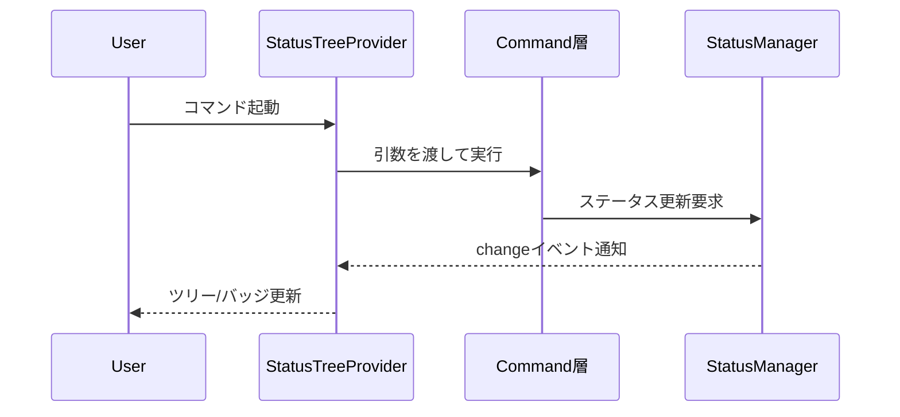
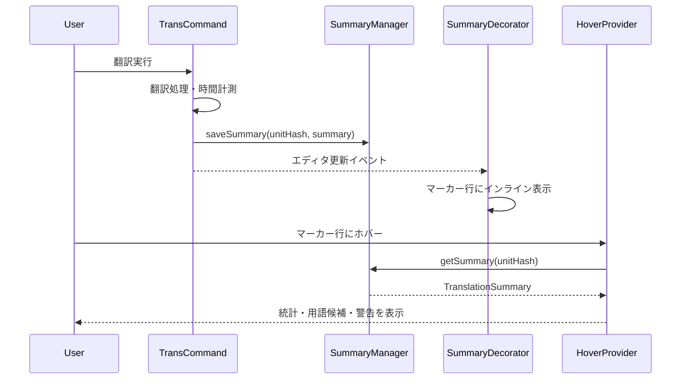

# UI

> [architecture](../architecture.md) > **UI**

## このドキュメントの責務

UI層は、mdaitの内部状態をVS Code標準UIパターンで可視化し、ユーザーに直感的な操作体験を提供します。

**設計意図**: 独自のWebビューは使わず、VS Codeネイティブな体験を提供します（[architecture.md](architecture.md) P6参照）。TreeView、CodeLens、Hover、Progressなど、VS Code標準のUI要素を活用することで、他の拡張機能と一貫したUXを実現し、ユーザーの学習コストを低減します。

---

## 主要コンポーネント

### StatusTreeProvider

`StatusItemTree`をVS Code TreeViewに変換し、翻訳状態を階層的に表示します。

**機能**:
- needフラグをアイコンとバッジで視覚化
- frontmatterを含む場合は先頭に表示（ファイル翻訳の前にfrontmatter翻訳を実行可能）
- 部分更新イベントに対応して最小限のDOM更新
- `Configuration.isConfigured()`がfalseの場合は空配列を返しリソース消費を抑制

**設計意図**: ツリー構造により、ディレクトリ→ファイル→ユニットという自然な階層でステータスを把握できます。

#### コンテキストメニューの表示制御

StatusTreeは`contextValue`プロパティを使用して、VS Codeのwhen条件で各コマンドの表示を制御します。

**contextValueの種類**:
- `mdaitFileSource` / `mdaitDirectorySource`: ソースファイル/ディレクトリ（用語集検出コマンド用）
- `mdaitFileTarget` / `mdaitDirectoryTarget`: 翻訳未完了のターゲットファイル/ディレクトリ
- `mdaitFileTargetComplete` / `mdaitDirectoryTargetComplete`: 翻訳完了のターゲットファイル/ディレクトリ（TM登録・用語集展開コマンド用）

**contextValueの設定**:
ターゲットファイル/ディレクトリは、翻訳状態に応じて以下のいずれかのcontextValueを持ちます：
- 未完了: `mdaitFileTarget` / `mdaitDirectoryTarget`
- 完了: `mdaitFileTargetComplete` / `mdaitDirectoryTargetComplete`

**package.jsonのwhen条件**:
- 翻訳コマンド: `viewItem == mdaitFileTarget || viewItem == mdaitFileTargetComplete` （完了・未完了両方で表示）
- TM登録等: `viewItem == mdaitFileTargetComplete` （完了時のみ表示）

**翻訳完了判定** (`Status.Translated`):
- すべてのユニットが`status === Status.Translated`
- frontmatterも翻訳済み（存在する場合）
- ディレクトリの場合、直下のファイルとサブディレクトリすべてが完了状態

**エッジケース**:
- **空ファイル**: 翻訳すべき内容がないため完了扱い (`mdaitFileTargetComplete`)
- **エラーファイル**: パースエラーがある状態は不完全 (`mdaitFileTarget`)
- **空ディレクトリ**: ファイルもサブディレクトリもない場合は不完全扱い

---

### Welcome View

`mdait.json`未設定時に表示される初期設定ガイドです。

**機能**:
- `viewsWelcome`でギアアイコンCTAを表示
- `mdait.setup.createConfig`コマンドにリンク
- `mdaitConfigured`コンテキスト変数で表示を制御

**設計意図**: 初回利用時の「何をすればいいか分からない」状態を解消し、スムーズなオンボーディングを実現します。

---

### CodeLens機能

mdaitマーカー上に表示されるインラインアクションボタンです。VS CodeのCodeLens機能を利用してテスト実行ボタンのような直感的なUIを提供します。

#### 表示されるCodeLens

**ターゲットファイル（訳文）のマーカー**:
- **$(symbol-reference) Source**: 原文ユニットへジャンプ（`from`属性がある場合）
- **✨[AI]翻訳**: AI翻訳を実行（`need:translate`がある場合）
- **$(check) 完了マーク**: needフラグを手動でクリア（`need`属性がある場合、種類に応じたラベル）

**ソースファイル（原文）のマーカー**:
- **$(symbol-reference) Target**: 訳文ユニットへジャンプ（`from`属性がなく、対応する訳文が存在する場合）
- 複数の訳文言語がある場合、`transPairs`設定順で最初のターゲットへジャンプ

**frontmatterマーカー**:
- **$(play) 翻訳**: frontmatter翻訳を実行（`need:translate`がある場合のみ）
- **$(check) 完了マーク**: frontmatter needフラグをクリア（`need`がある場合のみ）
- **翻訳完了後（`from`あり、`need`なし）**: CodeLensを表示しない
  - 理由: TM登録・確定は非対応、原文は同ファイル内のため移動不要

**TM登録**: StatusTreeのファイル/ディレクトリコンテキストメニューから利用可能。ユニット単位のTM登録CodeLensは廃止された。

#### ジャンプ時の動作

- 右側（Beside）に分割表示でジャンプ先を開く
- 左右のユニットをハイライト表示（find match風の背景色）
- 左側のスクロールに右側が追従する一方向スクロール同期
- カーソルがハイライト範囲外に移動、または右側を手動スクロールすると同期解除

**設計意図**: 原文と訳文を並べて確認できることで、翻訳品質のレビューが容易になります。

#### 実装の詳細

- **Provider**: `MdaitCodeLensProvider`がドキュメント内のマーカーを検出し、適切なCodeLensを生成
- **Command**: `codeLensJumpToSourceCommand`, `codeLensJumpToTargetCommand`, `codeLensTranslateCommand`, `codeLensClearNeedCommand`等がアクションを実行
- **パフォーマンス**: ソースファイル判定は`FileExplorer.isSourceFile()`でO(transPairs数)、ターゲット検索は`StatusItemTree.getTargetUnitByFromHash()`で優先検索→全体検索のフォールバック

---

### 翻訳サマリ表示

翻訳完了後、処理時間、トークン数、用語候補、警告をユーザーに提示します。

#### TranslationSummaryHoverProvider

mdaitマーカー行およびfrontmatterマーカー行にホバーしたときに翻訳サマリを表示します。

**表示内容**:
- 処理時間
- トークン数
- 用語候補
- 警告

**実装**: `SummaryManager`からハッシュをキーにサマリ情報を取得し、Markdown形式でリッチ表示

#### SummaryDecorator

翻訳サマリの概要をマーカー行末尾にGitLens風のインライン表示で提供します。

**特徴**:
- frontmatterマーカーも対象に含む
- CodeLensと同じ色・フォントスタイルで統一
- 詳細はHoverで確認可能

**設計意図**: エディタを開いたまま、翻訳の統計情報を一目で確認できます。

#### SummaryManager

翻訳実行時に生成されたサマリデータ(`TranslationSummary`)をメモリ上でMap管理するシングルトンです。

**特徴**:
- 永続化は不要で、VS Code再起動時にクリアされる
- 翻訳完了時に`trans-command`から呼び出され、Hover/Decorator表示時に参照される

---

### Progress Reporter

sync/trans/term実行中の進行状況を表示し、`CancellationToken`でユーザーからの中断を処理します。

**設計意図**: 長時間処理でもユーザーが状況を把握でき、必要に応じて即座にキャンセルできます（[architecture.md](architecture.md) 哲学4参照）。

---

## 更新シーケンス

### ステータス更新フロー

**自動同期のトリガー**:
- ドキュメント保存時は`workspace.onDidSaveTextDocument`で対象ファイルを検知
- `sync.autoSyncOnSave`が`true`（デフォルト）で、mdaitマーカー（ユニットまたはフロントマター）が存在する場合のみ、`syncSingleFile`を呼び出して自動同期を実行
- まだ一度もsyncしていないファイル（マーカーが存在しないファイル）は自動同期の対象外

**設計意図**: 原文編集直後に自動同期が走ることで、翻訳が必要な箇所が即座に可視化されます。マーカーが存在しないファイルは意図的に除外することで、mdait管理外のファイルに対する不要な処理を防ぎます。

### 翻訳サマリ表示フロー

**設計意図**: 翻訳完了後、`SummaryManager`にサマリを保存し、`SummaryDecorator`がマーカー行末尾に簡潔な統計を表示します。詳細情報は`HoverProvider`でオンデマンド提供することで、エディタが情報で溢れることを防ぎます。

---

## 視覚表現の原則

- **needフラグ別の固定アイコン**: どの画面でも同じ記号で意味が伝わる一貫性
- **進捗表示の簡潔さ**: ファイル単位で「翻訳済み/要翻訳/エラー」の数値を表示し、折りたたみ表示でも情報が埋もれない
- **l10nシステム**: `/l10n`配下で文言を管理し、日本語/英語を等価に提供

**設計意図**: VS Code標準のアイコンとスタイルを活用することで、ユーザーが直感的に理解できるUIを実現します。

---

## ナビゲーションボタン

ステータスビューのツールバー（`view/title`メニュー）に配置されるナビゲーションボタンです。

**用語集を開く** (`mdait.status.openTerm`):
- **アイコン**: `$(repo)`
- **機能**: `.mdait/`配下の用語集ファイルをVSCodeエディタで開く
- **表示条件**: `mdaitConfigured && mdaitHasStatus`
- **エラーハンドリング**: ファイルが存在しない場合は情報メッセージを表示

**TMを開く** (`mdait.status.openTm`):
- **アイコン**: `$(database)`
- **機能**: `.mdait/translations.tmx`をVSCodeエディタで開く
- **表示条件**: `mdaitConfigured && mdaitHasStatus`
- **エラーハンドリング**: ファイルが存在しない場合は情報メッセージを表示

**設計意図**: 用語集とTMファイルに素早くアクセスできることで、翻訳品質の確認・編集が容易になります。用語集は「本」アイコン（`$(repo)`）、TMは「データベース」アイコン（`$(database)`）で視覚的に区別します。

---

## コンテキスト変数

### mdaitConfigured

**用途**: 設定完了状態を示すコンテキスト変数

**動作**:
- `Configuration.isConfigured()`の結果に基づき更新
- `true`の場合はツールバーボタン（sync/filter/glossary）を表示
- `false`の場合はWelcome Viewを表示
- activation時と設定変更(`Configuration.onConfigurationChanged`)時に更新され、UI全体の表示状態を制御

**設計意図**: 未設定状態を明示し、ユーザーに次のアクション（設定ファイル作成）を促します。
