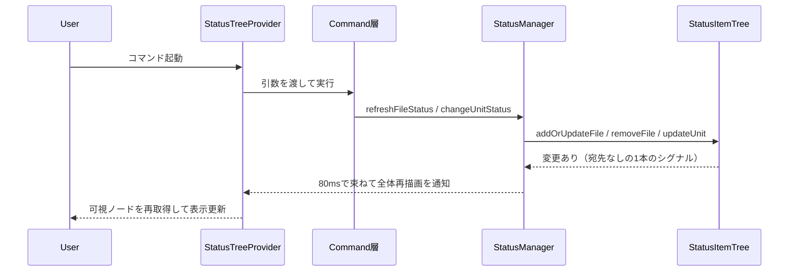
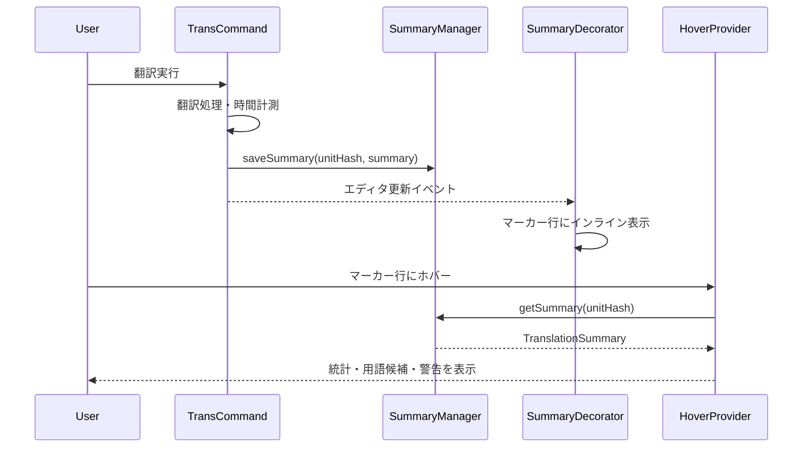

# UI

> [architecture](../design.md) > **UI**

## このドキュメントの責務

UI層は、mdaitの内部状態をVS Code標準UIパターンで可視化し、ユーザーに直感的な操作体験を提供します。

**設計意図**: VS Codeネイティブな体験を提供します（[design.md](../design.md) P6参照）。TreeView、CodeLens、Hover、Progressなど、VS Code標準のUI要素を活用することで、他の拡張機能と一貫したUXを実現し、ユーザーの学習コストを低減します。独自Webビューは原則使いませんが、mdait.json 設定エディタのみ例外として Webview を採用しています（ADR-260711-01。見た目・操作モデルはVS Code設定画面に準拠）。

本ドキュメントは UI **部品**のカタログである。ジャーニー全体・UX原則（デッドエンド禁止・判断サーフェス・工程間の手渡し等）・課題台帳は [ux.md](../ux.md) を正準とし、部品の追加・変更時は ux.md の原則との整合を確認すること。

---

## 主要コンポーネント

### StatusTreeProvider

`StatusItemTree`をVS Code TreeViewに変換し、翻訳状態を階層的に表示します。

**機能**:
- needフラグをアイコンとバッジで視覚化
- frontmatterを含む場合は先頭に表示（ファイル翻訳の前にfrontmatter翻訳を実行可能）
- ステータスに変更があれば**ツリー全体を再描画**する（どのノードを描き直すかは判定しない。ADR-260724-01）
- `Configuration.isConfigured()`がfalseの場合は空配列を返しリソース消費を抑制

**設計意図**: ツリー構造により、ディレクトリ→ファイル→ユニットという自然な階層でステータスを把握できます。

#### 更新通知のモデル（ADR-260724-01）

`StatusItemTree` の変更は宛先を持たない「変更あり」1本のシグナル（ペイロードなし）として `StatusManager` に届き、`StatusManager` がデバウンス（既定80ms）で束ねて全体再描画を1回だけ通知する。以前は「このディレクトリ配下だけ」という部分通知を宛先付きで発行していたが、その宛先判断が「要対応ノードだけ更新されない」不具合の発生源であったため、判断そのものを設計から削除した。

この方式が成り立つ前提は2つある。**変更する場合は前提が崩れていないか確認すること**。

1. **全体再描画は安価である**: VS Code が再取得するのは可視かつ展開済みのノードだけであり、`getChildren` / `getTreeItem` はインメモリのマップ参照のみでディスクI/Oを伴わない。ディスクを読み直す重い処理は `StatusManager.buildStatusItemTree()` であり、これは全体再描画とは別物である。
2. **`treeItem.id` が安定している**: 展開・選択状態は id で保持されるため、全体再描画でもツリーが畳まれない。id 採番（ディレクトリ／ファイルはワークスペース相対パス、ユニットは `相対パス#ハッシュ`）を変更する場合は、展開状態が維持されることを必ず確認すること。

デバウンスは通知を束ねるためのものであり、遅らせるためのものではない。守るべき性質は2つで、いずれも `StatusManager` の単体テストで保証している。

- 最後の変更から必ず1回通知される（取りこぼさない）
- 変更が待ち時間より短い間隔で続いても、上限（既定300ms）を超えたら通知する。これが無いとディレクトリ一括 sync の最中にツリーが凍って見える

#### Needs Attention（要対応キュー）

ルート直下の仮想ノード。`need:review` / `need:verify-deletion` の**裁定の単位**を、**選択中の transPair の範囲で**横断集約する（範囲の算出はツリー本体と共通の `getSelectedScopeDirs`。算出点が分かれると、ツリーに出ていないファイルの項目が要対応にだけ並ぶ）。裁定の単位は3種類 — 本文ユニット、`need:review` の frontmatter、`need:review` の非 Markdown ファイル（ファイル＝1ユニット）。マーカーの無い既訳はふつうの sync でも review で受ける（ADR-260912-06）ので、frontmatter と非 Markdown の確認待ちは日常的に生じる。本文ユニットだけを並べると、通知の件数（`countPendingReviewUnits`）や AI レビューの対象（`mdait.aiReview.pending`）と食い違い、AI が残した frontmatter の確認待ちに辿れなくなる。走査は `StatusItemTree.walkNeedsAttentionItems` 1本で、ノードの中身と通知の件数は必ず同じ集合から出る（差は verify-deletion を含むかだけ）。原文と結びついていない訳文（`isOrphanTarget`）と原文側のファイルは、review が残っていても並べない — 先に決めるべきは「この訳文をどうするか」で、その操作はファイル行にある。

- 件数ラベルと子リストは同じ集約結果から作られる（以前は件数だけがルート構築時のスナップショットで固まり、中身と食い違っていた）
- 並びはファイルパス昇順→開始行昇順で固定。同じ状態なら常に同じ並びになる
- 項目の副題（`description`）に `ファイル名 · 種類` を出す（見出しタイトルだけでは同名の見出しを区別できないため）
- 0件のときはノードごと出さない（UX-P7: デッドエンドを置かない）
- ノードが現れた最初の1回だけ展開状態で返す。全体再描画のたびに展開し直すと、ユーザーが畳んでも保存のたびに勝手に開いてしまうため
- 集約範囲は LM Tools の集計（`mdait_getStatus` 等）とも共通で、人間とエージェントの件数は一致する（ADR-260724-01）
- **項目のクリックは訳文と原文を並べて開く**（`mdait.openPair`。ADR-260912-07）。review は「この訳がこの原文の訳として正しいか」を見る作業で、訳文だけ開いても判断できない。訳文を左（既にどこかの列に見えていればその列、無ければ列1）に開き、右に原文を preview で開いて両側のユニットをハイライトし、左→右のスクロール同期を付ける（中身は CodeLens「Source」と同じ `openSourceBesideTarget`）。`from` が無い項目（verify-deletion・独立ユニット）や原文が見つからない項目は訳文だけを開いて黙る — その項目にできること（Keep / Delete / 確定）は訳文側に揃っている。ファイル配下のふつうのユニット行は従来どおり `mdait.jumpToUnit` で訳文だけを開く（編集の入口で毎回右に原文が出るのは煩い）
- **インラインボタン**: `$(verified)`「✨AI翻訳レビュー（レビュー待ちをまとめて確認）」（`mdait.aiReview.pending`。選択中ペアの `need:review` 全件を AI にかける。[command_ai-review.md](command_ai-review.md)）と「次の要対応へ」の2つ。コンテキストメニューにも同じ2つ
- **「次の要対応へ」**（`mdait.needsAttention.next`）で、現在位置の次の項目へ1操作で移動できる。末尾まで来たら先頭へ回る。移動先は項目クリックと同じ対訳表示（`mdait.openPair`）。導線は要対応ノードのインラインボタン・コマンドパレット・キーバインド（`ctrl+alt+n` / `cmd+alt+n`）。CodeLens には出さない — マーカー行に並べるのはそのユニットへの操作だけ（ux.md §3.3。ADR-260912-07）。**CodeLens「レビュー完了」とこのノードの「レビュー済みにする」を押した直後は、残っている次の要対応へ自動で進む**（`advanceAfterReview`。ADR-260912-08）。移動先と進み方はこのコマンドと同じで、残りが 0 件になったらステータスバーに「要対応: すべて片づきました」を一時的に出して終わる（通知は出さない）。翻訳済み・改訂済み・isolate 解除・Keep / Delete・「要翻訳にする」では進まない — 「要翻訳にする」の次の一手はその場の ✨翻訳なので、飛ぶと押せなくなる

#### コンテキストメニューの表示制御

StatusTreeは`contextValue`プロパティを使用して、VS Codeのwhen条件で各コマンドの表示を制御します。

**contextValueの種類**:
- `mdaitFileSource` / `mdaitDirectorySource`: ソースファイル/ディレクトリ（用語集検出コマンド用）
- `mdaitFileTarget` / `mdaitDirectoryTarget`: 翻訳未完了のターゲットファイル/ディレクトリ
- `mdaitFileTargetComplete` / `mdaitDirectoryTargetComplete`: 翻訳完了のターゲットファイル/ディレクトリ（TM登録・用語集展開コマンド用）
- `mdaitFileTargetVerifyDeletion`: 確認待ち（`need:verify-deletion`）を含むターゲットファイル（ファイル単位の一括確定用。ADR-260805-01）
- `mdaitFileTargetOrphan`: 原文と結びついていないターゲットファイル（破棄コマンド用。ADR-260806-01）
- `mdaitPlainFileTarget` / `mdaitPlainFileTargetComplete`: 非Markdownのターゲットファイル（ファイル＝1ユニット）
- `mdaitUnitTargetAttention` / `mdaitFrontmatterTargetAttention` / `mdaitPlainFileTargetAttention`: `need:review` の本文ユニット / frontmatter / 非Markdown ファイル（「レビュー済みにする」用。need で決め、`Status` は見ない。Attention には翻訳系のボタンを出さない — review に ✨翻訳を出すと「翻訳不要」で終わるデッドエンドになる）
- `mdaitUnitIndependent`: 独立ユニット（訳文側の `from` なし。ADR-260912-05）。メニューは登録しない — 原文の章が無い以上「凍結する」に意味が無く、押しても何も変わらないものを並べないため（CodeLens が「その他」を出さないのと同じ判断）。原文ユニットの `mdaitUnitSource` と分けているのはこのためである

**contextValueの設定**:
ターゲットファイル/ディレクトリは、翻訳状態に応じて以下のいずれかのcontextValueを持ちます：
- 未完了: `mdaitFileTarget` / `mdaitDirectoryTarget`
- 完了: `mdaitFileTargetComplete` / `mdaitDirectoryTargetComplete`
- 確認待ちを含む: `mdaitFileTargetVerifyDeletion`
- **原文なし: `mdaitFileTargetOrphan`（最優先で上書きする）**

孤立を最優先にするのは、原文が消えている訳文に通常のユニット操作を並べても、
人が最初に決めるべきこと（この訳文をどうするか）から目を逸らさせるだけだからである
（ux.md §3.3「同じ重みのボタンを3つ以上並べない」）。

**package.jsonのwhen条件**:
- 翻訳コマンド: `viewItem == mdaitFileTarget || viewItem == mdaitFileTargetComplete` （完了・未完了両方で表示）
- TM登録等: `viewItem == mdaitFileTargetComplete` （完了時のみ表示）

**翻訳完了判定** (`Status.Translated`):
- すべてのユニットが`status === Status.Translated`
- frontmatterも翻訳済み（存在する場合）
- ディレクトリの場合、直下のファイルとサブディレクトリすべてが完了状態

**エッジケース**:
- **空ファイル**: 翻訳すべき内容がないため完了扱い (`mdaitFileTargetComplete`)
- **エラーファイル**: パースエラーがある状態は不完全 (`mdaitFileTarget`)
- **空ディレクトリ**: ファイルもサブディレクトリもない場合は不完全扱い

**非MDファイルの表示**:
- ユニット分割されないため、**リーフノード（子ノードなし、collapsibleState: None）** として表示
- ステータスは `UnitStateStore` のneedフィールドから直接決定（`need:''` → Translated、`need:translate` → NeedsTranslation等）
- ファイルサイズが `trans.maxFileSize` を超過する場合、tooltipに超過理由を表示
- CodeLens は非MD訳文の1行目に Source と、`need` があれば ✨翻訳・完了マーク・要翻訳にする（`need:review` のときだけ）を出す（ファイル＝1ユニット）。Hover・SummaryDecoratorの非MD対応は将来の拡張スコープ

---

### Welcome View

`mdait.json`未設定時に表示される初期設定ガイドです。

**機能**:
- `viewsWelcome`でギアアイコンCTAを表示
- `mdait.setup.createConfig`コマンドにリンク
- `mdaitConfigured`コンテキスト変数で表示を制御

**設計意図**: 初回利用時の「何をすればいいか分からない」状態を解消し、スムーズなオンボーディングを実現します。

---

### 設定エディタ（SettingsPanel / SettingsEditorProvider）

VS Code設定画面ライクな mdait.json 編集用 Webview です（P6 の例外、ADR-260711-01・ADR-260711-02）。`mdait.json` を直接エディタで開いた場合も、`CustomTextEditorProvider`（`SettingsEditorProvider`、`priority: "default"`）により標準JSONエディタの代わりにこの設定UIがデフォルト表示されます。ステータスビューのツールバー（ギアアイコン）・コマンドパレット・エディタで直接開く、のいずれからも同じ設定UIに到達します。

**JSON表示との切り替え**:
- Markdownプレビューの表示切り替えボタンと同様に、エディタタイトルバーのボタンで設定UI ⇔ 生JSONを切り替えられる（`mdait.settings.openAsJson` / `mdait.settings.openAsUi`、`when: activeCustomEditorId == mdait.settingsEditor` で排他表示）
- 内部的には同一タブ上で `vscode.openWith` によりエディタ種別を切り替える（新規タブは開かない）
- 設定UI内の「JSONで編集」ボタンも同じ仕組みで生JSONへ切り替わる

**スキーマ駆動生成**:
- UI は `assets/schemas/mdait-config.schema.json` から実行時に自動生成（`settings-model.ts`、純粋ロジック）
- カテゴリ = スキーマのトップレベルキー（スカラーは general に集約）。型に応じたウィジェット（boolean/enum/数値/文字列/文字列配列/transPairs 表エディタ）を割り当てる
- 生成器が未対応の形（`copyAssets` のような boolean|array の oneOf 等）は「JSONで編集」フォールバック行として表示
- 解説文は `settings-doc.ts` に集約し l10n で日英提供。未定義の設定はスキーマ description にフォールバックするため、スキーマへの設定追加だけでも UI は機能する

**編集の仕組み**:
- 検索・カテゴリナビ・変更済みインジケータ（modified バー）・既定値リセットを提供
- 書き込みはキー単位の最小差分（`src/infra/config/config-json-editor.ts`。markers-migration とも共有される mdait.json 書き換えの単一経路）。既存キーの順序・インデント・末尾改行を保持し、リセットはキー削除＋空になった親オブジェクトの刈り取り
- 検証・型変換・パス解決（`Configuration` 経由）・ファイルI/Oはすべて拡張側（`settings-panel.ts`）。Webview は表示に徹する
- 外部編集（エディタでの直接編集等）は `Configuration.onConfigurationChanged` 経由で UI に反映。入力中のウィジェットは上書きしない
- mdait.json 未作成時はパネルを開かず `mdait.setup.createConfig` へ誘導

**設計意図**: 50項目超の設定の発見可能性を高め、スキーマを唯一の真実源とすることで UI とスキーマの二重管理を避けます。

---

### CodeLens機能

mdaitマーカー上に表示されるインラインアクションボタンです。VS CodeのCodeLens機能を利用してテスト実行ボタンのような直感的なUIを提供します。

#### 表示されるCodeLens

**ターゲットファイル（訳文）のマーカー**:
- **$(symbol-reference) Source**: 原文ユニットへジャンプ（`from`属性がある場合）
- **✨[AI]翻訳**: AI翻訳を実行（`need:translate`がある場合）
- **$(check) 完了マーク**: needフラグを手動でクリア（`need`属性がある場合、種類に応じたラベル）
- **$(check) Keep / $(trash) Delete Unit**: `need:verify-deletion` の2択（Delete は modal 確認つき。Keep は独立ユニット化＝need と from を同時に外す恒久操作。ADR-260805-01）。ツリーのファイル行には一括の「まとめて残す/まとめて削除」（どちらも modal）
- **$(sync) 要翻訳にする（Mark as Needs Translation）**: `need:review` の訳文ユニットにだけ出す。「この訳は採用しない」の答えで、`need:review` → `need:translate` に印を付け替える。**印を付け替えるだけで AI は呼ばない**（だから ✨ を付けない）。訳すのはその後の「✨翻訳」に任せる。書き換えは `getFileHandler().requestTranslate`（`commands/markers/request-translate.ts`、`withMarkerOnlyMutation`）だけを通す。ずれた紐づけからの逃げ道でもある — 訳文を捨てて、紐づいた原文から訳し直す。frontmatter の review 行には出さない（書き換え経路が本文ユニットと別で、数行の見出し語なら手で直して確認済みにするほうが早い）。非 Markdown の review 行にも同じボタンを出す（ADR-260912-07）
- **$(kebab-vertical) その他**: QuickPick メニュー（`from`と`hash`がある場合）。「凍結する」（`need`なし時のみ）・「✨全文で訳し直す」（`need` が空か `revise@…` のときのみ。判断は `isRetranslatableUnit`。ADR-260906-01）・「ノート」を集約（`mdait.codelens.otherActions`）

`need` ごとのボタンの並び（`buildUnitCodeLensSpecs`。純関数で、テストがこの順を固定している）:

| need | 並び |
|---|---|
| `translate` / `revise@…` | Source → ✨翻訳 → 翻訳済みにする（改訂済みにする） → その他 |
| `review` | Source → レビュー済みにする → 要翻訳にする → その他 |
| `verify-deletion` | Source → Keep → Delete Unit → その他 |
| `isolate` | Source → Un-isolate → その他 |
| なし | Source → その他 |

「次の要対応へ」はこの行に出さない — マーカー行に並べるのはそのユニットへの操作だけで、次のユニットへ動くのはツリーとパレットの役目（ADR-260912-07。要対応ノードの節を参照）。ただし **「レビュー完了」を押した直後は、残っている次の要対応へ自動で進む**（本文ユニット・frontmatter・非 Markdown の3種類とも。ADR-260912-08）。要対応を上から順に片づけるとき、1件ごとに「次の要対応へ」を押し直す手間をなくすため。

**ソースファイル（原文）のマーカー**:
- **$(symbol-reference) Target**: 訳文ユニットへジャンプ（`from`属性がなく、対応する訳文が存在する場合）
- 複数の訳文言語がある場合、`transPairs`設定順で最初のターゲットへジャンプ
- **$(kebab-vertical) その他**: 訳文側と同じメニュー（原文側は `hash` があれば表示）。原文側の isolate 宣言（sync が `need:translate` を生成しなくなる。ADR-260706-02）と原文側ノート（audit 時に `from` ハッシュ経由で AI に渡る）に対応

**frontmatterマーカー**:
- **$(play) 翻訳**: frontmatter翻訳を実行（`need:translate`がある場合のみ）
- **$(check) 完了マーク**: frontmatter needフラグをクリア（`need`がある場合のみ）
- **翻訳完了後（`from`あり、`need`なし）**: CodeLensを表示しない
  - 理由: TM登録・確定は非対応、原文は同ファイル内のため移動不要

**TM登録**: StatusTreeのファイル/ディレクトリコンテキストメニューから利用可能。ユニット単位のTM登録CodeLensは廃止された。

#### ジャンプ時の動作

- 右側（Beside）に分割表示でジャンプ先を開く
- 左右のユニットをハイライト表示（find match風の背景色）
- 左側のスクロールに右側が追従する一方向スクロール同期
- カーソルがハイライト範囲外に移動、または右側を手動スクロールすると同期解除

**設計意図**: 原文と訳文を並べて確認できることで、翻訳品質のレビューが容易になります。

**対訳表示コマンド `mdait.openPair`**（`openPairCommand`。ADR-260912-07）: 「Source」の中身（`openSourceBesideTarget`）を、**訳文を開くところから**始める版。訳文ファイルと開始行を受け取り、訳文を左（既にどこかの列に見えていればその列、無ければ列1。`pickViewColumnForTarget`）に開いてから、右に原文を preview で開いて上と同じハイライト・スクロール同期を付ける。アクティブ列に開かないのは、前の項目で右に出した原文 preview がアクティブなとき訳文がそこへ開き、さらにその右へ原文が出て3列になるため。原文の所在は `locatePairSource`（`from` が無ければ探さない → 対になる原文ファイル → 全体）で決め、見つからなくても警告は出さない（ボタンを押した本人が相手の「Source」だけ理由を返す）。ステータスツリーの要対応ノードの項目クリックと「次の要対応へ」から呼ばれる。package.json には宣言しない（`mdait.jumpToUnit` と同じ内部コマンド）

#### 実装の詳細

- **Provider**: `MdaitCodeLensProvider`がドキュメント内のマーカーを検出し、適切なCodeLensを生成。どのボタンをどの順で出すかは純関数 `buildUnitCodeLensSpecs` が決め、Provider は range を付けて `vscode.CodeLens` に包むだけ
- **Command**: `codeLensJumpToSourceCommand`, `codeLensJumpToTargetCommand`, `codeLensTranslateCommand`, `codeLensClearNeedCommand`, `codeLensRequestTranslateCommand`（`ui/codelens/request-translate-command.ts`）等がアクションを実行。**マーカーの書き換えは自分で行わず `getFileHandler` 経由で実行する**（排他制御・ステータス更新の取りこぼしを防ぐため。`commands/markers/unit-mutation.ts`）
- **パフォーマンス**: ソースファイル判定は`FileExplorer.isSourceFile()`でO(transPairs数)、ターゲット検索は`StatusItemTree.getTargetUnitByFromHash()`で優先検索→全体検索のフォールバック

---

### 翻訳サマリ表示

翻訳完了後、処理時間、トークン数、用語候補、警告をユーザーに提示します。あわせて「原文が変わった」ユニットの状態と、その差分の解説もこの2つのサーフェスが担います（サーフェスの役割分担は [ux.md](../ux.md) §3.3 が正準）。

#### TranslationSummaryHoverProvider

mdaitマーカー行およびfrontmatterマーカー行にホバーしたときに翻訳サマリを表示します。

**表示内容**:
- 処理時間
- トークン数
- TM参照ヒット（`source → target`形式）
- 用語候補（各候補に「用語集に追加」リンク。`command:` URI 経由で `mdait.addToGlossary` を起動する唯一の導線）
- 警告

**実装**: `SummaryManager`からハッシュをキーにサマリ情報を取得し、Markdown形式でリッチ表示

**人が訳文を手で直したことは出さない**（ADR-260905-04）。締めくくり方は CodeLens の `✓翻訳済みにする` が常に隣にあり、そちらが唯一の案内である。

**原文が変わったユニット**（`need:revise`）: 旧原文（`revise@{旧原文ハッシュ}`）と新原文（`from`）を `.mdait/unit-registry` から引き、`core/markdown/source-diff.ts` で行差分を作って ```diff ブロックで出す。AI は使わない（旧原文が保存済みのため。ADR-260802-03）。引けないときは差分を出さない（Hover 自体は壊さない）

**独立ユニット**（訳文側の `from` なし。判定は `core/unit-state/independent-unit.ts`）: `このユニットは原文には存在しません。` の一言だけを出して終える（ADR-260912-05）。統計も差分も無く、CodeLens にも操作が出ないので、ここが唯一の説明になる

#### SummaryDecorator

翻訳サマリの概要をマーカー行末尾にGitLens風のインライン表示で提供します。

**特徴**:
- frontmatterマーカーも対象に含む
- CodeLensと同じ色・フォントスタイルで統一
- 詳細はHoverで確認可能
- サマリが無くても状態を出す。状態は気づける場所に置き、理由と対処は Hover に置く
  - `need:revise`（`needsRevision()`）→ `原文が変わりました`（ADR-260802-03）
  - 独立ユニット（訳文側の `from` なし）→ `原文なし`（ADR-260912-05）。サマリより優先する — その章が何であるかは、その章に何が起きたかより先に読めるべきである
  - 人が訳文を手で直したことは出さない（ADR-260905-04）

---

### ステータスバー常駐サマリ（StatusBarSummary）

抱えている needs 件数を右下に1行で常駐表示する（`$(globe) 翻訳待ち 3 / 要確認 2`）。

- **役割**: 原文保存で `autoSyncOnSave` が黙って `need:revise` を付けたことに、視界の隅で気づけるようにする唯一の受動サーフェス（ADR-260802-03）。保存のたびにトーストは出さない（通知疲れの回避）
- **集計範囲**: ツリー本体と同じ「選択中の transPair」（`getSelectedScopeDirs`）。算出点を分けると人間とエージェントで件数が食い違う
- **0件のときは項目ごと隠す**（やることが無いのに常駐すると、変化に意味がなくなる）
- クリックで mdait のビューへ（`mdait.status.focus`）

**設計意図**: エディタを開いたまま、翻訳の統計情報を一目で確認できます。

#### SummaryManager

翻訳実行時に生成されたサマリデータ(`TranslationSummary`)をメモリ上でMap管理するシングルトンです。

**特徴**:
- 永続化は不要で、VS Code再起動時にクリアされる
- 翻訳完了時に`trans-command`から呼び出され、Hover/Decorator表示時に参照される

---

### Progress Reporter

sync/trans/term実行中の進行状況を表示し、`CancellationToken`でユーザーからの中断を処理します。

**設計意図**: 長時間処理でもユーザーが状況を把握でき、必要に応じて即座にキャンセルできます（[design.md](../design.md) 哲学4参照）。

---

## 更新シーケンス

### ステータス更新フロー



変更の宛先は誰も判定しない。翻訳中のようにユニット単位の更新が連続しても、デバウンスが1回の再描画にまとめる（ADR-260724-01）。

**自動同期のトリガー**:
- ドキュメント保存時は`workspace.onDidSaveTextDocument`で対象ファイルを検知
- `sync.autoSyncOnSave`が`true`（デフォルト）で、mdaitマーカー（ユニットまたはフロントマター）が存在する場合のみ、`syncSingleFile`を呼び出して自動同期を実行
- まだ一度もsyncしていないファイル（マーカーが存在しないファイル）は自動同期の対象外

**設計意図**: 原文編集直後に自動同期が走ることで、翻訳が必要な箇所が即座に可視化されます。マーカーが存在しないファイルは意図的に除外することで、mdait管理外のファイルに対する不要な処理を防ぎます。

### 翻訳サマリ表示フロー



**設計意図**: 翻訳完了後、`SummaryManager`にサマリを保存し、`SummaryDecorator`がマーカー行末尾に簡潔な統計を表示します。詳細情報は`HoverProvider`でオンデマンド提供することで、エディタが情報で溢れることを防ぎます。

---

## 視覚表現の原則

- **needフラグ別の固定アイコン**: どの画面でも同じ記号で意味が伝わる一貫性
- **進捗表示の簡潔さ**: ファイル単位で「翻訳済み/要翻訳/エラー」の数値を表示し、折りたたみ表示でも情報が埋もれない
- **l10nシステム**: `/l10n`配下で文言を管理し、日本語/英語を等価に提供

**設計意図**: VS Code標準のアイコンとスタイルを活用することで、ユーザーが直感的に理解できるUIを実現します。

---

## ナビゲーションボタン

ステータスビューのツールバー（`view/title`メニュー）に配置されるナビゲーションボタンです。

**用語集を開く** (`mdait.status.openTerm`):
- **アイコン**: `$(repo)`
- **機能**: `.mdait/`配下の用語集ファイルをVSCodeエディタで開く
- **表示条件**: `mdaitConfigured && mdaitHasStatus`
- **エラーハンドリング**: ファイルが存在しない場合は情報メッセージを表示

**TMを開く** (`mdait.status.openTm`):
- **アイコン**: `$(database)`
- **機能**: `.mdait/translations.tmx`をVSCodeエディタで開く
- **表示条件**: `mdaitConfigured && mdaitHasStatus`
- **エラーハンドリング**: ファイルが存在しない場合は情報メッセージを表示

**設計意図**: 用語集とTMファイルに素早くアクセスできることで、翻訳品質の確認・編集が容易になります。用語集は「本」アイコン（`$(repo)`）、TMは「データベース」アイコン（`$(database)`）で視覚的に区別します。

**検証**（単独の人間導線は持たない。ADR-260802-02）:
- **配置**: ✨AI翻訳レビューの**前処理**として自動実行される。ツールバー・パレットには出さない
- **機能**: 構造チェック＋用語一貫性検証（読取専用・AI不使用）。結果は AI レビューのレポート（`.mdait/reports/ai-review.md`）に「機械チェック（構造・用語）」セクションとして載り、件数は同じ完了通知に足される
- **理由**: 機械で判定できる違反を LLM に有料で聞かない。ユーザーから見た操作は「✨AI翻訳レビュー」1つに減る
- **対称性**: エージェント側の `mdait_validate` は据え置き（ゴール判定に使うため）。コア（`validate_CoreProc`）は共通

---

## コマンドID正準リスト

`mdait.*` コマンドの正準台帳。**新しいコマンドを追加したらこの表も更新すること**（package.json・extension.ts と本表の乖離は「宣言と実体の齟齬」として扱う）。導線列の凡例: パレット=コマンドパレット、ツリー=StatusTree（タイトルバー/行内/コンテキストメニュー）、内部=UIサーフェスから直接は呼ばれない。

| コマンドID | 導線 | 備考 |
|---|---|---|
| `mdait.sync` / `mdait.setup.*` / `mdait.settings.open` / `mdait.translateSelection` / `mdait.adopt.run` | パレット（一部はツリーにも） | スタンドアロンで動作するもののみパレットに露出（ux.md C-2） |
| `mdait.markers.externalize` / `mdait.markers.embed` / `mdait.tm.optimize` | 内部（パレット非表示） | AI 運用ループに乗らないためユーザー導線から外した（ADR-260802-02）。移行は設定変更時の sync 自己修復、TM の重み再計算は tm.commit の後段で自動実行される |
| `mdait.translate.{directory,file,unit,frontmatter}` / `mdait.term.update` / `mdait.tm.commit.{file,directory}` / `mdait.aiReview.{file,directory}` | ツリー行内/コンテキストメニュー | アイテム引数必須のためパレット非表示。`term.update` は検出＋展開を1操作にまとめたもの（ADR-260802-02） |
| `mdait.aiReview.pending` | 要対応ノードの行内/コンテキストメニュー・sync 完了通知の「✨AI review」・パレット | 引数なしで、選択中ペアの `need:review` 全件（本文・frontmatter・非MD）を AI レビューにかける。モード選択は出さず pending 固定（ADR-260912-07） |
| `mdait.unit.{markReviewed,keep,delete,markIsolated,unisolate}` / `mdait.needsAttention.next` / `mdait.jumpToUnit` / `mdait.openPair` | ツリー/キーバインド/パレット | 判断サーフェス（ux.md J4）。書き換えは `getFileHandler` 経由。`openPair` は要対応ノードの項目クリックと「次の要対応へ」の移動先（訳文と原文を並べて開く。package.json 未宣言の内部コマンド） |
| `mdait.codelens.*` / `mdait.unit.editNoteForUnit` | CodeLens | エディタ内インラインアクション専用 |
| `mdait.status.{sync,sync.initial,selectTargets,openTerm,openTm}` | ツリータイトルバー | `mdait.status.sync.processing` はハンドラを持たない表示専用ダミー（`enablement: false` のスピナー表示枠） |
| `mdait.addToGlossary` | Hover の `command:` URI | package.json 未宣言（Hover 起点が正しい導線のため意図的） |
| `mdait.trans` / `mdait.term.detect` / `mdait.term.expand` | 内部 | テスト・デバッグIPC・他コマンドからの内部呼び出し専用。パレットに出さない |
| `mdait.trans.pendingTargets` | 内部 | sync 完了通知の「今すぐ翻訳」の実体。翻訳待ちが残る訳文ルートを対象にする（複数ペアなら QuickPick）。`mdait.trans` は URI 必須のため、この導線からは呼べない |

---

## コンテキスト変数

### mdaitConfigured

**用途**: 設定完了状態を示すコンテキスト変数

**動作**:
- `Configuration.isConfigured()`の結果に基づき更新
- `true`の場合はツールバーボタン（sync/filter/glossary）を表示
- `false`の場合はWelcome Viewを表示
- activation時と設定変更(`Configuration.onConfigurationChanged`)時に更新され、UI全体の表示状態を制御

**設計意図**: 未設定状態を明示し、ユーザーに次のアクション（設定ファイル作成）を促します。
