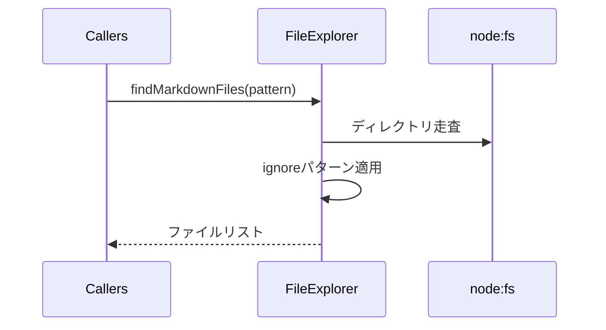

# utils

> [architecture](../architecture.md) > **Utils**

## このドキュメントの責務

Utils層は、CoreやCommands層のロジックをシンプルに保つため、ファイル探索やログ出力などの汎用処理を切り出します。Node.js標準モジュールとVS Code APIの差異を吸収し、共通インターフェースで提供します。

---

## FileExplorer

Markdown文書の探索とフィルタリングを担当します。

### 処理フロー



### 主要API

- `findMarkdownFiles(pattern, options)`: パターンマッチによるファイル探索
- `getTransPairFromTarget(filePath)`: 対象ファイルが属するtransPairを解決

### 設計方針

- ドメイン知識を含めず、入力と出力を純粋関数に近い形で返す
- PromiseベースでI/Oを扱い、テストではスタブ化しやすい構造
- 大規模リポジトリでも負荷を抑えられるよう、フィルター対象の正規表現や深さ制限を引数で受け取れる

**設計意図**: ファイル探索という汎用機能を切り出すことで、Commands層は「どのファイルを処理するか」という判断に集中できます。

**実装**: [`src/infra/workspace/file-explorer.ts`](../../src/infra/workspace/file-explorer.ts)

---

## FileMutex

ファイルパス単位の非同期排他制御を担当します。

### 解決する問題

sync・trans・保存時自動syncはいずれも同一ファイルを read-modify-write します。これらが並行実行されると後勝ちの上書きが起き、マーカーや翻訳結果が失われます。FileMutexは同じファイルへの操作を獲得順（FIFO）に直列化し、異なるファイルへの操作は並行のまま許可します。

### 主要API

- `runExclusive(keys, task)`: 指定パス群のロックを獲得してタスクを実行。先行タスクの完了を待ち、例外時もロックを解放する

### 設計方針

- 複数キーの獲得は同期的に一括登録するため、部分獲得によるデッドロックは構造的に発生しない
- 再入非対応（ロック保持中の処理から同一キーで再獲得しない設計を呼び出し側が守る）。現在の獲得点は `transFile_CoreProc` / `transUnit_CoreProc` / `translateFrontmatter_CoreProc` / syncコマンドのファイルワーカー / `syncSingleFile` で、互いに入れ子にならない
- ロック獲得直後に `flushDirtyDocument` で未保存のエディタバッファをディスクへ反映し、バッファ/ディスクの不整合による処理結果の消失を防ぐ。保存に失敗した場合は例外で操作ごと中断する（不整合のまま続行すると結局上書き消失を防げないため）
- ロックキーとパス比較は `normalizeFileKey` で正規化する（win32では大文字小文字を無視）

**実装**: [`src/infra/workspace/file-mutex.ts`](../../src/infra/workspace/file-mutex.ts), [`src/infra/workspace/dirty-document.ts`](../../src/infra/workspace/dirty-document.ts), [`src/infra/workspace/file-key.ts`](../../src/infra/workspace/file-key.ts)

---

## Logger

構造化ログによる診断情報の記録を担当します。

### ログレベルの使い分け

| レベル | 用途 | 例 |
|--------|------|-----|
| **DEBUG** | 開発・デバッグ時の詳細情報 | 変化のないファイルの同期完了、コンテキスト構築詳細 |
| **INFO** | 正常系の重要なイベント | 変化があったファイルの同期完了、ユニット翻訳開始・完了 |
| **WARN** | リカバリー可能な異常 | リトライ発生、パッチ適用失敗からのフォールバック |
| **ERROR** | リカバリー不可能なエラー | リトライ上限到達、処理失敗 |

### ログフォーマット規約

```
[YYYY-MM-DD HH:mm:ss][LEVEL][scope] message | context(JSON)
```

- **scope**: コンポーネント名（`sync`, `trans`, `config` など）
- **message**: 人間が読みやすい簡潔なメッセージ
- **context**: 追加情報をJSON形式で記録（ファイル名、unitHash、エラー詳細など）

### 構造化ログのベストプラクティス

| カテゴリ | フィールド | 例 |
|---------|-----------|-----|
| ファイル操作 | `file` または `filePath` | `{ file: "docs/ja/intro.md" }` |
| ユニット処理 | `unitHash`, `title` | `{ unitHash: "abc12345", title: "Introduction" }` |
| 差分情報 | `added`, `modified`, `deleted`, `unchanged` | `{ added: 2, modified: 3 }` |
| リトライ情報 | `attempt`, `maxRetries`, `reason`, `retryable` | `{ attempt: 2, maxRetries: 3, reason: "API timeout" }` |
| エラー情報 | `formatError(error)` | `{ name: "TypeError", message: "...", stack: "..." }` |

### リトライログの構造化

リトライが発生した場合、以下の情報を記録します：

```json
{
  "attempt": 2,
  "maxRetries": 3,
  "reason": "API timeout",
  "retryable": true,
  "unitHash": "abc12345",
  "title": "Introduction"
}
```

**設計意図**: 構造化ログにより、問題発生時にログを検索・集計しやすくなります。例えば、特定のファイルやユニットで頻繁にリトライが発生している場合、それを容易に検出できます。

**実装**: [`src/infra/logging/logger.ts`](../../src/infra/logging/logger.ts)

---

## 関連

- ファイル探索利用例: [command_sync.md](command_sync.md)
- 設定での除外パターン: [config.md](config.md)
- [architecture.md](../architecture.md) 「Utils層」参照