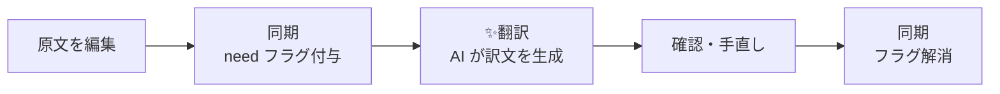

# 翻訳を進める人のガイド

mdait が設定済みのリポジトリで、原文を書く人・訳文を仕上げる人のためのガイド。導入や設定は [管理者ガイド](guide-admin.md) を参照。

## 操作早見表

アクティビティバーの 🌐 アイコンで **mdait ビュー**（翻訳状況ツリー）を開く。

| したいこと | 操作 |
|---|---|
| 原文の変更を訳文に反映させる | ビュー上部の **同期** |
| ディレクトリ／ファイルをまとめて翻訳 | 該当行の ▶ ボタン（**✨ファイルを翻訳**） |
| 1ユニットだけ翻訳 | マーカー行の CodeLens **✨翻訳** |
| 訳文と原文を見比べる | CodeLens **原文** / **訳文** で相互ジャンプ |
| 訳文をその場で確認 | 原文のマーカーにカーソルを乗せる（Hover） |
| レビューを終えた印をつける | CodeLens **レビュー完了** |
| 選択したテキストだけ即翻訳 | 右クリック → **✨選択範囲を翻訳** |
| 調子が悪いとき | コマンドパレット → **mdait: セットアップ診断** |

**✨** が付いた操作は AI を使う。それ以外（同期・状況表示・フラグ解除）は AI を使わず、何度実行しても結果が変わらない。

## 日常の流れ

原文を保存すると同期は自動で走る（マーカーがすでにあるファイルのみ）。同期は原文をコピーせず、訳文の置き場所と `need` フラグだけを用意する。訳文が空なのは正常で、次の翻訳で埋まる。

原文を書き換えたユニットには `need:revise` が付き、翻訳時には**変わった差分だけ**が AI に渡る。訳文全体は作り直されないので、手で整えた言い回しは残る。

## need フラグの意味と対処

マーカー `<!-- mdait {hash} from:{原文hash} need:{フラグ} -->` の `need` は「このユニットに何が必要か」を表す。

| フラグ | 状態 | 対処 |
|---|---|---|
| `translate` | まだ訳されていない | **✨翻訳** を実行 |
| `revise@{旧hash}` | 原文が変わった | **✨翻訳** を実行（差分だけが更新される） |
| `review` | 人の確認待ち | 訳文を読み、問題なければ **レビュー完了** |
| `verify-deletion` | 原文側が削除された | **保持** か **ユニットを削除** を選ぶ |
| `isolate` | 翻訳対象外として凍結中 | 何もしない |

`need` が付いていないユニットは同期済み・作業不要。訳文側で `from:` を持たないマーカーは**独立ユニット**、つまり原文に対応相手のない独自セクションで、常に保持され翻訳も削除もされない。

`review` は、AI が訳文の構造を原文と揃えられなかったとき、既存訳を取り込んだとき、マーカーのない訳文が見つかったときに付く。内容に問題がなければ **レビュー完了** で外すのが最短。

## 訳文を確認する

原文のマーカーにカーソルを乗せると、現在の訳文とステータスがポップアップする。腰を据えて見比べるときは CodeLens の **原文** / **訳文** で対応ユニットへジャンプする。

ユニット数が多いときは、行の **✨AI翻訳レビュー** で AI に一次判定させられる。忠実な訳と判定されたユニットは `need:review` が自動で外れ、誤ったペアや訳抜けの疑いだけが残る。

## 選択範囲をその場で翻訳

テキストを選んで右クリック → **✨選択範囲を翻訳**（コマンドパレットからも可）。選択範囲の直下に訳文が追記される。

これはワンショットの補助機能で、マーカー・ステータス・翻訳メモリのどれも変更しない。用語集だけは通常の翻訳と同じように効く。正式な訳文づくりには使わない。

翻訳方向は開いているファイルのパスから決まる。候補が複数ある構成では選択 UI が出る。

## マーカーを手で編集しない

マーカーを手で書き換えると、同期が別のユニットと誤認して不要な再翻訳や大量の差分を生む。フラグを外したいときは CodeLens のボタン（**レビュー完了** / **保持** など）を使い、状態を作り直したいときは同期を実行し直す。同期はどんな状態からでも整合の取れた状態へ戻せる。

## 困ったとき

**同期したのに訳文が空**
正常な動作。同期はマーカーだけを置く。**✨翻訳** を実行する（同期完了通知の「✨今すぐ翻訳」からも起動できる）。

**「翻訳ペアが見つかりません」「翻訳は不要です」と出る**
原文側のファイルを翻訳しようとしている、同期がまだ、あるいは `need` が付いていない、のいずれか。ビューの **✨翻訳**（▶）は常に訳文側を対象にするので確実。

**AI 翻訳が動かない（Language model is not available）**
既定の `vscode-lm` は GitHub Copilot 経由で動く。Copilot の導入とサインインを確認し、直らなければ管理者に AI 設定を見てもらう。

**原文の見出しを消したら訳文も消えた**
既定では、原文が消えたユニットの訳文は自動削除される。手動同期なら削除前に確認ダイアログが出る（保存時の自動同期では出ない）。消えたものは `git checkout` で戻せる。常に手で確認したい場合は管理者に `sync.orphanTargetPolicy` の変更を依頼する。

**「原文に本文が無いので同期を見送りました」と出る**
原文の本文が空（見出しも段落も無い）で、訳文にはまだ本文がある状態。そのまま同期すると訳文が丸ごと消えるため、mdait は訳文に触らずに止める。原文を書き戻すか、`git checkout` で戻せば次の同期から通常どおり進む。作り直したい場合は訳文ファイルを削除してから同期する。frontmatter だけになった原文も「本文が無い」扱いになる。

**予期しない再翻訳や大量の差分が出た**
マーカーの手編集か、ユニットの区切り（`sync.level`）の変更が原因。前者はマーカーを触らないこと、後者は変更後に全ファイルを同期し直すこと。

上記で解決しなければ **mdait: セットアップ診断** を実行する。設定・ディレクトリ・AI 接続・API キーの直書きをまとめて点検してくれる。

## 関連

- [管理者ガイド](guide-admin.md) — 導入・設定・既存翻訳の取り込み・用語集と翻訳メモリの運用
- [開発者ガイド](guide-developer.md) — Copilot Chat やエージェントから mdait を動かす
