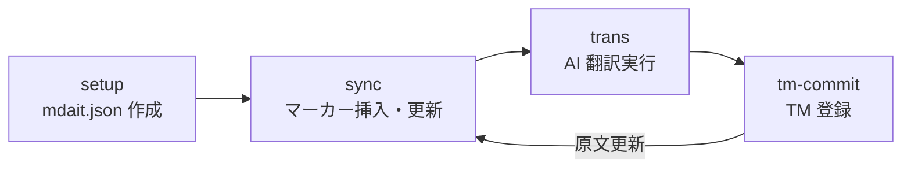

<!-- mdait dec99a38 -->
# 主要概念 — ユニット・マーカー・ワークフロー

mdait がどのように翻訳を管理するかを理解するためのページです。

---

<!-- mdait 8de6740d -->
## ユニット

Markdown ファイルは **ユニット** 単位で管理されます。ユニットとは「1つの見出しから次の見出しの直前まで」のブロックです。

見出しレベルの境界は `sync.level` 設定で決まります。

| `sync.level` | ユニット境界 |
|---|---|
| `1` | `#` のみ |
| `2` | `#` と `##` |
| `3`（デフォルト）| `#` `##` `###` まで |

各ユニットは CRC32 ハッシュで同一性を管理します。原文が1文字でも変わるとハッシュが変化し、再翻訳が必要と判断されます。

---

<!-- mdait 7f43f49d -->
## mdait マーカー

Sync 実行後、各ユニットの直前に HTML コメント形式の **マーカー** が挿入されます。

```

<!-- mdait 11111111 from:a1b2c3d4 need:revise@aaaabbbb -->
```

| フィールド | 意味 |
|---|---|
| （先頭の値） | このユニット自身の CRC32 ハッシュ（省略可） |
| `from:` | 対応するソースユニットの CRC32 ハッシュ |
| `need:` | 必要なアクション（下記参照） |

<!-- mdait be2760e0 -->
### need フラグ

`need` フィールドには 5 種類の値があり、ユニットに必要なアクションや状態を示します。

- `translate` — 未翻訳（新規ユニット）
- `revise` — 原文が変更された（要改訂）
- `review` — 人間の確認待ち（構造不一致・adopt 採用・管理外コンテンツの検出）
- `verify-deletion` — 原文が削除された（`orphanTargetPolicy: "verify"` 時）
- `isolate` — 保持＋下流への伝播停止（独自コンテンツの opt-out）

各フラグの発生条件と対処方法は [sync.md](sync.md) で詳しく説明しています。

---

<!-- mdait 7718ec36 -->
## ユニット分割とマーカーの実例

**Sync 前（ソースファイル）**

```markdown
# はじめに
これはサンプルドキュメントです。

## インストール
以下の手順でインストールしてください。
```

**Sync 後（ターゲットファイル）**

```markdown

<!-- mdait from:a1b2c3d4 need:translate -->
# Introduction

<!-- mdait from:b2c3d4e5 need:translate -->
## Installation
```

原文の各ユニットに `from` ハッシュが付与され、翻訳状態が追跡されます。

---

<!-- mdait a1ea9fcc -->
## ワークフローの全体像



| ステップ | 何をするか |
|---|---|
| **setup** | `mdait.json` を生成してソース/ターゲットディレクトリを設定する |
| **sync** | 原文を走査し、マーカーを挿入・更新する（差分を `need` フラグで表現）|
| **trans** | `need` フラグのあるユニットを AI で翻訳する |
| **tm-commit** | 完成した翻訳を翻訳メモリ（TM）に登録する |

原文が更新されたら **sync → trans → tm-commit** を繰り返します。

---

<!-- mdait 9cdc3aed -->
## 翻訳メモリ（TM）との関係

tm-commit で登録された翻訳は TM に蓄積され、次回翻訳時に参照されます。同じ原文フレーズが再登場したとき、TM から候補を提示することで翻訳コストと表記ゆれを抑えます。

---

<!-- mdait 791ea325 -->
## 次のステップ

- [sync.md](sync.md) — Sync の詳細設定とオプション
- [translate.md](translate.md) — 翻訳オプション・用語集・翻訳メモリの活用
