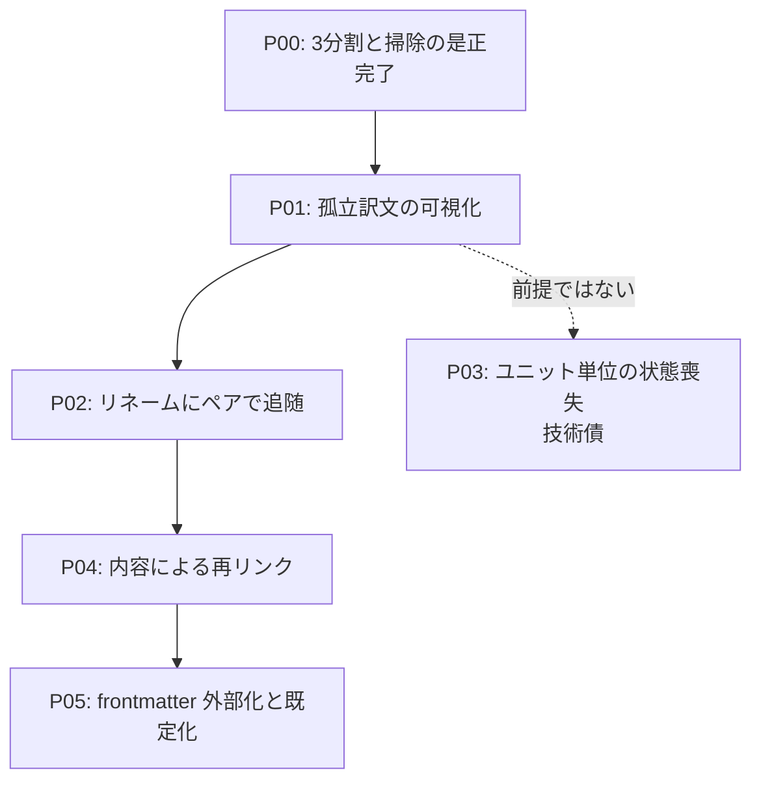

# Roadmap-v01: external マーカーを既定にする

## Concept

mdait は原文と訳文の対応を「マーカー」で覚えている。その保管方式が2つある。**embedded** は原文と訳文の
本文に `<!-- mdait hash... -->` を直接書き込む。**external** は `.mdait/unit-state` という別ファイルに、
1ユニット1行の表として持つ。

いま既定は embedded で、原文を mdait に渡すと初回同期でコメントが全ファイルに入る。翻訳を依頼する相手
（ライター・翻訳会社・他部署）にとって、これは「よく分からない記号が原稿に混ざる」という抵抗になる。
**ADR-260802-04 が目指しているのは、原文を1文字も書き換えないこと** — つまり external を既定にすることである。

しかし実測（`scripts/exploratory/probe-robustness.js`、70本超のシナリオ）で、**external のほうが弱い場面がある**
と分かった。両者の性質は正反対である。embedded は「文書の中の変化」（章の挿入・削除・並べ替え、ファイルの
リネーム）に強い。マーカーが本文と一緒に動くからである。external は「文書の外の処理」（整形ツール・
翻訳ベンダーの往復・コピペでコメントが失われる）に強い。状態が別ファイルにあるからである。

「文書の中の変化」への弱さのうち、**ユニットの並びに関するものは §10〜§16 でおおむね潰した**。
残っているのは**ファイルの同一性**である。external の行は相手を「パス」で覚えているので、リネーム・移動・
原文削除でパスが変わると、誰の行か分からなくなり掃除で消える。ADR-260802-04 の備考にも
「再リンクと孤立の可視化を前提条件として保留」と書いてある。

このロードマップを終えたとき、次の状態になっている。**原文にマーカーは1文字も入らない。** ファイルを
リネーム・移動しても原文と訳文はペアで動き、状態は失われない。VS Code の外で動かされて対応が切れても、
訳文は消えずにツリーに「原文と結びついていない」と出て、人が破棄を選べる。つまり **external は
embedded が無料で持っていた「文書の中の変化への追従」を別の手段で持ち直し、既定にできる。**

スコープ外: 段階3（ユニットの並べ合わせの作り直し）は §7 の検討で「新しい不可逆の壊れ方を作る危険が
大きい」として意図的に外してある。embedded は廃止しない。

## Map

## Phases

### P00: キー正規化の一本化と掃除の3分割 ※完了（§12〜§14）

**Why**
「走査対象外 / 実体が無い / 導出した原文が無い」を区別できないと、以降の段階がすべて誤検出になる。

**WHAT**
`cleanupOrphansInScope` の3分割、保留席（`HELD_ORDER_BASE`）、孤立ユニットの自動削除の停止、
確認待ちの出口（Keep の恒久化・ファイル単位の一括確定）。ADR-260803-03/-04、ADR-260804-01、ADR-260805-01。

**Gates**
- [x] probe が `想定外の差 0` で通る

---

### P01: 孤立訳文の可視化（削除ではなく要対応に倒す）

**Why**
リネーム・移動・原文削除で訳文が原文と結びつかなくなっても、いまは画面のどこにも出ず、external では
状態が消える。**先に「気づける」ようにするのが一番安く、壊す危険も小さい**（§7 で当初案から順序を入れ替えた理由）。
embedded の F-10（ux.md）も同じコードで直る。

**WHAT**
判定は「その訳文ファイルは実在する。しかしそこから導いた原文ファイルは実在しない」の一点。
**記録は持たず、毎回ディスクから計算する**（ADR-260806-01）。ツリーは既に訳文ディレクトリを列挙している
（`status-collector.ts`）ので、ファイル行にその場で印を付ける。sync 側は `cleanupOrphansInScope` に
「ディスクに実在するなら消さない」を足すだけで、新しいディレクトリ列挙は要らない。
あわせて S68（訳文を空にして貼り戻すと `need:translate` に固定される）を、
「空になった側には触らない」の対称化として直す（ADR-260806-02）。

**Steps**
- [ ] 孤立判定（訳文の実在 ∧ 導出原文の不在）を1箇所に置く
- [ ] `cleanupOrphansInScope` に実在確認を足し、孤立行を消さない
- [ ] ツリーのファイル行に印（アイコン＋副題）と Hover の解説、破棄操作（ごみ箱へ移動・modal）
- [ ] ステータスバーの常駐サマリに孤立件数、新規に孤立したときだけ1回通知
- [ ] 訳文のユニットが0件のとき sync を中止する（S68）
- [ ] probe に孤立とユニット単位の状態喪失のシナリオを追加

**Gates**
- [ ] リネーム・原文削除で訳文の状態が黙って消えない
- [ ] 孤立がツリーに出て、人が破棄を確定できる（modal・ごみ箱経由）
- [ ] 定常 sync の決定性・冪等性を維持（ADR-260705-01）
- [ ] `npm test` / probe / sweep がすべて通る

---

### P02: リネーム・移動にペアで追随する

**Why**
孤立を「見えるようにした」次は「そもそも起こさない」。VS Code 上の操作は構造的に潰せる。

**WHAT**
`onWillRenameFiles` の `waitUntil` に `WorkspaceEdit`（`renameFile`）を返し、原文のリネームに訳文を
連れて動かす。**ユーザーのリネームと同じ取り消し単位に相乗りする**ので Ctrl+Z で両方戻り、確認は挟まない。
訳文側をリネームされた場合は原文を動かさず、`unit-state` の行の `path` だけ追随させる（原文が正、訳文が従）。

**Steps**
- [ ] `onWillRenameFiles` の購読と、ペア解決（`getTransPairsFromSource` / `getTransPairFromTarget`）
- [ ] `unit-state` の行の `path` 付け替えを `unit-mutation.ts` 経由の入口として足す（複数パス版の排他）
- [ ] sync 実行中に届いたリネームの保留と、ハンドラ側の `save()`
- [ ] ディレクトリごとの移動（イベント1件・ファイル多数）の受け入れテスト

**Gates**
- [ ] 原文・訳文を揃えたリネーム／フォルダ移動で状態が失われない（probe で embedded と一致）
- [ ] Ctrl+Z で原文・訳文が一緒に戻る
- [ ] リネーム直後の sync が状態を捨てない（`load()` が上書きしない）

---

### P03: ユニット単位の状態喪失（技術債・P01 の前提ではない）

**Why**
訳文の中ほどの章を1つ消して保存すると、`detachMarkers` が行を並び順で上書きするため、その章の行が
**保留も刈り取りもされないまま消える**。貼り戻しても `need:translate` のままで、次の翻訳が人の訳を上書きする。
embedded は貼り戻しで完全復帰するのでモード差の欠陥である。

**WHAT**
保留席へ移す基準を「末尾の行」から「**対応が付かなかった行**」へ変える。パース時の照合結果を書き出し時まで
運ぶ配管が要る。あわせて §14(5) の残存リスク（保留席の行が見出しだけ同じ別物の章に拾われる）を、
**保留席の行は本文ハッシュの完全一致でだけ拾う**に絞って閉じる。

**Gates**
- [ ] 章を1つ消して保存 → 貼り戻す で embedded と一致する
- [ ] 保留席の行が別物の章に拾われない

---

### P04: 内容によるファイル再リンク

**Why**
VS Code の外（git・エクスプローラ・CLI）で動かされたファイルは P02 では拾えない。P05 で frontmatter まで
外部化すると、Markdown は mdait の痕跡を1文字も持たなくなるため、内容が唯一の手がかりになる。

**WHAT**
孤立した訳文と、新しく現れて対応する訳文が無い原文を突き合わせ、**pair と role で候補を縛り、双方向に
一意のときだけ**行を移送する。判定基準（被覆率か Jaccard か・最小ユニット数・空ファイルの除外・移送後の
order 再割当）を先に定式化する。**未翻訳の訳文は原文の丸写しなので、role で縛らないと原文の行が旧訳文へ吸い込まれる。**

**Gates**
- [ ] VS Code の外でリネームしたあと sync すると状態が復帰する
- [ ] 誤った再リンクが起きない（双方向一意でなければ孤立のまま残す）
- [ ] 的中率を実測し、`docs/design/unit-state.md` に記録する

---

### P05: frontmatter の外部化と external の既定化

**Why**
ADR-260802-04 のゴール。external でも frontmatter マーカーは全ファイルの先頭に残っており、
「原文は初回同期でも1文字も書き換わらない」はまだ達成できていない。

**WHAT**
frontmatter マーカーを `unit-state` へ退避し、新規セットアップのテンプレート既定を `markers.mode: external`
にする。既存ワークスペースは据え置き。7列固定の形式にバージョンを入れるならこの段階で行う
（ADR-260805-02 で「形式バージョニングが入るなら限界費用がほぼゼロ」として再訪を約束した項目がここに集まる）。

**Gates**
- [ ] external で原文が1バイトも書き換わらない
- [ ] 既存ワークスペースの `unit-state` が読めなくならない（形式の移行）
- [ ] probe の `想定外の差 0` を維持したまま既定を切り替えられる

## Gates

- [ ] 新規セットアップの既定が `markers.mode: external` になっている
- [ ] external が embedded に対して弱い項目が `docs/design/unit-state.md` §6 の表から消えている
- [ ] probe が `想定外の差 0`、絶対チェックの失敗0で通る

## Notes

- 段階番号は `docs/design/unit-state.md` §7 の段階表と対応する（P01=段階1、P02=段階2、P04=段階4、P05=段階5）。
  段階3（並べ合わせの作り直し）はロードマップから外し、その一部（保留席の基準）だけを P03 として技術債に移した。
- **原文への `id` 1行は書かない**（§7 の 2026-08-05 決定）。再訪条件は「P04 を入れたあと、実運用で
  再リンクが決められず孤立のまま残る事例が観測されたら」。
- [TODO] 実行時見直し：P04 の判定基準は P02 の取りこぼし頻度が分からないと決められない。P02 完了後に
  「VS Code の外で動かされる頻度」を実測してから設計する。
- 技術債（このロードマップの外）: `SectionMatcher` の `interval-align` への載せ替え（§10）、
  `UnitStateStore` の path 索引（§12）、LM Tool 層のテスト基盤（Task-260806-02）。
