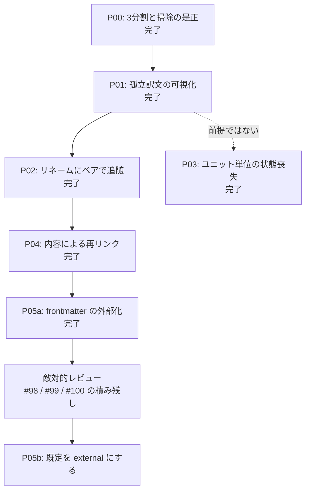

# Roadmap-v01: external マーカーを既定にする

## Concept

mdait は原文と訳文の対応を「マーカー」で覚えている。その保管方式が2つある。**embedded** は原文と訳文の
本文に `<!-- mdait hash... -->` を直接書き込む。**external** は `.mdait/unit-state` という別ファイルに、
1ユニット1行の表として持つ。

いま既定は embedded で、原文を mdait に渡すと初回同期でコメントが全ファイルに入る。翻訳を依頼する相手
（ライター・翻訳会社・他部署）にとって、これは「よく分からない記号が原稿に混ざる」という抵抗になる。
**ADR-260802-04 が目指しているのは、原文を1文字も書き換えないこと** — つまり external を既定にすることである。

しかし実測（`scripts/exploratory/probe-robustness.js`、70本超のシナリオ）で、**external のほうが弱い場面がある**
と分かった。両者の性質は正反対である。embedded は「文書の中の変化」（章の挿入・削除・並べ替え、ファイルの
リネーム）に強い。マーカーが本文と一緒に動くからである。external は「文書の外の処理」（整形ツール・
翻訳ベンダーの往復・コピペでコメントが失われる）に強い。状態が別ファイルにあるからである。

「文書の中の変化」への弱さのうち、**ユニットの並びに関するものは §10〜§16 でおおむね潰した**。
残っているのは**ファイルの同一性**である。external の行は相手を「パス」で覚えているので、リネーム・移動・
原文削除でパスが変わると、誰の行か分からなくなり掃除で消える。ADR-260802-04 の備考にも
「再リンクと孤立の可視化を前提条件として保留」と書いてある。

このロードマップを終えたとき、次の状態になっている。**原文にマーカーは1文字も入らない。** ファイルを
リネーム・移動しても原文と訳文はペアで動き、状態は失われない。VS Code の外で動かされて対応が切れても、
訳文は消えずにツリーに「原文と結びついていない」と出て、人が破棄を選べる。つまり **external は
embedded が無料で持っていた「文書の中の変化への追従」を別の手段で持ち直し、既定にできる。**

スコープ外: 段階3（ユニットの並べ合わせの作り直し）は §7 の検討で「新しい不可逆の壊れ方を作る危険が
大きい」として意図的に外してある。embedded は廃止しない。

## Map

## Phases

### P00: キー正規化の一本化と掃除の3分割 ※完了（§12〜§14）

**Why**
「走査対象外 / 実体が無い / 導出した原文が無い」を区別できないと、以降の段階がすべて誤検出になる。

**WHAT**
`cleanupOrphansInScope` の3分割、保留席（`HELD_ORDER_BASE`）、孤立ユニットの自動削除の停止、
確認待ちの出口（Keep の恒久化・ファイル単位の一括確定）。ADR-260803-03/-04、ADR-260804-01、ADR-260805-01。

**Gates**
- [x] probe が `想定外の差 0` で通る

---

### P01: 孤立訳文の可視化（削除ではなく要対応に倒す） ※完了（§17）

**Why**
リネーム・移動・原文削除で訳文が原文と結びつかなくなっても、いまは画面のどこにも出ず、external では
状態が消える。**先に「気づける」ようにするのが一番安く、壊す危険も小さい**（§7 で当初案から順序を入れ替えた理由）。
embedded の F-10（ux.md）も同じコードで直る。

**WHAT**
判定は「その訳文ファイルは実在する。しかしそこから導いた原文ファイルは実在しない」の一点。
**記録は持たず、毎回ディスクから計算する**（ADR-260806-01）。ツリーは既に訳文ディレクトリを列挙している
（`status-collector.ts`）ので、ファイル行にその場で印を付ける。sync 側は `cleanupOrphansInScope` に
「ディスクに実在するなら消さない」を足すだけで、新しいディレクトリ列挙は要らない。
あわせて S68（訳文を空にして貼り戻すと `need:translate` に固定される）を、
「空になった側には触らない」の対称化として直す（ADR-260806-02）。

**Steps**
- [x] 孤立判定（訳文の実在 ∧ 導出原文の不在）を1箇所に置く（`core/unit-state/orphan-target.ts`）
- [x] `cleanupOrphansInScope` に実在確認を足し、孤立行を消さない
- [x] ツリーのファイル行に印（アイコン＋副題）と Hover の解説、破棄操作（ごみ箱へ移動・modal）
- [x] ステータスバーの常駐サマリに孤立件数、新規に孤立したときだけ1回通知
- [x] 訳文のユニットが0件のとき sync を中止する（S68）
- [x] probe に孤立とユニット単位の状態喪失のシナリオを追加（S75）

**Gates**
- [x] リネーム・原文削除で訳文の状態が黙って消えない（probe S6 / S9 が embedded と一致）
- [x] 孤立がツリーに出て、人が破棄を確定できる（modal・ごみ箱経由）
- [x] 定常 sync の決定性・冪等性を維持（ADR-260705-01）
- [x] `npm test` / probe / sweep がすべて通る

---

### P02: リネーム・移動にペアで追随する ※完了（§18）

**Why**
孤立を「見えるようにした」次は「そもそも起こさない」。VS Code 上の操作は構造的に潰せる。

**WHAT**
`onWillRenameFiles` の `waitUntil` に `WorkspaceEdit`（`renameFile`）を返し、原文のリネームに訳文を
連れて動かす。**ユーザーのリネームと同じ取り消し単位に相乗りする**ので Ctrl+Z で両方戻り、確認は挟まない。
訳文側をリネームされた場合は原文を動かさず、`unit-state` の行の `path` だけ追随させる（原文が正、訳文が従）。
行の付け替えは移動が済んでから、**計画の控えではなくそのときのディスクの実測**で決める（ADR-260807-01）。

**Steps**
- [x] `onWillRenameFiles` / `onDidRenameFiles` の購読（`extension.ts`）と計画（`core/unit-state/rename-plan.ts`）
- [x] `unit-state` の行の `path` 付け替え（`UnitStateStore.movePath`）を `unit-mutation.ts` の入口として足す
- [x] ストア全体の排他（`infra/workspace/unit-state-lock.ts`）で sync 中の移動を待たせ、ハンドラ側で `save()`
- [x] ディレクトリごとの移動（イベント1件・ファイル多数）の受け入れテスト（probe S77 / 単体）
- [x] ピボット構成（`ja→en, en→fr`）で追随を連鎖させる（止めると `fr` 側に新しい孤立を作る）

**Gates**
- [x] 原文・訳文を揃えたリネーム／フォルダ移動で状態が失われない（probe S7 / S8 / S10 / S28 が embedded と一致）
- [x] 原文だけを動かしても訳文が連れて動く（probe S76 / S77）
- [x] Ctrl+Z で原文・訳文が一緒に戻る（`waitUntil` の編集として構成。巻き戻し後の行の追随を単体で固定）
- [x] リネーム直後の sync が状態を捨てない（`load()` が上書きしない）

---

### P03: ユニット単位の状態喪失 ※完了（§19）

**Why**
訳文の中ほどの章を1つ消して保存すると、`detachMarkers` が行を並び順で上書きするため、その章の行が
**保留も刈り取りもされないまま消える**。貼り戻しても `need:translate` のままで、次の翻訳が人の訳を上書きする。
embedded は貼り戻しで完全復帰するのでモード差の欠陥である。

**WHAT**
保留席へ移す基準を「末尾の行」から「**対応が付かなかった行**」へ変えた。読み込み時の照合結果を
`MarkerFileContext.alignment` に控え、書き出しの冒頭で適用する。あわせて保留席の寿命を無くし
（末尾の刈り取りで消さない）、§14(5) の残存リスクを **保留席の行は本文ハッシュの完全一致でだけ拾う**
に絞って閉じた。席へ預けるのは「失うと人の作業が消える行」だけに限る（ADR-260809-01）。

**Gates**
- [x] 章を1つ消して保存 → 貼り戻す で embedded と一致する（probe S75 = 末尾 / S79 = 途中）
- [x] 保留席の行が別物の章に拾われない（拾い戻しを本文ハッシュの完全一致だけに絞った）
- [x] 席が増える条件が「消えたきり戻ってこなかった、内容の異なる章」だけに収まる

---

### P04: 内容によるファイル再リンク ※完了（§20）

**Why**
VS Code の外（git・エクスプローラ・CLI）で動かされたファイルは P02 では拾えない。P05a で frontmatter まで
外部化すると、Markdown は mdait の痕跡を1文字も持たなくなるため、内容が唯一の手がかりになる。

**WHAT**
孤立した訳文と、新しく現れて対応する訳文が無い原文を突き合わせ、**pair と role で候補を縛り、双方向に
一意のときだけ**行を移送する。判定基準（被覆率か Jaccard か・最小ユニット数・空ファイルの除外・移送後の
order 再割当）を先に定式化する。**未翻訳の訳文は原文の丸写しなので、role で縛らないと原文の行が旧訳文へ吸い込まれる。**

**Gates**
- [x] VS Code の外でリネームしたあと sync すると状態が復帰する（probe S80）
- [x] 誤った再リンクが起きない（双方向一意でなければ孤立のまま残す。probe S81）
- [x] 判定基準を `docs/design/unit-state.md` §20 に記録する（実運用での的中率は未測。probe の範囲では誤り0件）

---

### P05a: frontmatter の外部化 ※完了（§25 / ADR-260814-01）

**Why**
external でも frontmatter マーカーは全ファイルの先頭に残っており、「原文は初回同期でも1文字も
書き換わらない」（ADR-260802-04）はまだ達成できていなかった。

**WHAT**
frontmatter マーカーを `unit-state` の**予約した order**（`FRONT_MATTER_ORDER` = 2,000,000。
保留席より上）へ移す。列は増やさない — 7列固定を破ると既存ファイルが警告付きで全行スキップされる。
出し入れは `MarkerProvider` の `attachFrontMatter` / `detachFrontMatter` に載せ、本文ユニットと
同じ仕組みに相乗りさせる。**形式バージョニングは入れない**（列を増やさない道を選んだ時点で、
この段階に集める理由が消えた。ADR-260805-02 の再訪は先送り）。

**Steps**
- [x] 検証を先に置く（probe の大域絶対チェック＋ CI で回る単体テスト。置いた時点では赤い）
- [x] 予約 order と `isFrontMatterEntry`。保留席の判定・採番・本文の行の取得から外す
- [x] `FrontMatter` に `_raw` を触らない経路（`_externalKeys`）。`set()`/`delete()` は外部キーで `_updateRaw()` を呼ばない
- [x] external では sync が原文を書き戻さない（`stringify` は行の引き取りのために必ず通す）
- [x] Externalize / Embed の双方向でマーカーを運ぶ。自己修復の早期判定も frontmatter を見る
- [x] CodeLens の素の `FrontMatter.parse` を `resolveMarkerIO` 経由へ（ADR-260801-01）
- [x] 内容による再リンクの手がかりから frontmatter 行を外す
- [x] probe の frontmatter 読み取りをモード非依存にする

**Gates**
- [x] external で原文が1バイトも書き換わらない（単体＋ probe 全シナリオの絶対チェック）
- [x] 既存ワークスペースの `unit-state` が読めなくならない（列を増やさないので該当しない）
- [x] probe の `想定外の差 0` を維持（一致 72 / 想定内の差 6 / 想定外の差 0 / 絶対チェック失敗 0）
- [x] モードの往復で frontmatter の翻訳状態が失われない（単体）

---

### P05b: 新規セットアップの既定を external にする

**Why**
ADR-260802-04 のゴール。P05a で「原文を書き換えない」は達成できたので、あとは既定を倒すだけ。

**WHAT**
`assets/mdait.template.json` に `"markers": { "mode": "external" }` を足す。**`Configuration` の
既定（`resetToDefaults()`）は `embedded` のまま**にする。既存ワークスペースの `mdait.json` には
`markers` キーが無いので、テンプレートだけを触れば据え置きが自動的に成り立つ。
あわせて `settings-doc.ts` の「'embedded' (default)」という説明を書き換え、`npm run l10n` で再生成する。

**Why not `Configuration` の既定**
既定そのものを倒すと、`markers` キーを持たない既存ワークスペースが一斉に external になり、
本文に埋まっているマーカーがただのコメント文字列として扱われる。probe も `setMode("embedded")` で
`markers` キーを消して既定に頼っているため（`probe-robustness.js`）、embedded 側の測定が
external になり、**突き合わせが全件「一致」になって、測っていないのに緑になる**。

**この段階の前に置くもの**
未消化の敵対的レビュー（PR #98 は3体中1体のみ完走、#99 と #100 は0周）。既定を倒した瞬間に
P02（リネーム追随）・P03（保留席）・P04（再リンク）の欠陥が**これから使い始める全員の既定の経路**に
なるため、関所はここに置く。レビューの単位は PR 差分ではなく **`unit-state` / `marker-provider` /
sync の掃除と再リンクというモジュール単位**とする（#100 が #98・#99 のコードを部分的に作り替えており、
差分に書かれた形はもう `main` に無い）。

**Gates**
- [ ] 新規セットアップの `mdait.json` に `markers.mode: external` が書かれている
- [ ] `markers` キーを持たない既存ワークスペースが embedded のまま動く
- [ ] probe の embedded 側が embedded のまま測れている（`setMode` の明示指定）
- [ ] 設定UIの説明と l10n が既定の変更に追随している

## Gates

- [ ] 新規セットアップの既定が `markers.mode: external` になっている（P05b）
- [ ] external が embedded に対して弱い項目が `docs/design/unit-state.md` §6 の表から消えている
- [x] probe が `想定外の差 0`、絶対チェックの失敗0で通る
- [x] external で原文が1バイトも書き換わらない（P05a）

## Notes

- 段階番号は `docs/design/unit-state.md` §7 の段階表と対応する（P01=段階1、P02=段階2、P04=段階4、P05a/P05b=段階5）。
  段階3（並べ合わせの作り直し）はロードマップから外し、その一部（保留席の基準）だけを P03 として技術債に移した。
- **原文への `id` 1行は書かない**（§7 の 2026-08-05 決定）。再訪条件は「P04 を入れたあと、実運用で
  再リンクが決められず孤立のまま残る事例が観測されたら」。
- ~~[TODO] 実行時見直し：P04 の判定基準は P02 の取りこぼし頻度が分からないと決められない~~
  **解消（2026-08-10）**: 判定の手がかりが「本文 hash が一致するか」だと分かった時点で、
  被覆率か Jaccard かという選択も最小ユニット数という調整項も消えた。移動しただけなら重なりは
  1.0 になるので、分布を取っても山は1つしか出ない。残る自由度（どこまで書き換えを許すか）は
  頻度ではなく代償の非対称で決まる。実測を挟まずに設計した理由は §20 に記録した。
- 技術債（このロードマップの外）: `SectionMatcher` の `interval-align` への載せ替え（§10）が残る。
  1回の明示 sync でトーストが最大6本重なる件は 2026-08-11 に解消した（§24 / ADR-260811-01）。
  `UnitStateStore` の行の持ち方は 2026-08-10 に二段（path → order）へ変えた（§23）。
  LM Tool 層は同日 `invoke` の入力検証と確認UIの契約を固定した（§22）— エンベロープの形と
  ソース走査の契約は元から在った。
