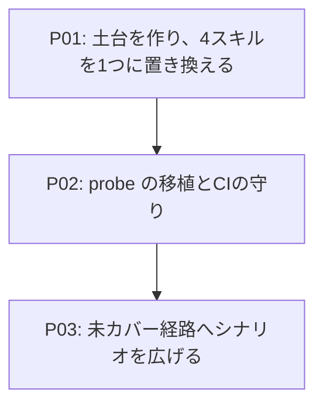

# Roadmap-v02: 検証の道具を1つに束ねる

## Concept

mdait の動作を確かめる道具は、いま4つある。`debug-ipc`（本物の VS Code をデバッグ起動し、ファイル IPC で
コマンドを叩く）、`explore-sweep`（VS Code を起こさず Node から commands 層を直接叩いて総なめする）、
`byok-shim`（OpenAI 互換の受け皿を手元に立て、HTTP の向こう側まで本物を走らせる）、`ux-lab`（ブラウザ版
VS Code を立てて Playwright で操作し、見た目を撮る）。**どれも「エージェントが自力で動作を確かめる」ための
道具なのに、別々の時期に別々の考えで作られたので、互いに噛み合っていない。**

噛み合っていない、とは具体的にこういうことである。**AI の偽物が3つある**（`fake-ai.js` は `AIService` ごと
差し替えるのでプロバイダ層が動かない、`fake-ollama.js` は HTTP だが検証したい OpenAI 経路とずれている、
`byok-shim` だけが本物の経路を通る）。**コマンドの起こし方が3通りある**（IPC、Node から関数を直接、
コマンドパレットに文字を打つ）。**結果の受け取り方も3通りある**（`result.json`、標準出力、目視）。
**同じ注意書きが4箇所に重複している**（共有する `mdait.json` を汚すな、終わったら `git checkout` で戻せ）。
その結果、私（エージェント）は「今どの道具の作法で書いているか」を毎回思い出す必要があり、思い出し損ねると
リポジトリを汚したまま次へ進む。

このロードマップを終えたとき、道具は `mdait-lab` 1つになっている。**入口は1つ**（`lab`）、**命令の経路は1つ**
（ファイル IPC）、**AI の偽物は1つ**（shim の `echo` モード）、**結果の形も1つ**（run ディレクトリ）。
違うのはホストだけで、それも `--host headless | code-server | desktop` の1語で切り替わる。ホストが変わっても
`lab run mdait.sync` の書き方は1文字も変わらない。テストワークスペースはリポジトリの外（`/tmp/mdait-lab/ws`）に
出るので、**「戻し忘れ」という事故の形が存在しなくなる**。

得るのは統一だけではない。統合の副産物として、今できないことが3つできるようになる。**ブラウザ版 VS Code でも
IPC が使える**ので、コマンドパレットに文字を打つ壊れやすい操作をやめ、実 UI を動かしながら結果 JSON と全ログを
機械可読で受け取れる。**探索スイープもプロバイダ層まで本物が走る**（`fake-ai.js` をやめ、HTTP の向こうに shim を
置くため）。**記録が上書きで消えない**ので、多段シナリオの3手目で壊れたときに2手目のログを読める。

スコープ外: 単体テスト（`npm test`）と VS Code 統合テスト（`npm run test:vscode`）の作り方は変えない。
`docs/design/test.md` の層の分け方も、名前が変わるだけで層そのものは動かさない。

## Map

## Phases

### P01: 土台を作り、4スキルを1つに置き換える

**Why**
「4つがバラバラ」という痛みは、土台（入口・命令経路・AI・結果の形・ワークスペース）が1つになった時点で
解ける。ここを分割して文書だけ先に出すと、新旧のスキルが同居する期間ができる。スキルは説明文から自動的に
引かれるので、**同居はそのまま「古い作法を読んで混乱する」危険になる**。だから置き換えまでを1つの段階にする。

**WHAT**
`scripts/lab/` に土台を作る。CLI（動詞＋プリセット）、3つのホスト（headless / code-server / desktop）、
ファイル IPC の共通クライアント、run ディレクトリ、リポジトリ外のワークスペース、AI の一本化。
`run-sweep.js` を土台へ載せ替える。`.claude/skills/` の4本を `mdait-lab` 1本に置き換える。
`npm run test:explore` / `test:byok` / `test:byok:e2e` は**名前を変えず**、中身が `lab` を呼ぶ形にする。

**Steps**
- [ ] `scripts/lab/lib/`（session / ipc / workspace / runs / digest）を作る
- [ ] `hosts/headless.mjs` — 常駐して `command.json` を待ち、`result.json` を返す。形は `DebugCommandHandler` と同一
- [ ] `hosts/registry.mjs` — `mdait.*` から `out/` の実装への対応表。UI 前提のものは理由つきで「headless では動かせない」と返す
- [ ] `hosts/code-server.mjs` — 設営（ネットワーク制約の回避を全部引き継ぐ）・起動・`.ipc-enabled` の設置・ready 待ち
- [ ] `hosts/desktop.mjs` — `.ps1` を Node へ移し、OS を問わず同じ呼び方にする（同バージョン回避の知識を残す）
- [ ] `ui/driver.mjs` — Playwright ヘルパ。撮る先を run ディレクトリへ。通知・ダイアログの文言を機械可読で拾う
- [ ] `ai/` — `byok-shim` を移設し、`echo` モード（決定的・遅延指定つき）を足す。`fake-ai.js` と `fake-ollama.js` を廃止
- [ ] `lab.mjs` — 動詞（up / run / shot / ai / status / reset / report / down）とプリセットの骨組み
- [ ] `scenarios/sweep.mjs` — `run-sweep.js` の P1〜P8 を土台に載せ替え、判定（FAIL / INFO）はそのまま残す
- [ ] `.claude/skills/mdait-lab/` を書き、旧4スキルを削除する
- [ ] `docs/design/test.md` を新しい形に合わせて直す

**Gates**
- [ ] `lab up --host headless --ai echo` → `lab run mdait.sync` → `lab run mdait.trans <file>` が通る
- [ ] `lab up --host code-server` → `lab run mdait.sync`（IPC）→ `lab shot` が通る
- [ ] `npm test` / `npm run test:explore` / `npm run test:byok:e2e` が緑
- [ ] `git status` が汚れない（既定のワークスペースがリポジトリ外にある）
- [ ] 旧4スキルのディレクトリが残っていない

### P02: probe の移植と、CI による土台の守り

**Why**
`probe-robustness.js`（78KB・S0〜S14）は「どの順に何を起こすと何が壊れるか」という手順の知識そのもので、
書き直せば必ず抜ける。ただし今は判定せず観察結果を並べるだけなので、**前回との差分が取れない**。土台に載せると
run ディレクトリの比較機能がそのまま効く。あわせて、**lab が壊れると検証手段が全部同時に死ぬ**ので、土台が
生きていることだけは CI で守る。

**WHAT**
probe を `scenarios/probe.mjs` として移植し、run 間の差分比較を足す。headless のスモークを CI に載せる
（ワークスペースがリポジトリ外に出たので、CI で走らせても何も汚さない）。プリセット（`sweep` / `probe` /
`regress` / `prompt` / `ux`）を実装で埋める。

**Steps**
- [ ] `scenarios/probe.mjs` — S0〜S14 を移植（embedded と external の両方を同じ手順で流す性質を保つ）
- [ ] `lab probe --diff <前の run>` — 前回の観察結果との差分を出す
- [ ] CI に headless スモークを追加（起こす → `mdait.sync` → 期待どおり → 落とす。数秒で終わる範囲）
- [ ] プリセット5つを低レベル動詞の合成として実装する（独自実装を持たせない）
- [ ] `scripts/exploratory/` を削除する（橋渡し用に残していた薄い再輸出も消す）

**Gates**
- [ ] `lab probe` が旧 `probe-robustness.js` と同じ観察結果を出す（S0〜S14 の出力を突き合わせる）
- [ ] `lab probe` を2回走らせ、2回目が「前回と差分なし」と答える
- [ ] CI が緑（追加したスモークを含む）

### P03: 未カバー経路へシナリオを広げる

**Why**
今のスイープは sync / trans / revise の骨格しか叩いていない。土台が1つになった後なら、シナリオを足す作業は
「手順を書く」だけになり、駆動・記録・判定は使い回せる。ここで初めて、統合の投資が回収に変わる。

**WHAT**
未カバーの経路にシナリオを足す。AI を使う経路は `echo` で機構を、`script` で耐性を、`replay` で回帰を守る、
という三重の使い分けを型として確立する。

**Steps**
- [ ] `term.detect` / `term.expand` / `tm.commit` / `ai-review` / `adopt` の各経路
- [ ] external マーカーモードでの sync / trans（`markers.mode: "external"`）
- [ ] 非 Markdown（csv / txt）の `PlainFileHandler` 分岐
- [ ] エッジな原稿（`structure_mismatch` / 空マーカー / マーカー無し / frontmatter だけ / 見出しレベルの境界）
- [ ] 意地悪な台本（429 / 500 / 遅延 / 途中で切れた JSON）を trans 以外の AI 経路にも当てる
- [ ] 実 UI でしか見えないもの（翻訳中のツリーの遷移、CodeLens、確認ダイアログ）を code-server ホストで撮る

**Gates**
- [ ] 上記の各経路に、少なくとも1つの決定的なシナリオがある
- [ ] 見つかった不具合は「根本修正 ＋ 単体回帰テスト ＋ シナリオへのアサーション追加」で閉じている

## Gates

- [ ] 検証の入口が `lab` 1つになっている（他の入口は `npm run test:*` の別名だけ）
- [ ] AI の偽物が shim 1つになっている（`fake-ai.js` / `fake-ollama.js` が存在しない）
- [ ] 3ホストで `lab run` の書き方が同一である
- [ ] スキルが `mdait-lab` 1本になっている
- [ ] 既定の操作でリポジトリが汚れない

## Notes

- 判定の規律は旧 `explore-sweep` から引き継ぐ。**純 sync（AI 非使用）で出た逸脱は本物の製品バグ**、
  **偽の訳文が絡むものはモックの限界**として分け、断定しない。逸脱は必ず単独 repro で再現してから報告する。
- 実測済みの事実（12往復28.4秒、503/429 は約2秒後に再送され完走、409 は再送されない、コードブロックは
  プレースホルダに置換されて送られる、`SelectionState` は初期状態が空）は、新しいスキル文書の本体に残す。
  参照ファイルへ逃がすと読まれず、同じ調査が二度行われる。
- 統合の下調べで**製品側の欠陥**を1つ見つけた。`src/commands/term/command-open.ts:51` が
  `mdait.term.detect.file` を `executeCommand` しているが、**その ID はどこにも登録されていない**
  （実在するのは `mdait.term.detect` で、引数は `(units, transPair)`）。用語集ファイルが無いときに
  「開いているファイルから用語検出を起こす」経路が、必ず「用語集ファイルを開けませんでした」で終わる。
  同じ4つの実在しない ID が `src/infra/debug/debug-command-handler.ts` の変換表にも載っている。
  どの入口から用語検出を起こすのが正しいかは設計判断を伴うので、P03（term 経路のシナリオ）で
  実際に叩いて確かめてから直す。
- [TODO] 実行時見直し：headless ホストで `fireTimeline` / `stateDiff` / `syncAnalysis` をどこまで取れるか。
  ツリーの provider が構築されないなら省略で構わないが、取れるなら sync のギャップ検出が headless でも効く。

---

## 補足: この計画を決めた議論の記録（2026-08-23）

10問の質疑で決めた。選択肢と、選ばれた答えと、その理由を残す。

| # | 問い | 選択肢 | 選択 | 理由 |
|---|------|--------|------|------|
| 1 | 統合の深さ | A 文書だけ / B 入口だけ一本化 / C 下回りごと再構築 | **C 寄りの B** | 文書だけでは「同じことを2通りで書いた説明」が残り、整合性の問題が解けない。ただし既存資産を残すことは目的にしない — 重複や薄い価値のものは捨てる |
| 2 | AI の偽物 | A shim 一本化 / B ＋Ollama 形も残す / C fake-ai は残す | **A** | `fake-ai.js` は `AIService` ごと差し替えるためプロバイダ層が一切走らない。shim は同一プロセスにも立てられるので速度の心配は無い。Ollama だったのは経路を検証したかったからではなく、ブラウザ版に `vscode.lm` が無いからにすぎない |
| 3 | 実 Extension Host の経路 | A code-server 1本 / B 1つの入口で両ホスト / C 2本のまま | **B** | 命令を IPC に統一するとブラウザ版でも結果 JSON と全ログが機械可読で取れる。デスクトップは実 `vscode.lm` とブレークポイントという独自価値がある。**ただし手元でも Claude が自力で起こせること**が条件なので、起動ヘルパは捨てずに Node へ移す |
| 4 | コマンド体系の形 | A 低レベル動詞のみ / B プリセットのみ / C 両方 | **C** | 使い方は「一発で答えが欲しい」と「触りながら見たい」に二極化している。プリセットに独自実装を許さないという条件を付ければ、増えても保守対象は増えない |
| 5 | 状態の持ち方 | A 3ホストとも常駐 / B headless だけ都度起動 / C 完全ワンショット | **A** | 多段シナリオが本命で、状態が続かないと意味が薄れる。結果の形が1つになり、文書からホストごとの分岐が消える |
| 6 | 観測の置き場と出し方 | A run ディレクトリ＋要約出力 / B リポジトリ内 / C 現状維持 | **A** | 記録が上書きで消えないことが多段シナリオの前提。標準出力を要約に絞るのは、読み取り予算をログで使い切らないため。リポジトリ外に置けば誤コミットが構造的に起きない |
| 7 | スキル文書の構成 | A 全部入り1枚 / B 入口＋参照ファイル / C `--help` に寄せる | **B** | 使うたびに全部読むのは無駄。ただし実測事実と落とし穴は本体に残す（参照へ逃がすと読まれず再調査になる）。`--help` は「いつ使うか・何を信じてよいか」を書けない |
| 8 | 大物2本の扱い | A そのまま移設 / B 駆動と記録だけ載せ替え / C 捨てて書き直し | **B** | そのまま移すと第二の駆動系が残り、統合が名ばかりになる。あの2本の価値は駆動コードではなく手順の知識で、書き直せば必ず抜ける |
| 9 | ワークスペースの置き場 | A `/tmp` の固定パス / B リポジトリ内のまま / C run ごとに別パス | **A** | 「注意して防ぐ」をやめ、事故の形を構造から消す。CI にスモークを載せられるようになる。固定パスにするのは、パスが変わると VS Code の信頼状態が毎回リセットされるため |
| 10 | 今回やる範囲 | A 文書まで / B 第1段階まで / C 全段階 | **C** | サブエージェントを使って統括する形で、3段階すべてを進める |

議論の中で方針が変わった点が2つある。ひとつは質問3で、当初は「デスクトップは人が F5 で立てる前提の軽い経路」
としたが、**デスクトップでも Claude に自律開発させたい**という要件が示されたため、起動ヘルパを持つ管理下の
ホストへ格上げした。もうひとつは質問1で、当初は既存資産の再利用を重んじたが、**中長期の使い勝手と保守性を
優先してよい**と確認されたため、`fake-ai.js` / `fake-ollama.js` / `trans-e2e.js` / `.ps1` の廃止に踏み切った。
