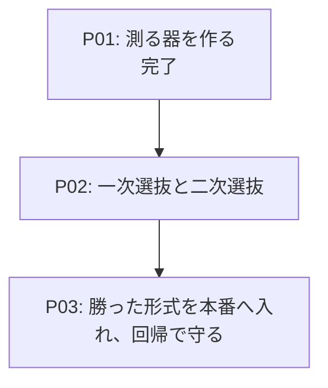

# Roadmap-v03: 改訂（revise）を、弱いモデルでも成立する形にする

## Concept

原文が変わったときの翻訳（revise）は、いま **AI に「独自形式のパッチ」を「JSON の文字列フィールドに詰めて」
返させている**。パッチの形は `=`（文脈行）/ `-`（削除）/ `+`（追加）のプレフィックス方式で、指示文自身が
"It is NOT a standard unified diff" と断っているとおり **mdait 独自**であり、どのモデルも訓練で見たことがない。
しかもその形式は「前回訳文から3行を逐語で写す」ことを要求する。長距離の逐語コピーは、非力なモデルが最も
苦手とする操作である。**未知の形式で、最も苦手な操作を要求している。**

実際、ローカル LLM（llama.cpp の OpenAI 互換の口）へ繋ぐと、改訂がまともにできない文が出た。ただしこのとき
何が起きていたのかは分かっていない。**「指示文の文面が下手」「形式が難しい」「構造化出力を使っていない」の
3つが混ざったまま**で、切り分ける手段が無いからである。事実として `openai-provider.ts` は `response_format` を
一度も送っていない（JSON モードも json_schema も未使用）。

そして計測の土台が無い。`lab prompt` は未実装で、指示文を変えても良くなったか悪くなったかを言う手段が無かった。
録音による回帰（`lab regress`、CI 常時）は新規翻訳の12往復だけで、**改訂の往復が1件も入っていない**。
つまり `trans.revisePatch` を丸ごと書き換えても CI は緑のまま通る。**いま最も危険な場所に、最も守りが薄い。**

このロードマップを終えたとき、次の3つが揃っている。

**測れる。** `lab bench-revise` が、同じケース集合を出力形式ごとに投げ、`transport → envelope → format →
apply → health` の5段で成否を数える。判定はすべて決定的で、正解データ（ゴールデン）を要らない。行き先は
`--base-url` で差し替えられるので、**同じ表が手元の llama.cpp でも出る**。

**壊れたことに気づける。** 判定は「パッチが当たったか」で止めない。当てはめ器はわざと寛容なので
（プレフィックスの無い行を文脈行として受け入れ、アンカーだけで位置を決める戦略まで持つ）、**出鱈目なパッチでも
「当たって」しまい、訳文が壊れた形で保存されうる**。適用成功率だけを見ると、原稿を壊す候補が満点になる。
だから `health`（フェンスの釣り合い・見出し数・原文言語の混入・編集範囲の局所性）を別の段として数える。

**選び直せる。** 出力形式は6つの候補として台に載っている。いまの形（`current`）、封筒だけ外したもの（`plain`）、
標準 unified diff（`udiff`）、SEARCH/REPLACE ブロック（`searchreplace`）、**逐語コピーを一切要求しない行番号方式**
（`linenum`）、封筒の効き目だけを測る対照（`udiff-json`）。どれを本番に採るかは**測ってから決める**。

スコープ外: 訳文の品質（訳として良いか）は測らない。正解が一意でないので機械判定が機能せず、LLM 採点は
判定者のブレが改稿の効果より大きくなる。ここで最適化するのは**プロトコルの頑健性**だけである。

未決事項: パッチ形式を最終的にどれにするかは P2 の結果が出るまで決めない。フォールバックの段
（当たらなかったときに、より簡単な形式で1回だけ聞き直す）を実装するかも P2 の数字次第で決める。

## 計測の限界（先に明示する）

**構造化出力（`response_format`）の効果は、この開発環境では測れない。** lab の `agent` モードは shim が受けた
要求を `claude -p` へ投げ直す仕組みで、`claude` は OpenAI 互換ではないため `response_format` は捨てられる。
強い指示文で代用すると「文法で縛る」のとは別物を測ることになるので、代用しない。**構造化出力の絶対的な効果は
llama.cpp / Ollama / OpenAI を直接指したときにしか確かめられない**（`--base-url` で指せる）。

**Claude のはしごで測れるのは相対値である。** `haiku` を最弱の段に置くが、これは 7B 級のローカルモデルの
代役ではない。「候補 X が候補 Y より落ちにくい」を言うためのもので、「あなたの 7B で通る」は言えない。
絶対値は手元の口を指して測る。**強いモデルに非力を演じさせることはしない** — 「弱いモデルはこう壊れるはず」
という仮説を台本に書き、それが再現されたのを見て仮説を確認することになり、新しい事実が1つも出ないため。

代わりに難度は**要求の重さ**で刻む。ケースは `markdown-prefix`（`-`/`+` で始まる行）・`code-block`（原文側は
目印に畳まれ訳文側は実物のまま、という非対称）・`long-context`（逐語コピーの負荷）・`multi-hunk`（離れた
2か所）の4軸で重くしてある。非力さの正体は能力の絶対値ではなく**要求の重さに対する余力の無さ**なので、
要求を重くすれば強いモデルでも同じ形で崩れる。

## Map



## Phases

### P01: 測る器を作る ※完了

**Why**
候補を絞るより先に、絞るための数字が要る。ここが無いまま指示文を触ると、良くなったか悪くなったかを
言えないまま変更が積み上がる。

**WHAT**
`lab bench-revise` を作る。mdait を丸ごと走らせるのではなく、**本番の関数をそのまま呼ぶ薄いベンチ**にする
（`protectCodeBlocks` / `createUnifiedDiff` / `buildUserMessage` / `extractJsonFromResponse` /
`detectJsonInContent` / `applySimplePatch`）。置き換えるのはファイルの読み書きと VS Code だけで、偽物は
1つも挟まない。ケース6件、候補6件、判定5段、健全性7項目。行き先は `--base-url` で差し替えられる。

**Steps**
- [x] `scripts/lab/scenarios/revise-cases.mjs` — 6ケース（原文の旧版・新版・前回訳文の3つ組）。難度は要求の重さで刻む
- [x] `scripts/lab/scenarios/revise-variants.mjs` — 6候補。形式以外の文面は全候補で同一にし、`current` は本番の現物を使う
- [x] `scripts/lab/scenarios/bench-revise.mjs` — 依頼の組み立て・HTTP・5段の判定・健全性・表
- [x] `lab bench-revise` プリセットと `--agent-model` の配線（lab のセッションには触らず、受け皿だけ立てて必ず落とす）
- [x] `--self-test` — LLM を1回も呼ばずに判定の筋道を確かめる（21件）
- [x] 送る指示文が本番と1バイトも違わないことを、`PromptProvider` と突き合わせて自動で確かめる

**Gates**
- [x] `node scripts/lab/lab.mjs bench-revise --self-test` がすべて通る（21件）
- [x] 「当てはめには通るが全文を書き直した」答えが `health` で落ちることを、作り物の答えで確かめてある
- [x] `npm test` が緑（1878 + 39 passing）

### P02: 一次選抜と二次選抜

**Why**
候補を広く載せるのは安い（テンプレート1つと小さな関数1つ）が、実装は高い。**測ってから1つだけ実装する**
ことで、波及を最小にしたまま当たりを大きくできる。

**WHAT**
一次は 6ケース × 6候補 × haiku × 1回 = **36往復**。明らかに劣る候補を落とす。表を出して**いったん止まり**、
残す候補を人が決める。二次は残った2〜3候補を 6ケース × 2モデル（haiku / sonnet）× 3回で詰める。
LLM は非決定的なので、接戦の判定には反復が要る（一次は粗い篩なので1回でよい）。

**Steps**
- [x] 一次選抜を走らせ、候補ごとの成立数と落ちた段の内訳を出す（36往復・haiku・2026-09-01）
- [x] 易しい段が天井に張り付いたので、重い段（C7〜C12）を足して測り直す（さらに36往復）
- [x] ケース設計そのものの妥当性を機械で確かめる仕掛けを入れる（空振りする目安を2件検出した）
- [ ] 表を見て、二次へ進める候補を決める（**ここは人の判断を挟む。実費ではなく利用枠を使うため**）
- [ ] 二次選抜（反復あり）を走らせ、勝った形式を決める
- [ ] 手元の llama.cpp を `--base-url` で指し、絶対値を確かめる（構造化出力の有無も含めて）
- [ ] 結果を ADR に記録する（形式の決定は**測ってから**書く）

**Gates**
- [ ] 勝った形式が、6ケースすべてで `health` まで通る
- [ ] 落ちた場合の理由が段ごとに説明できる（「なんとなく良い」で選ばない）

#### 一次選抜の結果（2026-09-01・haiku・36往復）

**成功率では差が出なかった。** 35/36 が成立し、天井に張り付いた。落ちたのは `plain` の C5（`anchor-not-found`）
1件だけ。**この段のケースは haiku には易しすぎる**、というのが第一の事実である。「haiku なら壊れる」という
見込みは外れた（コードフェンスの1件だけを根拠にしたのが甘かった）。

**一方、閾値の下でははっきり差が出た。** 生の答えを数え直して得た事実:

| 候補 | フェンスで包んだ | 応答の文字数（中央値） | 所要（中央値） |
|---|---|---|---|
| `current`（JSON） | **6/6** | 959 | 51.5s |
| `udiff-json`（JSON） | **6/6** | 834 | 57.4s |
| `plain` | 0/6 | 879 | 37.7s |
| `udiff` | 0/6 | 687 | 52.7s |
| `searchreplace` | 0/6 | 352 | 10.3s |
| `linenum` | 0/6 | **314** | **8.5s** |

読み取れること3つ。

1. **JSON の封筒は、指示に反したフェンス包みを 100% 引き起こす。** 指示文は "Do NOT include markdown
   code blocks" と書いてあるのに、JSON を求めた2候補は6件中6件が ``` で包んで返した。素のテキストを
   求めた4候補は0件。いまは `extractJsonFromResponse` が救っているが、**救い手が要る状態**であり、
   中身の JSON も崩す相手には失敗が2段重なる。
2. **逐語コピーを要求しない形式は、出力が3分の1・時間が5分の1になる。** `linenum` 314文字/8.5秒に対し
   `current` 959文字/51.5秒。出力量は非力なモデルが崩れる場所そのもの（打ち切りもここで起きる）。
3. **プレフィックス形式には「`=` の後ろに空白を入れてしまう」罠がある。** 12件中3件（25%）で発生。
   標準 unified diff の文脈行が空白始まりなので、既知の形式に引きずられる。散発なら適用器の寛容さが
   吸収するが（C6: 13本中2本で通過）、固まると落ちる（C5: 9本中6本 → `anchor-not-found`）。
   **唯一の失敗はこれが原因だった。**

#### 重い段の結果（2026-09-01・haiku・36往復）

易しい段が天井に張り付いたので、**当て推量ではなく一次で見えた3つの壊れ方を狙って**重い段（C7〜C12）を
足した — 表の似た行（`near-duplicate`）、長いユニット（`volume`）、引用符とバックスラッシュ（`escaping`）、
4か所の変更、入れ子と水平線、コードブロック2つ。易しい段は残したので勾配が読める。

**それでも天井は破れなかった。** 35/36 が成立。ただし落ちた1件は易しい段とは別の候補・別の機序だった。

| 候補 | easy | hard | 合計 |
|---|---|---|---|
| `current`（JSON＋プレフィックス） | 6/6 | **5/6** | 11/12 |
| `plain`（プレフィックス） | **5/6** | 6/6 | 11/12 |
| `udiff` / `searchreplace` / `linenum` / `udiff-json` | 6/6 | 6/6 | **12/12** |

**72試行のうち失敗は2件で、どちらもプレフィックス形式だった。** 他の4形式は無傷。統計としては弱いが、
2件とも機序が特定できている点が効く。

- easy/C5（`plain`）… `=` の後ろに空白を入れた。標準 unified diff の文脈行が空白始まりなので引きずられる
- hard/C9（`current`）… 文脈行の逐語コピーで**閉じ引用符が1つ落ちた**
  （写したもの: `` `^\[ERROR\]\s+"(?<msg>[^"]+)` `` ／ 本物: `` `^\[ERROR\]\s+"(?<msg>[^"]+)"` ``）。
  **JSON のエスケープ負荷が逐語コピーを壊した。** 同じ形式でも封筒の無い `plain` は C9 を通している

閾値の下の差は重い段でさらに開いた。

| 候補 | フェンス包み（easy/hard） | 文字数（easy → hard） | 所要（easy → hard） |
|---|---|---|---|
| `current` | 6/6・6/6 | 959 → 884 | 51s → **86s** |
| `linenum` | 0/6・0/6 | 314 → **195** | 8s → **10s** |

重い段で `current` は 86 秒・884文字、`linenum` は 10 秒・195文字。**出力量で4.5倍、時間で8倍の開き**。
JSON を求めた2候補は**両方の段で 12/12 すべてフェンスに包んで返した**（指示文は明示的に禁じている）。

**走行中に見つけたベンチ自身のバグ2つ**（どちらも修正済み・回帰を固定）:
`diff` の `applyPatch` は「読めない diff」を `false` ではなく**例外**で知らせる（"Hunk at line 7 contained
invalid line"）。捕まえ損ねて29/36で走行ごと落ち、36往復分の枠が消えた。**壊れた答えはベンチにとって
観測対象であって異常事態ではない**ので、judge と worker の両方で1マスの失敗に閉じ込めるようにした。

### P03: 勝った形式を本番へ入れ、回帰で守る

**Why**
改訂は回帰保護がゼロの状態にある。形式を変える前に現状を録音で固定しないと、何が変わったのかを説明できない。

**WHAT**
勝った形式を `trans.revisePatch` と `trans.revisePatchPlain` に入れ、パッチ適用器を対応させる。
改訂の往復を録音して `lab regress` に足し、CI で守る。

**Steps**
- [ ] 改訂の往復を録音し、`lab regress` に足す（**形式を変える前に、現状の姿を先に固定する**）
- [ ] 勝った形式を本番のテンプレートへ入れる
- [ ] パッチ適用器を対応させる。**形式を推測させない** — どの形式を要求したかを引数で受け取り、その形式としてのみ読む
- [ ] カスタムプロンプト上書き（`.mdait/prompts/revise-patch.txt`、`docs/design/prompt.md` の公開機能）の後方互換を保つ
- [ ] P02 で「当たったが壊れた」が実際に見つかっていれば、根本修正と単体回帰テストを `src/test/unit/` に固定する
- [ ] フォールバックの段（より簡単な形式で1回だけ聞き直す）を、P02 の数字が要求するときだけ足す
- [ ] `docs/design/prompt.md` の `trans.revisePatch` の節を更新する

**Gates**
- [ ] `npm test` と `lab sweep` と `lab regress` がすべて緑
- [ ] 録音を録り直した場合、**何が変わったのかを説明できる**（黙って上書きしない）
- [ ] 全文再翻訳への自動落下を足していない（手修正を消す道を作らない）

## Gates

- [ ] 改訂の成立率が、勝った形式で `current` を上回ることを数字で示せる
- [ ] 同じベンチが `--base-url` で手元の llama.cpp を指して動く
- [ ] 改訂の往復が `lab regress` に入り、指示文を1文字変えれば CI が落ちる
- [ ] 訳文を守る仕組み（パッチ失敗時の据え置き）を弱めていない

## Notes

### 適用器の寛容さは両刃である

`applySimplePatch` は3つの戦略を持つ。Strategy 1（文脈＋削除行の精密一致）、Strategy 1b（挿入のみ）、
Strategy 2（**前後のアンカーだけで位置を決め、その間を丸ごと置換**）。さらにパーサーは**プレフィックスの
無い行を黙って文脈行として扱う**。この寛容さは「弱いモデルでも当たる」ために入っているが、裏返すと
**出鱈目なパッチが `ok: true` で当たる**。P01 の `health` 判定はこれを数字で捕まえるために置いた。

この寛容さは、形式を増やすときの落とし穴でもある。標準 unified diff を流し込むと、先頭が半角空白の文脈行は
プレフィックス無しと見なされ、`@@` ヘッダは文脈行になり、`---`/`+++` は削除行と追加行になる。**「読めてしまう」
が正しいとは限らない。** だから P03 で形式を推測させない。

### 文書の食い違いを1つ直した

`AGENTS.md` は `npm run test:byok:e2e` を「手動実行、CI対象外」と書いていたが、`.github/workflows/ci.yml:46`
で実際に走っている。次の人が「壊しても CI は気づかない」と誤解するので、実態に合わせた。

### 参照

- 判定の分け方の決定: `docs/adr.md` の ADR-260901-02
- ベンチの実装: `scripts/lab/scenarios/bench-revise.mjs`（動かし方はファイル先頭のコメント）
- 使い方: `.claude/skills/mdait-lab/` の `mdait-lab` スキル
- 本番の指示文: `src/prompts/defaults.ts` の `DEFAULT_TRANS_REVISE_PATCH`
- 当てはめ器: `src/core/diff/diff-generator.ts`
- 失敗理由の見せ方: `src/commands/shared/guidance.ts` の `describePatchFailure`

## 補足: この計画を決めた質疑（2026-09-01）

10問で可能性空間を絞った。選択と理由を残す。

| # | 問い | 選択 | 理由 |
|---|---|---|---|
| 1 | 誰のための最適化か（ローカルLLM対応 / 訳質 / 頑健性） | **頑健性を先に** | 測れないものは最適化できない。成否が 0/1 で機械判定できる側から入る。容疑者も文面より形式が濃い |
| 2 | 計測台をどこに置くか（実物を走らせる / 薄いベンチ / 単体テスト） | **薄いベンチを lab の下に** | 総当たりが要る仕事で 28秒/件は重い。本番関数を直接呼べば偽物を挟まずに済む（ADR-260823-02 と同じ思想）。入口は1つに保つ |
| 3 | 非力さをどう用意するか（Claudeのはしご / 演じさせる / 入力を重くする） | **はしご ＋ 入力を重く** | 演じさせるのは循環論法（自分の仮説を台本に書いて確認するだけ）。実測で haiku は「フェンスで包むな」に従わず包んだので、最弱の段として使える |
| 4 | 何をもって成功とするか（適用成功率 / ＋健全性 / ＋訳質） | **適用成功率 ＋ 健全性** | 適用だけだと「当たったが壊れた」が満点になる。訳質は正解が一意でないので機械判定が機能しない |
| 5 | 台に載せる候補をどこまで広げるか | **全部載せる（実装は勝った1つだけ）** | 候補を1つ足す費用はほぼゼロ、実装は高い。測る前に絞るのは、この計画が避けようとしていることそのもの |
| 6 | 構造化出力が使える相手をどう見分けるか | **製品は設定で、既定 off。ベンチでは全部試す** | 既定プロバイダ（vscode-lm）には送る口が無いので土台にできない。400 での自動判別は本物の 400 と区別できず推測になる |
| 7 | 当たらなかったときの段を増やすか | **方針は「簡単な形式で1回だけ」。実装可否は数字で** | 形式を変えるだけで解けるなら段は要らない。全文再翻訳への自動落下は、手修正を消す道なので作らない |
| 8 | 回帰保護と後方互換をどこまで | **録音 ＋ 後方互換 ＋ 単体回帰**。適用器に形式を推測させない | 改訂の回帰保護がゼロと判明した。変える前に現状を固定しないと、何が変わったか説明できない |
| 9 | 測る規模と枠の使い方 | **段階選抜。一次の後で人が判断** | 消費するのは従量課金ではなく利用枠で、利用者の他の作業と取り合いになる。一気に焼かない |
| 10 | どこまでやるか | **文書 ＋ ベンチ実装 ＋ 一次選抜** | 文書だけでは次のセッションが同じ議論から始まる。器が最も価値のある成果物 |
