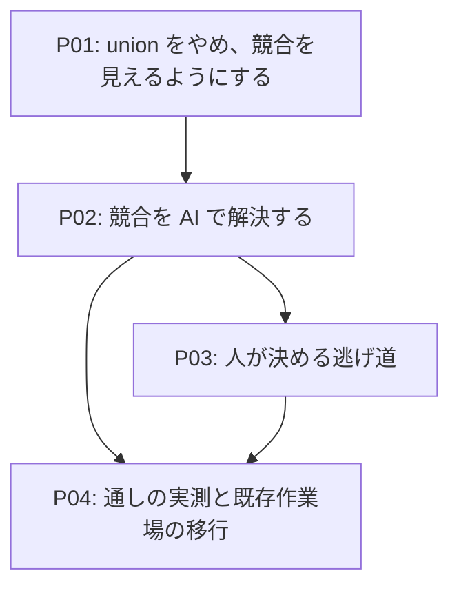

# Roadmap-v04: 合流の競合を、その場で解決できるようにする

## Concept

複数人が同じ翻訳ワークスペースを合流させると、`.mdait` の中で衝突が起きる。同じ語に2人が別の訳語を
足す、同じ原文に別の訳を登録する、同じ席の `from` と `need` が2つ来る。いま結末は2通りある。

git では `.mdait/.gitattributes` の `merge=union` が競合マーカーを消し、**読み込みが先勝ちで片方を捨てる**。
用語集の CSV は跡を1つも残さず（`terms-repository-csv.ts` の畳み込み）、`translations.tmx` はログに1行だけ
書いて次の保存で消す。SVN には union が無いので競合マーカーが残り、TM と用語集は読むのを拒む
（ADR-260908-02）。**片方は黙って失われ、もう片方は手が止まる。** どちらの場合も、人にできるのは
ファイルを手で開いて直すことだけで、mdait は「競合がある」とすら言わない。

このロードマップを終えたとき、こうなっている。

合流したあと VS Code を開くと、ステータスバーに `⚠ 競合の解決 5件` が出る。押すと StatusTree の
「競合の解決」の枝に、衝突している用語・TM のエントリ・`unit-state` の行が1件1行で並ぶ。✨`競合を AI で解決`
を押すと、**AI に問い合わせる前に**「5件を AI に判定させます」の確認が1枚出る（UX-P4 はコストを事前に
見せることを求める）。承認すると AI が**原文の旧版と新版・`from` の対応・TM・用語集**を材料にどちらを
採るかを決め、書き戻す。結果は `.mdait/reports/` のレポートに残る。AI が迷った件はツリーに残り、
行内の `こちらを採る` / `あちらを採る` で人が決める。

**git と SVN で同じ挙動になる。** union に頼るのをやめ、`.mdait/.gitattributes` を撤去するので、
どちらのバージョン管理でも合流の結果は「競合マーカーの入ったファイル」1種類に揃う。しかも diff3 形式の
マーカーは真ん中に共通の祖先を持つので、「どちらが何を変えたか」が材料として手に入る。

代わりに払う代償がある。union が正しく処理していた「2人が別々のエントリを足しただけ」も、同じ挿入位置に
入れば1つの競合ブロックになる（TM の実測で 16/20・18/20 の頻度）。**この形は人に見せない** — 競合ブロックの
中身を鍵（語・tuid・席）で突き合わせ、**片方にしか無い鍵は両方を採る**。決定的に決まるので AI も人も要らない。
人の前に出るのは**同じ鍵に別の値が来たもの**だけである。

スコープ外: 原稿（原文・訳文）そのものの競合は人の仕事で、この機能は扱わない。`mdait.json` の競合も
人が決める。例外は1つ、`unit-state` の解決が embedded でマーカー行の書き換えを要する場合だけ、原稿を
1行触る。台帳（`unit-registry`）は中身が原文の過去の本文なので、衝突したら両方残す — 選択は要らない。

## Map

## Phases

### P01: union をやめ、競合を見えるようにする

**Why**

`merge=union` は「競合を消す代わりに黙って片方を捨てる」取引で、SVN では最初から効かない。頼るのを
やめれば git と SVN が同じ形に揃い、以降の段が扱う入力は1種類になる。そして解決の前に、競合が
あることが見えていなければならない。

**WHAT**

`.gitattributes` を撤去し、`.mdait` の中の未解決の競合を数えてサーフェスに出す。この段では解決しない。

対象は `unit-state`・`unit-registry`・`translations.tmx`・**設定から解決した用語集の実ファイル**の4つ。
用語集は名前を `terms.filename` で変えられ、拡張子で CSV と YAML を選ぶ（`terms-repository.ts`）ので、
`terms.csv` と決め打ちにしない。判定は `hasConflictMarkersInDataFile` を使う（原稿用の
`hasConflictMarkers` はコードブロックを見るので、`.mdait` の中のファイルには当てない）。

あわせて `unit-state` の **合流由来の `held` 行**も未解決として数える。`held` はこれだけではない —
本文から消えた章の状態を預かる正規の種別でもあり（章を消して貼り戻す運用で使う）、そちらを競合として
出すのは誤りである。読み込みが同じ席の重複を降ろしたとき（`seatOnLoad`）に付いた行だけを数えられるよう、
由来を見分ける手立てをこの段で決める。

出し方は `docs/ux.md` §3.3 に従う。**気づきはステータスバーの1行**（`⚠ 競合の解決 N件`、押すとツリーへ）、
**状態と操作は StatusTree**（1件1行。語・原文の先頭・ファイルと席が読める）、**解説は Hover**。
合流のたびにトーストは出さない。

実測台は union を前提に数字を出しているので、この段で測り直す（`merge.mjs` / `merge-extra.mjs`）。

**Steps**
- [ ] `mdait-dir.ts` の `.gitattributes` 自動生成をやめる。既存の作業場からは、**先頭トークンが `unit-state` / `unit-registry` / `translations.tmx` / 用語集のファイル名のいずれかで、指定が `merge=union` の行**を消す（行に出所は書かれていないので、利用者が同じ行を自分で書いていた場合も消える。union を外すのがこの段の目的なので、意図は一致する）。それ以外の行は残し、ファイルが空になったら消す
- [ ] 合流由来の `held` を、本文から消えた章を預かる `held` と見分ける手立てを決める
- [ ] `.mdait` の4ファイルの未解決を数える係を作る（合流由来の `held` を含む）
- [ ] ステータスバーに件数を出し、押すと StatusTree の「競合の解決」の枝へ飛ぶ
- [ ] StatusTree に枝と行を出す。Hover に両側の中身を置く
- [ ] `merge.mjs` / `merge-extra.mjs` を union 無しで測り直し、数字を記録する
- [ ] l10n（`bundle.l10n.json` + `.ja.json`、`package.nls.json` + `.ja.json`）

**Gates**
- [ ] `.mdait/.gitattributes` を持つ既存の作業場を開くと、mdait が書いた行だけが消える（他人が足した行は残る）
- [ ] union 無しの実測で、**ディスク上のバイトが1つも失われない**（合流したファイルを読んで書き戻す経路が無いこと）。競合の件数を数字として記録した
- [ ] 対象ごとの読み込みの振る舞いを、変えずに確かめた — `unit-state` と `unit-registry` は競合マーカーを読み飛ばして読めた行を保持し、`translations.tmx` は `isConflicted` を立てて保存を拒み、用語集は例外を投げる
- [ ] 競合があっても定常 sync の挙動は変わらない（今と同じく見送る）
- [ ] 状態・操作・解説の置き場が §3.3 の表に沿っている

### P02: 競合を AI で解決する

**Why**

主導線は1つに絞る。「合流したら1回押せば片付く」でなければ未解決は溜まり、P01 で見えるようにした
件数がただ増えていく。AI が持ち出せる材料（原文の旧版と新版・`from` の対応・TM・用語集）は人が手で
集められないもので、ここがこの機能の値打ちである。

**WHAT**

✨`競合を AI で解決` コマンドを作る。**AI に問い合わせる前に**確認ダイアログを1枚出す（対象件数・
概算のコスト・何を書くか・取り消せるか）。件数は P01 が数えた未解決から出せる。UX-P4 が求めるのは
コストの事前提示なので、判定が終わってから確認を出す形にはしない。結果は `.mdait/reports/` へ書いて
通知のボタンから開く（`report-file.ts` 経由）。骨格は `commands/ai-review/` と揃える。

**この経路だけが競合マーカーの入ったファイルを読める。** 通常の読み込みは今のまま拒む
（ADR-260906-04 と ADR-260908-02 の線は動かさない）。両側と、diff3 形式なら共通の祖先を切り出す係を作る。

**ガードを越える境界を、対象ごとに決める。** `TmxStore.save()` は競合を検知した状態では保存を拒み、
用語集の読み込みは競合マーカーを見つけると例外を投げる。解決の経路が通常の load / save をそのまま
呼べば必ず止まるので、**それぞれのクラスの中に解決専用の入口**（競合ブロックを解いた結果を受け取って
書き出すもの）を足す。クラスの外に別の書き出しを作らない — 原子的な書き込みと排他はそこにしかない。

切り分けは2段になる。**鍵で突き合わせて片方にしか無い鍵は両方を採る**（決定的。AI も人も通さない）。
**同じ鍵に別の値が来たものだけ**が判定の対象になる。

AI へ渡す材料は、衝突している2つの値、共通の祖先（あれば）、原文の旧版（`unit-registry` の控え）と
新版、`from` の対応、TM の近い訳、用語集。返すのは「どちらを採るか」と理由1行。

書き戻し先は4つある。`unit-state` は `commands/markers/unit-mutation.ts`（embedded ではここで原稿の
マーカー行も直る）、`unit-registry` は `UnitRegistryManager`（保存は `persistStore`）、TM は `TmxStore`、
用語集は `TermsRepository`（CSV / YAML の実装を設定から選ぶ）。新しい書き込み経路は作らない。

AI が迷った件と、API キーが無い場合は**書かずに残す**。残った件数はレポートとツリーに出る。

**Steps**
- [ ] 競合マーカーの入ったファイルから両側と共通の祖先を切り出す係
- [ ] 鍵で突き合わせ、片方にしか無い鍵を両方採る決定的なマージ（AI を通さない）
- [ ] 判定の語彙と応答の形式を決める（`ai-review` の `verdict` とは別物。同じ鍵の二択が土台で、`merged`（両方を合わせた新しい値）を許すかは実行時に決める）
- [ ] 対象4種それぞれの解決専用の入口（既存クラスの中に足す）
- [ ] 指示文（`src/prompts/`）と応答の検証
- [ ] ✨コマンド・確認ダイアログ・レポート・通知ボタン
- [ ] 書き戻しを4種の対象それぞれの入口へ繋ぐ（`unit-registry` は `UnitRegistryManager`）
- [ ] l10n

**Gates**
- [ ] 定常 sync（`autoSyncOnSave` 含む）は1行も AI を呼ばない（ADR-260705-01）
- [ ] 確認ダイアログを閉じたら1バイトも書かれず、AI への問い合わせも起きない（コストは事前に見える）
- [ ] 別々の鍵の追加が1つの競合ブロックに入っても、どちらも失われない
- [ ] 迷った件・API キーが無い場合は書かず、件数が残る
- [ ] 録音の再生（`npm run test:byok:e2e`）に競合解決の往復を足した
- [ ] embedded で `unit-state` を解いたとき、原稿のマーカー行が `unit-mutation.ts` 経由で直る

### P03: 人が決める逃げ道

**Why**

採否は人の宣言である（`docs/ux.md` §3.3「機械が判定できないことを機械が決めない」）。AI が迷った件と、
AI を使わない人の道が要る。ここが無いと、P02 で残った件を誰も片付けられない。

**WHAT**

StatusTree の行内に `こちらを採る` / `あちらを採る` を置く。Hover には両側の全文と、AI が付けた理由を出す。
AI を呼ばないので ✨ は付けない。

合流由来の `held` 行の照合もこの段に入れる。これは訳の良し悪しではなく事実の照合で、原稿のハッシュと
突き合わせれば決定的に決まる — 一致する側を席へ戻し、一致しなければ人に選ばせる。本文から消えた章を
預かる `held`（正規の用途）には触らない。

**Steps**
- [ ] ツリー行内の操作2つと Hover
- [ ] 合流由来の `held` 行の決定的な照合
- [ ] l10n

**Gates**
- [ ] API キーが無い状態で、全件を人が解決できる
- [ ] ✨ が付いていない操作が AI を呼ばない（UX-P4 の逆向き）

### P04: 通しの実測と既存作業場の移行

**Why**

union を外したのだから、外した世界で通しで測らないと「直った」と言えない。既存の作業場には
`.gitattributes` と溜まった合流由来の `held` 行があり、そこを通る道も測る対象である。

**WHAT**

`scripts/lab/scenarios/` に「合流 → 競合の解決 → 消失 0」を通す台を足す。git と diff3（SVN 相当）の
両方で走らせ、3人以上の順次合流も通す。既存作業場を開いたときの移行（`.gitattributes` の掃除、溜まった
合流由来の `held` 行の解消）を確認する。`docs/design/merge-resilience.md` の数字を、union 無しの実測で置き換える。

**Steps**
- [ ] 通しの台（競合を作る → 解決コマンド → 消失と増殖を数える）
- [ ] git と diff3 の両方で走らせる
- [ ] 既存作業場からの移行を通す
- [ ] `merge-resilience.md` の数字と結論を更新する

**Gates**
- [ ] 全台で消失 0・増殖 0（別々の鍵が1つの競合ブロックに入った形を必ず含める）
- [ ] SVN 相当（diff3）で git と同じ結果になる

## Gates

- [ ] git と SVN 相当の両方で、`.mdait` の競合をファイルを手で開かずに解決できる
- [ ] 黙って片方が消える経路が1つも残っていない（用語集 CSV の先勝ち畳み、`translations.tmx` のログだけ、の両方が無くなった）
- [ ] `npm test` / `npm run bundle` / `npm run test:explore` / `npm run test:byok:e2e` が通る
- [ ] `docs/design/merge-resilience.md` の結論が union 無しの実測で書き換わっている

## Notes

- **frontmatter のキーごと分割**（`docs/design/merge-resilience.md`「残っている対策案」1）とは、`unit-state` の
  形式と StatusTree で触る場所が重なる。どちらを先にやるかは P01 が終わった時点で決め直す。
- **台帳の掃除の、未合流の枝への効き目**はこのロードマップでは解けない（控えはハッシュしか鍵に持たず、
  同じファイルの過去の版を区別できない）。同名の課題として `merge-resilience.md` に残す。
- `1 TU = 1 行`（ADR-260908-01）は union のための工夫だったが残す。行単位のほうが競合の範囲が小さく、
  両側を切り出しやすい。
- [TODO] 実行時見直し：AI の判定語彙と、`merged`（同じ鍵の両方を合わせた新しい値）を許すかどうか
- [TODO] 実行時見直し：合流由来の `held` 行を同じ枝に混ぜたときの件数。実運用で多すぎるなら別の枝へ分ける

## 補足: 策定時の議論（2026-09-11）

このロードマップは `grill-x` の5問で方針を詰めて起こした。論点と結論を残す。

**1. 対象はどこか。** 当初は「原稿の競合を AI で解く」を想定していた。→ **`.mdait` の中に絞る。**
原稿はユーザーの領域で、競合の解決は原則としてユーザーの仕事である。`.mdait` を解いた余波として原稿の
編集が必要な場合だけ、原稿を触る。

**2. 機能の中身は「AI が解く」か「黙って消えているものを見せる」か。** 選択肢は (A) AI で訳を選ぶ機能に
絞る / (B) 合流の後始末という入口を1つ作り、中で仕事を割る / (C) まず見える化だけ。→ **(B)。** いま
一番損をしているのは AI が無いことではなく、消えたことに気づけないことだから、器（見える化と人の選択）
が本体で AI はその上に載る層になる。`mdait.json` は人が設定するものなので対象外とした。

**3. 「両側を拾う」をどこでやるか。** 選択肢は (A) `unit-state` と同じ3点セット（マーカーを読み飛ばす・
捨てずに保留へ・値で決める）を TM と用語集にも入れる / (B) 現状維持で後始末コマンドが解く / (C) 解決
コマンドの中でだけ両側を読む。→ **(C)。** 競合マーカーのある状態はエラー状態であり、止まってよい。
早急に解決すべきもので、その解決こそこの機能である。あわせて **SVN でも確実に動くこと**が要件になった。

**4. 出口はどのサーフェスか。** 選択肢は (a) ツリーで1件ずつ / (b) 専用ビュー / (c) コマンド1本＋確認
ダイアログ / (d) (a) を土台に (c) を足す。→ **(d)**、名前は**「競合の解決」**。ただし主導線は
**✨ 一発で AI が解決するところまで**とし、個別の選択はその逃げ道に置く。段の順序も P02 を AI の一発、
P03 を逃げ道に組み替えた。

**5. union をどうするか。** `.gitattributes` は紛らわしいので**撤去し、union は想定から外す**。これで
git と SVN の入力が「競合マーカーの入ったファイル」1種類に揃い、git 固有の「マーカーが無いのに同じ鍵が
二重」という形が消える。

文書化までを今回の範囲とし、実装は次のセッション以降とした。理由は2つ。`.gitattributes` の撤去は
`unit-state` の合流の姿を変えるので、実測台を先に直す必要がある。そして frontmatter のキーごと分割と
触る場所が重なるので、順序を先に決める必要がある。
