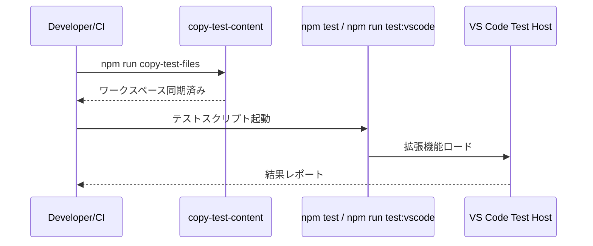

# テスト層設計

> **上位設計**: [architecture.md](architecture.md) P5「Core層：翻訳ドメインの心臓部」（純粋関数によるテスト容易性）

## このドキュメントの責務

テスト層は、コアロジックの信頼性とVS Code統合の動作確認を両立させ、継続的なリリースを支えます。サンプルコンテンツを使ったリグレッションチェックで翻訳差分を再現性高く検証します。

---

## テスト戦略

### 単体テスト (`src/test/`)

**対象**: Core層の純粋な関数（正規化、ハッシュ計算、SectionMatcherなど）

**スタイル**: `suite`/`test`のTDDスタイル

**実行**: CIで常時実行（`npm run test`）

**設計意図**: Core層をVS Code APIから独立させているため、ロジックの単体テストが容易です（[architecture.md](architecture.md) P5参照）。副作用のない処理を中心に、入出力の正確性を検証します。

### GUI/統合テスト (`src/test-gui/`)

**対象**: コマンド、StatusTreeProviderなどのVS Code統合部分

**実行**: VS Code Test Runnerを使用し、E2Eを検証（`npm run test:vscode`）

**頻度**: 手動実行（CI統合は将来検討）

**設計意図**: VS Code環境でのみ発生するバグ（UI更新、コマンド実行フロー等）を検出します。

### サンプルワークスペース

**場所**: `src/test/sample-content/`

**セットアップ**: `copy-test-files`スクリプトで`sample-content`から`workspace/content`へ同期

**更新**: テストケース追加時は`sample-content`を更新

**設計意図**: テスト前の初期状態を保証し、リグレッションチェックの再現性を担保します。

---

## 実行シーケンス



---

## テスト実践のプラクティス

### テスト名は日本語で期待値を明示

```typescript
test("正規化後のハッシュは常に同じ値を返す", () => { ... });
```

**理由**: テスト失敗時に、何が期待されていたかが一目で分かります。

### VS Code依存のテストは`this.timeout()`を調整

```typescript
test("syncコマンドは全ファイルを同期する", function() {
  this.timeout(10000); // 10秒
  ...
});
```

**理由**: 環境差によるタイムアウトを防ぎます。

### 大規模入力の回帰は`sample-content`を更新

新しいエッジケースを発見したら、`sample-content`にテストケースを追加します。

**理由**: リグレッションテストでカバレッジを確保します。

---

## 参照

- スクリプト: `package.json`
- コマンド挙動: [commands.md](commands.md)
- UI検証: [ui.md](ui.md)