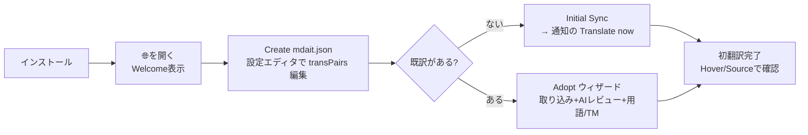
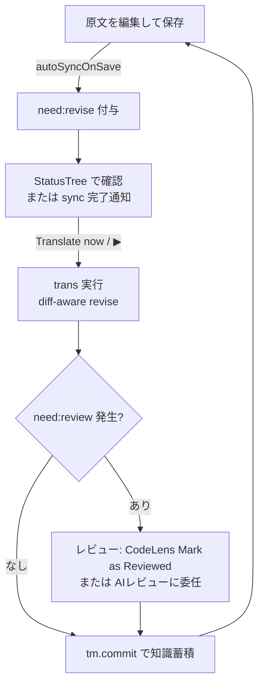

# mdait UX設計書 — 人間とエージェントの体験全体像

> mdait の**ユーザー体験（UX）全体を俯瞰する基準ドキュメント**である。人間（翻訳運用者）と AI エージェントという2種類のユーザーのジャーニー・接点・状態可視化・体験原則をここに集約する。個々の UI 部品の設計は [design/ui.md](design/ui.md)、エージェント・オーケストレーションの設計とロードマップは [design/agent-orchestration.md](design/agent-orchestration.md)、アーキテクチャ原則は [design.md](design.md) を参照。UX に関わる機能追加・変更時は必ず本ドキュメントとの整合を確認すること。
>
> 調査基準日: 2026-07-12（コミット 949c309 時点の全数調査に基づく。§7 の課題台帳に同日の改修結果を反映済み。同日中に UX-R1（ADR-260712-03）も実装しB-1〜B-3を解消）
>
> 追記 2026-07-24: 要対応ノードの同期不整合の調査により B-5〜B-8 / C-5〜C-7 を追加し、UX-R4（ADR-260724-01）として解消した。これらは全数調査ではなく個別調査に基づく。
>
> 追記 2026-07-31: 「宣言と実体の齟齬」の全体調査（ADR-260731-01）により E-8〜E-10 を追加し、同日解消した。

---

## 1. mdait の UX が満たすべきこと

mdait は「継続的な多言語文書管理」のツールである。翻訳は一度きりではなく、原文の更新・用語の統一・レビュー・知識蓄積が絡み合う**運用**であり、UX の主語は「1回の翻訳操作」ではなく「終わりのない運用ループ」である。

このループには2種類の従事者がいる:

| ユーザー | 特徴 | 主な接点 |
|---|---|---|
| **人間（翻訳運用者）** | 文書オーナー・技術ライター。判断（レビュー承認・削除確認・用語採否）の最終責任者。VS Code 上で作業する | StatusTree・CodeLens・Hover・通知・設定エディタ |
| **AIエージェント** | Copilot Chat 等。観測→行動ループでサイト全体の翻訳・用語集・TM 構築を代行する。判断を委任されることもある | LM Tools（JSONエンベロープ）・エージェントプレイブック |

両者は同じ状態（マーカー・needフラグ）を別のサーフェスから観測する。**「人間にできて機械にできない操作」「機械には見えるが人間には見えない状態」を作らない**ことが mdait の UX の根幹である。

---

## 2. UX原則

アーキテクチャ原則（P1〜P9、[design.md](design.md)）から導かれる体験側の原則。番号は UX-P 系で振る。

- **UX-P1: 状態はすべて観測可能** — need フラグ・翻訳率・違反は、人間には StatusTree/CodeLens/Hover で、エージェントには `mdait_getStatus`/`mdait_validate` で、常に同じ真実（マーカー）から観測できる。片方のサーフェスにしか出ない状態を作らない。
- **UX-P2: 判断は委ねる、決めつけない** — 構造不一致・削除・孤立などの曖昧ケースは `need:review`/`need:verify-deletion` として人間（または委任されたエージェント）の判断に倒す。そして**判断を求めるなら、判断を実行する操作手段を同じ場所に用意する**（判断サーフェスの原則）。
- **UX-P3: いつでも復帰できる安心感** — 全コマンド冪等・`sync` でどんな状態からも復帰・git フレンドリー。ユーザーが「壊したかも」と感じたときの答えは常に「sync して観測し直す」で済むこと。
- **UX-P4: AI は明示起動・コストは事前に見える** — ✨表記・確認UI・対象件数の事前提示（ADR-260705-01）。承認回数の削減はスコープの拡大（ディレクトリ単位1回）で行い、承認の省略では行わない。
- **UX-P5: VS Code 標準パターン準拠**（= P6）— 学習コストを VS Code の既存知識に載せる。例外（設定エディタ Webview）は ADR で明示する。
- **UX-P6: 工程は途切れず手渡す** — 運用ループ（sync→trans→review→tm.commit）の各工程完了時に、次工程への導線（通知ボタン・nextActions）を提示する。ユーザーが「次に何をすべきか」を思い出す必要をなくす。
- **UX-P7: デッドエンドを置かない** — 押せるのに何も起こらない・エラーだけ出るボタンやコマンドを置かない。実行できない操作はサーフェスに出さない（contextValue / when 句 / パレット非表示で制御）。
- **UX-P8: サーフェスごとに載せてよいものが決まっている** — 操作・状態・解説を混ぜない。CodeLens は操作、Decoration は状態、Hover は解説。§3.3 のデザイン言語を UX 変更のたびに参照する。

---

## 3. 接点マップ（全サーフェス一覧）

### 3.1 人間の接点

| サーフェス | 提供するもの | 主な設計ドキュメント |
|---|---|---|
| **StatusTree**（アクティビティバー🌐） | ディレクトリ/ファイル/ユニットの翻訳状態と行内アクション（▶翻訳・用語・TM・AIレビュー）。運用のホーム画面 | [design/ui.md](design/ui.md) |
| **Welcome View** | 未設定時: mdait.json 作成/選択/診断。未同期時: 「Initial Sync / Adopt」の2択導線 | [design/ui.md](design/ui.md)、ADR-260711-06 |
| **CodeLens**（マーカー行） | ユニット単位の翻訳・原文/訳文ジャンプ・need解決（Mark as …）・「その他」メニュー（isolate宣言・note編集。訳文/原文両対応） | [design/ui.md](design/ui.md) |
| **Hover / Decoration** | 翻訳結果サマリ・用語候補・TM参照・レビュー状態のインライン確認 | [design/ui.md](design/ui.md) |
| **通知・進捗・確認UI** | withProgress（キャンセル対応）、完了通知＋次アクションボタン、破壊的操作の modal 確認 | 本書 §7・[design/ui.md](design/ui.md) |
| **設定エディタ**（mdait.json Webview） | スキーマ駆動の設定GUI。JSON⇔UI をタブ内切替 | ADR-260711-01/02 |
| **セットアップ診断** | 設定・ディレクトリ・AI・キーの一括点検と修復導線 | ADR-260629-01 |
| **コマンドパレット** | スタンドアロンで動作するコマンドのみを露出（アイテム引数必須のものは非表示） | 本書 §7 C-2 |

### 3.2 エージェントの接点

| サーフェス | 提供するもの | 主な設計ドキュメント |
|---|---|---|
| **LM Tools（9種）** | `mdait_getStatus` / `mdait_sync` / `mdait_translate` / `mdait_term` / `mdait_tm` / `mdait_validate` / `mdait_aiReview` / `mdait_adopt` / `mdait_resolve`。共通JSONエンベロープ（`schemaVersion/ok/summary/data/nextActions`） | [design/tools.md](design/tools.md)、[design/agent-orchestration.md](design/agent-orchestration.md) |
| **エージェント・プレイブック** | S1（新規翻訳）/S2（既存対訳取り込み）の手順・ゴール判定・リカバリ・禁止事項 | [guide-developer.md](guide-developer.md) |
| **nextActions** | 各ツール出力に含まれる次アクション提案。状態→推奨アクションの誘導装置 | [design/tools.md](design/tools.md) |
| **debug IPC** | 開発/E2E 検証用のファイルベースIPC（`MDAIT_DEBUG_IPC`）。全 `mdait.*` コマンドを機械実行 | `.github/skills/debug-ipc/` |

---

### 3.3 サーフェスの役割分担（デザイン言語）

**UX に関わる変更を入れる前に必ずここを見る。** 「どこに出すか」を都度考えると、置きやすい場所に置いてしまう（実例: 手入力ユーザー向けの解説を CodeLens に置き、コマンドの列に文章が混ざった）。サーフェスごとに**載せてよいもの**を先に決めておく。

| サーフェス | 載せてよいもの | 載せてはいけないもの |
|---|---|---|
| **StatusTree** | いま何がどの状態か（全体の俯瞰）、その項目に対する操作 | 長い説明文。1行に収まらない情報 |
| **CodeLens**（マーカー行の上） | **押せるコマンドだけ**。ラベルは動詞で始める短い操作名 | 解説・状態表示・押せない文章 |
| **Decoration**（ユニット右のインライン薄字） | そのユニットの**状態を一言で**（`翻訳完了 : 1.2秒` / `未完了`） | 操作。長文。折り返すほどの情報 |
| **Hover**（マーカー行にマウスを乗せる） | **解説はすべてここ**。なぜこの状態なのか、次に何をすればよいか、統計・用語候補・TM 参照・note | 状態の一次表示（気づけないため。必ず Decoration か Tree に出したうえで詳細をここに置く） |
| **通知（トースト）** | 実行の結果と、結果に対する次の一手のボタン | 常時見せたい情報。操作の説明 |
| **確認ダイアログ（modal）** | これから起きること・対象件数・取り消せるかどうか | 選択肢の説明以外の解説 |
| **Welcome View** | いま押すべきものを**1つ**。他は文中のリンクに降ろす | 同じ見た目のボタンを並べること |
| **設定エディタ** | 設定項目とその説明 | 実行操作 |

#### 決め方の順序

1. **これは操作か、状態か、解説か** を先に決める。混ざっているなら分ける
2. **状態**は「気づける場所」（Tree / Decoration）に一言で置く
3. **解説**は Hover に置く。読まなくても操作はできる状態を保つ（解説は補助であって前提ではない）
4. **操作**は CodeLens / ツリー行内 / 通知ボタンに置く。ラベルは動詞

#### 共通ルール

- **状態は色だけで表さない** — アイコンの色に加えて文字（ラベル・副題）でも読めるようにする。色を見分けにくい人にも、アイコンの意味を知らない人にも届かないため
- **押せないものをボタンの形にしない** — 押せない文章は地の文として描画する（CodeLens なら `command: ""`）。ボタンの形をしていて何も起きないのは UX-P7 違反
- **同じ重みのボタンを3つ以上並べない** — 主導線は1つに絞り、条件つきの逃げ道は「いつ使うのか」を説明する文中のリンクにする
- **AI を使う操作には ✨ を付ける**（UX-P4）。付いていない操作は AI を呼ばない
- **機械が判定できないことを機械が決めない** — 「訳し終えたか」は判定できないので need の解除は人の宣言（確定ボタン）で行う。代わりに**宣言が必要なことを伝える責任**を UI 側が負う（Decoration + Hover）

#### 例: 手で訳したが未確定のユニット（ADR-260801-03）

- 状態 → Decoration に `未完了`（編集されたユニットにだけ出す）
- 解説 → Hover に「書き換えただけでは完了にならない。仕上がったら『翻訳済みにする』を押す」
- 操作 → CodeLens の `✓翻訳済みにする`（元からある。増やさない）

---

## 4. 人間のジャーニー

### J1: 初回セットアップ（インストール → 最初の翻訳）

- 要となる分岐は Welcome View の **2択導線**（Initial Sync / Adopt）。「Sync したら既訳が上書きされた」という最悪の初回体験を、入口の分岐で構造的に防ぐ（ADR-260711-06）。
- 初回の AI 実行時に1度だけ AI 利用確認ダイアログを挟む（以後は記憶）。
- 落とし穴（primaryLang 欠落・ディレクトリ不在・APIキー直書き）は**セットアップ診断**が一括検出し、エラー通知には修復導線を付ける（ADR-260629-01）。

### J2: 定常運用ループ（このアプリの主戦場）

最短ループは「保存（自動sync）→ trans → （review）→ tm.commit」の4アクション。UX-P6 に従い、各工程の完了通知が次工程のボタンを持つべきである（現状 sync→trans のみ実装。trans→review→tm の連鎖誘導は §8 UX-R2）。

### J3: 既存対訳の取り込み（Adopt）

1回きりのオンボーディング操作。`sync(adopt+align)` → AI翻訳レビュー →（オプトイン）用語集/TM構築を1操作に統合し、既訳を**1文字も変えずに**管理下へ置く。エスカレーション（誤ペア・訳抜け疑い）は統合レポートで人間に渡される。詳細: [design/command_adopt.md](design/command_adopt.md)、[guide-admin.md](guide-admin.md)。

### J4: 判断のジャーニー（review / verify-deletion / isolate）

mdait が「決めつけずに人間へ倒した」ものを人間が裁くフロー。UX-R1（ADR-260712-03）で判断手段を同じ場所に揃えた。

| 判断 | 発生条件 | 操作手段 |
|---|---|---|
| `need:review` の承認 | adopt採用・構造不一致・品質チェック | CodeLens「Mark as Reviewed」/ StatusTreeのNeeds Attentionノードから連続処理 / AIレビュー委任 / エージェントは `mdait_resolve { action:"resolve" }` |
| `need:verify-deletion` の裁定 | 原文削除（policy=verify） | CodeLens/ツリーの「Keep」「Delete Unit」2択 / エージェントは `mdait_resolve { action:"resolve" }`（保持）/ `{ action:"delete" }`（削除） |
| `need:isolate` の宣言/解除 | ユーザーの意思（独自コンテンツのopt-out） | CodeLens「その他」メニューの「独立扱いにする」（訳文の対訳ユニット/原文ユニット）・ツリーの「Mark as Isolated」/ 解除は「Un-isolate」/ エージェントは `mdait_resolve { action:"declare-isolate" }` / `{ needs:["isolate"] }` |

---

## 5. エージェントのジャーニー

### 観測→行動ループ

エージェントは `mdait_getStatus`（と `mdait_validate`）で観測し、ツールを1つ実行し、また観測する。全コマンド冪等なので失敗・中断してもループ再開で復帰する。ゴール（完成状態）は**ツール出力から機械的に判定できる**（needs 全0・violations 空・term/tm 再実行差分0・sync 再実行差分0）。シナリオ別手順・リカバリ・禁止事項の正準は [guide-developer.md](guide-developer.md)。

### エージェントUXの成立条件

1. **観測の解像度** — 件数だけでなく「どのユニットが・なぜ」まで機械可読であること（`detail:true` のファイル別・ユニット別内訳）。
2. **全操作の機械到達性** — ゴール条件に含まれる状態遷移はすべてツールで実行可能であること。`need:review` の解決が人間のマーカー手編集にしか開かれていなければ、エージェントは壊れやすい手段（マーカー文字列の直接編集）に追い込まれる → `mdait_resolve` で解消（§7 A-1）。
3. **誘導** — `nextActions` が状態から次アクションを提案し、「気の利かないエージェント」でもループが前進する。
4. **委任の境界** — レビュー承認をエージェントに委ねるかは人間が決める（プレイブックに「委任されていなければユーザーに承認を求める」と明記）。確認UIは維持し、承認回数はスコープ拡大で減らす（UX-P4）。

### 人間とエージェントの対応表（サーフェス対称性）

| 操作/観測 | 人間 | エージェント |
|---|---|---|
| 状態観測 | StatusTree / Hover | `mdait_getStatus`（detail・ユニット一覧） |
| 同期 | Sync ボタン / 保存時自動 | `mdait_sync` |
| 翻訳 | ▶（unit/file/dir） | `mdait_translate`（file/dir） |
| レビュー承認・need解決 | CodeLens「Mark as …」/ StatusTree Needs Attentionノード | `mdait_resolve { action:"resolve" }` |
| verify-deletion裁定 | CodeLens/ツリーの Keep / Delete Unit | `mdait_resolve { action:"resolve" \| "delete" }` |
| isolate宣言/解除 | CodeLens「その他」→独立扱いにする（訳文の対訳ユニット/原文ユニット）・ツリーの Mark as Isolated / Un-isolate | `mdait_resolve { action:"declare-isolate" }` / `{ needs:["isolate"] }` |
| AIレビュー委任 | ✨AI Translation Review | `mdait_aiReview` |
| 用語・TM | ツリー行ボタン | `mdait_term` / `mdait_tm` |
| 検証 | `mdait.validate`（パレット / ツリー「…」メニュー → `.mdait/reports/validate.md`） | `mdait_validate` |
| 取り込み | Adopt ウィザード | `mdait_adopt` |

---

## 6. 状態可視化マトリクス

「同じ真実を全サーフェスで観測できる」（UX-P1）の現状。✅=専用表現あり、⚠️=汎用表現に埋没、❌=不可視。

**観測範囲**: 人間・エージェントとも、範囲を指定しない観測は**選択中の transPair のみ**を対象とする（ADR-260724-01）。sync・trans が選択中のペアだけを処理することと揃えている。エージェントがパスを明示指定した場合はその指定を尊重する。

| 状態 | StatusTree | CodeLens | Hover/Decoration | getStatus (agent) |
|---|---|---|---|---|
| 翻訳済み | ✅ 緑 | ✅ Source/Note | ✅ サマリ | ✅ |
| `need:translate` | ✅ 白抜き | ✅ ▶ + Mark as Translated | — | ✅ |
| `need:revise` | ✅ 白抜き＋専用ツールチップ | ✅ ▶ + Mark as Revised | — | ✅ |
| `need:review` | ✅ 黄＋Mark as Reviewed | ✅ Mark as Reviewed | ✅ Needs Review | ✅ |
| `need:verify-deletion` | ✅ trash/橙＋Keep / Delete Unit | ✅ Keep / Delete Unit の2択 | ❌ | ✅ |
| `need:isolate` | ✅ circle-slash/灰＋Un-isolate | ✅ 「その他」メニュー内の Mark as Isolated / 完了マークの Un-isolate | ❌ | ✅ |
| エラーユニット | ✅ 赤 | — | ✅ | ✅（件数） |
| AIレビュー flagged | ❌（ツリーは need:review の有無のみ） | — | ✅ | ✅（escalations） |

---

## 7. UX課題台帳

全数調査（2026-07-12）で特定した痛点の正準リスト。**状態**: ✅=同日改修済み / 🔜=ロードマップ（§8）/ 📋=記録のみ（優先度低・様子見）。

### A. エージェント体験（agent-orchestration のギャップ番号を継承）

| # | 痛点 | 重大度 | 状態 |
|---|---|---|---|
| A-1 | `need:review`/`verify-deletion` の解決手段がツールになく、エージェントがマーカー文字列を手編集するしかない（G-1） | 重大 | ✅ `mdait_resolve` 新設 |
| A-2 | `mdait_getStatus` が need の件数しか返さず対象ユニットを機械特定できない（G-2） | 重大 | ✅ detail にユニット一覧追加 |
| A-3 | AGENTS.md が「LM Tools 3つ」のまま8→9ツール時代と乖離。tools.md も adopt 節欠落・aiReview の mode 欠落 | 中 | ✅ 実装に同期 |
| A-4 | debug-ipc スキルのワークスペースパスが陳腐化（`src/test/workspace` は存在しない）。aiReview/adopt の IPC 引数変換欠落 | 中 | ✅ パス修正・変換追加 |
| A-5 | CLI/MCP エントリポイントがなく、CI からの自動 sync+trans が不可（agent-orchestration が明示的にスコープ外と宣言） | 中 | 📋 将来展望（core の VS Code 非依存化が布石） |
| A-6 | AI初回同意ダイアログがヘッドレス自動化のブロッカー / IPC が単一インフライト / IPC 許可がプレフィックスのみ | 低 | 📋 debug 専用機構のため据え置き |

### B. 人間の判断サーフェス（J4）

| # | 痛点 | 重大度 | 状態 |
|---|---|---|---|
| B-1 | `verify-deletion` の「削除」導線がなく、唯一のワンクリック操作（Mark as Completed）が「保持」方向で誤読を招く | 重大 | ✅ CodeLens/ツリーをKeep/Delete Unitの2択に分岐（ADR-260712-03） |
| B-2 | `isolate` を宣言するUIが存在しない（マーカー手打ちのみ）。設計docも「将来増分」と自認 | 重大 | ✅ CodeLens/ツリーにMark as Isolated/Un-isolateを追加（ADR-260712-03） |
| B-3 | review が溜まったときの一覧・連続処理手段がない（CodeLens で1件ずつ、または AI 委任のみ） | 中 | ✅ StatusTreeにNeeds Attention仮想ノードを追加（ADR-260712-03） |
| B-4 | AIレビューの flagged が StatusTree に出ない。escalated は `need:review` として残るが、flagged（確定済みペアのドリフト検出）はマーカーを一切書き換えないためレポート/Hover 限定で、再起動すると消える | 中 | 📋 Needs Attentionへの統合は「一度受け入れたズレを蒸し返さない受理台帳」が前提。台帳なしに載せると監査のたび項目が復活する（ADR-260724-01で改めて据え置き） |
| B-5 | **要対応ノードの件数・中身が、要対応を増やす操作（trans / sync / aiReview）の後に更新されない。** ルート通知が出ないため古いスナップショットが凍結し、ファイルツリー側だけが新しくなる。手動 sync は全再構築されるため直り「押すと直る／放っておくとズレる」不安定さとして現れる | 重大（バグ） | ✅ 変更通知を全体再描画＋デバウンスに一本化（ADR-260724-01） |
| B-6 | 要対応が選択中の transPair で絞られず（ツリー本体は絞られる）、ツリーに存在しないファイルの項目が並ぶ。クリックすると選択外の言語が開く | 中 | ✅ 選択中の transPair で絞り込み（ADR-260724-01） |
| B-7 | 要対応の項目ラベルが見出しタイトルのみでどのファイルか分からず、並び順もスキャン順依存で再構築のたび変わる | 中 | ✅ 副題にファイル名と種類を表示＋安定ソート（ADR-260724-01） |
| B-8 | 裁定後に次の項目へ進む導線がなく、ツリー→ジャンプ→裁定→ツリーの往復が残る（B-3で一覧は得たがキューとして未完成） | 中 | ✅ `mdait.needsAttention.next`（次の要対応へ）を3導線で追加（ADR-260724-01） |
| B-9 | 要対応・翻訳率の件数が人間（StatusTree、選択中の transPair のみ）とエージェント（LM Tools、ワークスペース全体）で一致しない | 低 | ✅ LM Tools の集計も選択中の transPair に統一（ADR-260724-01）。sync/trans は元から選択中のペアだけを処理するため、集計のみ全体だと「誰も処理しない件数」を報告していた |

### C. デッドエンド・破綻（UX-P7 違反）

| # | 痛点 | 重大度 | 状態 |
|---|---|---|---|
| C-1 | TM Commit Directory / AI Review Directory がツリーから**常に失敗**（`dirPath` vs `directoryPath` の取り違え） | 重大（バグ） | ✅ 修正 |
| C-2 | アイテム引数必須コマンド（translate.\*、term.\*、tm.commit.\*、aiReview.\* 等）がコマンドパレットに露出し、起動すると例外/沈黙 | 中 | ✅ パレット非表示化 |
| C-3 | review/verify-deletion/翻訳済みユニットにも ▶（Translate Unit）が出るが、押すと「翻訳不要」で終わるデッドエンド | 中 | ✅ contextValue 分割で ▶ を translate/revise のみに |
| C-4 | 英語UIで AI 確認ダイアログが生キー `AI_Usage_Confirmation` を表示（英語圏の初回体験が破壊） | 中 | ✅ 修正 |
| C-5 | 削除・リネームされたファイルがツリーに残り続ける（`fileItemMap` から取り除く手段がなく、全体再構築まで消えない）。要対応に「クリックしても開けない項目」として表面化しうる | 中 | ✅ `StatusItemTree.removeFile` を追加し、コマンドが触れたファイルが消えていれば自己修復（ADR-260724-01）。ファイル監視は無いため、mdait 外での削除は次に触れるまで残る（📋 将来課題） |
| C-6 | 初回ロード中に到着した `getChildren` が待たずに空配列を返し、復元された展開状態が空のまま焼き付く | 低 | ✅ 初期化Promiseを共有し全呼び出しが完了を待つ（ADR-260724-01） |
| C-7 | ディレクトリ判定が単純な文字列前方一致のため `docs/en` と `docs/en-US` を取り違え、進捗 (x/y) が誤る | 低 | ✅ パス区切り境界で比較（ADR-260724-01） |

### D. 状態変化の気づき・工程間の手渡し（UX-P6）

| # | 痛点 | 重大度 | 状態 |
|---|---|---|---|
| D-1 | trans 完了後の次アクション誘導がない（need:review が新規発生しても知らされない。tm.commit を思い出すのはユーザー任せ） | 中 | 🔜 UX-R2 |
| D-2 | autoSyncOnSave がサイレントで、原文保存により need:revise が付いた事実に気づけない | 中 | 🔜 UX-R2（ステータスバー常駐サマリ） |
| D-3 | `need:revise` と `need:translate` がツリー上同一表示で区別不能 | 低 | ✅ ツールチップ・verify-deletion/isolate アイコンも追加 |

### E. 一貫性・細部

| # | 痛点 | 重大度 | 状態 |
|---|---|---|---|
| E-1 | 確認UIの粒度が非一貫（dir翻訳=modal、file翻訳=なし、tm.commit file=なし/dir=Yes-No、ai-review=常にQuickPick） | 中 | 🔜 UX-R3（確認ポリシーの明文化） |
| E-2 | sync がキャンセル不可・進捗が粗い（trans/adopt が cancellable なのと非対称） | 中 | 🔜 UX-R3 |
| E-3 | tm-optimize がキャンセル不可（token 未配線） | 低 | 🔜 UX-R3 |
| E-4 | term.add が sourceLang/targetLang を en/ja 決め打ち | 低 | 🔜 UX-R3 |
| E-5 | パッチ適用失敗の Continue/Skip modal がバッチ翻訳を中断させ、連続失敗でモーダル連打 | 低 | 📋 発生頻度を観測してから判断 |
| E-6 | detect/adopt/ai-review/tm.commit が成功のたびレポートタブを自動オープンしタブが増殖 | 低 | ✅ レポートを実ファイル化し、完了通知の「レポートを開く」ボタンからの手動オープンに統一（ADR-260726-01） |
| E-7 | 運用開始後も Adopt ボタンがツリータイトルに常駐し誤操作を誘発（冪等だが確認負荷） | 低 | 📋 |
| E-8 | `mdait_validate` に対応する人間導線がなく、エージェントは検証できるが人間はできない（UX-P1 違反） | 中 | ✅ `mdait.validate` 新設（パレット＋ツリー「…」メニュー。露出過多を避け行内ボタンは増やさない。ADR-260731-01） |
| E-9 | `trans.markdown.skipCodeBlocks` が消費者ゼロなのにスキーマ・テンプレート・設定UI・guide-admin が「機能する」と主張 | 中 | ✅ 全宣言箇所から削除（ADR-260731-01）。「消費者のいない設定キー」は契約テストが検出する |
| E-10 | `ai.vendor` / `ai.model` の既定値がコード・スキーマ・テンプレート・docs で乖離（最大4通り） | 中 | ✅ コード実装値（`copilot` / `gpt-4o`）を正準に統一し、スキーマ×コードの同値性を契約テストで固定（ADR-260731-01） |
| E-11 | `trans.retryLimit` が未配線（translator はハードコード 2 でリトライし、設定値をどこも読まない） | 中 | ✅ `TranslatorBuilder` で配線（ADR-260731-02。強化した消費者検出テストが発見） |

---

## 8. UX改善ロードマップ

課題台帳の 🔜 を3つのまとまりに束ねる。各リリースは独立して出荷可能で、[design/agent-orchestration.md](design/agent-orchestration.md) のマイルストーン形式（着手前チェック・考慮事項・完了ゲート）に従って実装チケットを起こすこと。

### UX-R1: 判断サーフェスの完成（B-1〜B-4）— 実装済み（ADR-260712-03）

**目的**: 「mdait が人間に倒した判断」をワンクリックで裁けるようにし、J4 を完成させる。UX-P2 の完全化。

**実装内容**（ADR-260712-03、詳細は同ADR参照）:

1. **verify-deletion の2択化**: CodeLens を汎用「Mark as Completed」から「$(check) Keep（needを外して保持）/ $(trash) Delete Unit（ユニット削除）」の2ボタンに分岐。Delete は modal 確認＋git 復旧可能の注記。ツリーのユニット行にも同アクションをコンテキストメニューで提供。
2. **isolate 宣言UI**: ユニットの CodeLens／ツリーコンテキストメニューに「Mark as Isolated」（`need:isolate` 付与）と「Un-isolate」（解除）を追加。原文側ユニットにも宣言できる（ADR-260706-02。ツリー対応は ADR-260726-01）。
3. **レビューキュー**: StatusTree に「Needs Attention」仮想ノード（review / verify-deletion を横断集約）を追加し、クリックで該当ユニットへジャンプ→CodeLens で裁定→次へ、の連続処理を成立させた。escalated（AIレビューflagged）の統合はB-4として📋見送り（データが未集計のため）。
4. エージェント側は `mdait_resolve` を `action: "resolve" | "declare-isolate" | "delete"` に拡張し、新規ツールを増やさず判断サーフェスをエージェントにも開いた（ADR-260712-03で新規ツール分割ではなくaction拡張を選択）。

**完了ゲート**: review/verify-deletion/isolate の全裁定が、本文の手動編集なしに GUI 2クリック以内・エージェントは `mdait_resolve` 1呼び出しで完了する。E2E（debug-ipc P12 拡張・手動 `npm run test:vscode`）は今回未実施 — 単体テストで core ロジック（delete-unit.ts / declare-isolate.ts / getNeedsAttentionUnits）を担保した。

### UX-R2: 工程間の手渡しと気づき（D-1, D-2）

**目的**: UX-P6 を通知レベルで完成させ、運用ループの認知負荷を下げる。

**実装方針**:

1. **trans 完了通知**: 「N units translated. M need review.」＋ボタン（review あり→「Review Now」（レビューキューへ）/ なし→「Commit to TM」）。ファイル/ディレクトリ翻訳の両方に。
2. **ステータスバー常駐サマリ**: `$(globe) 3 to translate / 2 to review` のような needs 集計をステータスバーに常駐表示（クリックで StatusTree へ）。autoSync がサイレントに need を付けても、視界の隅で変化が分かる。通知の増殖よりも常駐の受動的可視化を優先する（通知疲れの回避）。
3. nextActions（エージェント向け）と通知ボタン（人間向け）の対応表を作り、片方にしかない誘導をなくす（UX-P1 の誘導版）。

**完了ゲート**: J2 の1周が「通知/ステータスバーの導線だけを辿って」完了できる（手動確認）。

### UX-R3: 操作の一貫性（E-1〜E-4）

**目的**: 「同種の操作は同じ作法」を確立し、ユーザーの予測可能性を上げる。

**実装方針**:

1. **確認UIポリシーの明文化**（本書に追記）: (a) AI 使用×複数ファイル=事前確認1回（対象件数提示）、(b) AI 使用×単一ファイル/ユニット=確認なし（✨表記とキャンセル可能な進捗で足りる）、(c) 破壊的（削除・一括変換）=modal。既存コマンドをこのポリシーに揃える（tm.commit dir の Yes/No は (a) に統一、等）。
2. **sync の withProgress + キャンセル対応**: ファイル単位の進捗表示と CancellationToken 配線。中断しても冪等なので再実行で続きから。
3. tm-optimize の token 配線、term.add の言語 QuickPick 化（transPairs から候補生成）。

**完了ゲート**: 全 AI 使用コマンドが確認ポリシー表のどれかに分類され、例外がないこと（レビューで確認）。

### UX-R4: 状態表示の信頼回復とレビューキューの完成（B-5〜B-8, C-5〜C-7）— 実装済み（ADR-260724-01）

**目的**: 「ツリーに出ている状態は常に最新である」という前提を構造的に保証し、B-3 で作った要対応一覧をキューとして完成させる。UX-P1（状態の全サーフェス観測可能性）の土台の修復。

**実装内容**（詳細は ADR-260724-01 および `.tasks/do/260724-01_*`）:

1. **更新通知の一本化**: 部分通知と `notifyRootChanged()` を廃止し、変更シグナル1本＋デバウンスによる全体再描画に統一する。「どのノードを描き直すか」を誰も判断しない設計にすることで、派生ビューを追加した際の通知漏れを構造的に不可能にする。
2. **実体の一元化**: ユニットの本体を `children` に一元化し、索引はファイル単位で毎回張り直す。`removeFile` を追加して削除・リネームを反映する。
3. **要対応の一貫性**: 選択中の transPair で絞り、相対パス→行番号で安定ソートし、`description` にファイル名と種類を出す。
4. **「次の要対応へ」**: `mdait.needsAttention.next` を CodeLens・コンテキストメニュー・キーバインドの3導線で提供。自動ジャンプはしない（UX-P5）。

**完了ゲート**: 要対応を増やす操作（trans / sync / aiReview）の直後に、件数ラベルと項目リストが常に一致すること（単体の回帰テストで担保 — 済）。20件の要対応を、ツリーへ戻ることなく「裁定→次へ」の反復だけで処理しきれること（手動確認 — 未実施。`npm run test:vscode` および実ワークスペースでの確認が残る）。

---

## 9. 関連ドキュメント

- [design.md](design.md) — アーキテクチャ原則（P1〜P9）・層構造・固定不変条件
- [design/ui.md](design/ui.md) — UI 部品カタログ（StatusTree・CodeLens・Hover・設定エディタ）
- [design/agent-orchestration.md](design/agent-orchestration.md) — エージェント主導方針・M1〜M6 ロードマップ
- [design/tools.md](design/tools.md) — LM Tools の設計原則・エンベロープ契約
- [guide-developer.md](guide-developer.md) — エージェント向け運用手順の正準
- [guide-user.md](guide-user.md) / [guide-admin.md](guide-admin.md) — 人間向け（翻訳作業／導入・運用）
- [adr.md](adr.md) — UX 関連の主要 ADR: 260629-01（落とし穴予防）、260711-01/02（設定エディタ）、260711-06（オンボーディング2択導線）、260712-01/02（本書と判断サーフェス・mdait_resolve）
