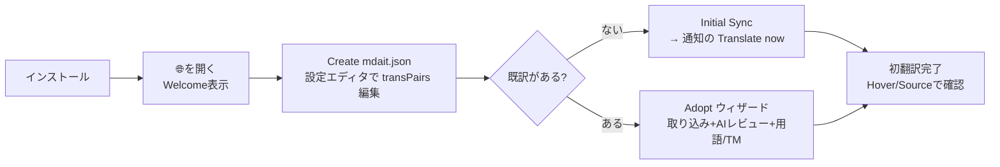
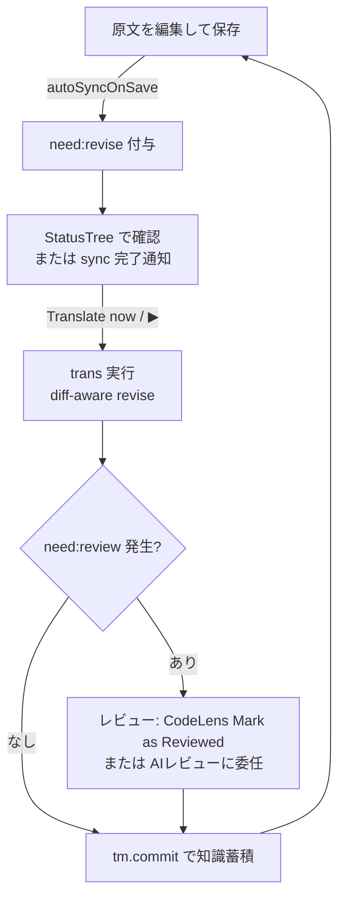

# mdait UX設計書 — 人間とエージェントの体験全体像

> mdait の**ユーザー体験（UX）全体を俯瞰する基準ドキュメント**である。人間（翻訳運用者）と AI エージェントという2種類のユーザーのジャーニー・接点・状態可視化・体験原則をここに集約する。個々の UI 部品の設計は [design/ui.md](design/ui.md)、エージェント・オーケストレーションの設計とロードマップは [design/agent-orchestration.md](design/agent-orchestration.md)、アーキテクチャ原則は [architecture.md](architecture.md) を参照。UX に関わる機能追加・変更時は必ず本ドキュメントとの整合を確認すること。
>
> 調査基準日: 2026-07-12（コミット 949c309 時点の全数調査に基づく。§7 の課題台帳に同日の改修結果を反映済み）

---

## 1. mdait の UX が満たすべきこと

mdait は「継続的な多言語文書管理」のツールである。翻訳は一度きりではなく、原文の更新・用語の統一・レビュー・知識蓄積が絡み合う**運用**であり、UX の主語は「1回の翻訳操作」ではなく「終わりのない運用ループ」である。

このループには2種類の従事者がいる:

| ユーザー | 特徴 | 主な接点 |
|---|---|---|
| **人間（翻訳運用者）** | 文書オーナー・技術ライター。判断（レビュー承認・削除確認・用語採否）の最終責任者。VS Code 上で作業する | StatusTree・CodeLens・Hover・通知・設定エディタ |
| **AIエージェント** | Copilot Chat 等。観測→行動ループでサイト全体の翻訳・用語集・TM 構築を代行する。判断を委任されることもある | LM Tools（JSONエンベロープ）・エージェントプレイブック |

両者は同じ状態（マーカー・needフラグ）を別のサーフェスから観測する。**「人間にできて機械にできない操作」「機械には見えるが人間には見えない状態」を作らない**ことが mdait の UX の根幹である。

---

## 2. UX原則

アーキテクチャ原則（P1〜P9、[architecture.md](architecture.md)）から導かれる体験側の原則。番号は UX-P 系で振る。

- **UX-P1: 状態はすべて観測可能** — need フラグ・翻訳率・違反は、人間には StatusTree/CodeLens/Hover で、エージェントには `mdait_getStatus`/`mdait_validate` で、常に同じ真実（マーカー）から観測できる。片方のサーフェスにしか出ない状態を作らない。
- **UX-P2: 判断は委ねる、決めつけない** — 構造不一致・削除・孤立などの曖昧ケースは `need:review`/`need:verify-deletion` として人間（または委任されたエージェント）の判断に倒す。そして**判断を求めるなら、判断を実行する操作手段を同じ場所に用意する**（判断サーフェスの原則）。
- **UX-P3: いつでも復帰できる安心感** — 全コマンド冪等・`sync` でどんな状態からも復帰・git フレンドリー。ユーザーが「壊したかも」と感じたときの答えは常に「sync して観測し直す」で済むこと。
- **UX-P4: AI は明示起動・コストは事前に見える** — ✨表記・確認UI・対象件数の事前提示（ADR-260705-01）。承認回数の削減はスコープの拡大（ディレクトリ単位1回）で行い、承認の省略では行わない。
- **UX-P5: VS Code 標準パターン準拠**（= P6）— 学習コストを VS Code の既存知識に載せる。例外（設定エディタ Webview）は ADR で明示する。
- **UX-P6: 工程は途切れず手渡す** — 運用ループ（sync→trans→review→tm.commit）の各工程完了時に、次工程への導線（通知ボタン・nextActions）を提示する。ユーザーが「次に何をすべきか」を思い出す必要をなくす。
- **UX-P7: デッドエンドを置かない** — 押せるのに何も起こらない・エラーだけ出るボタンやコマンドを置かない。実行できない操作はサーフェスに出さない（contextValue / when 句 / パレット非表示で制御）。

---

## 3. 接点マップ（全サーフェス一覧）

### 3.1 人間の接点

| サーフェス | 提供するもの | 主な設計ドキュメント |
|---|---|---|
| **StatusTree**（アクティビティバー🌐） | ディレクトリ/ファイル/ユニットの翻訳状態と行内アクション（▶翻訳・用語・TM・AIレビュー）。運用のホーム画面 | [design/ui.md](design/ui.md) |
| **Welcome View** | 未設定時: mdait.json 作成/選択/診断。未同期時: 「Initial Sync / Adopt」の2択導線 | [design/ui.md](design/ui.md)、ADR-260711-06 |
| **CodeLens**（マーカー行） | ユニット単位の翻訳・原文/訳文ジャンプ・need解決（Mark as …）・note編集 | [design/ui.md](design/ui.md) |
| **Hover / Decoration** | 翻訳結果サマリ・用語候補・TM参照・レビュー状態のインライン確認 | [design/ui.md](design/ui.md) |
| **通知・進捗・確認UI** | withProgress（キャンセル対応）、完了通知＋次アクションボタン、破壊的操作の modal 確認 | 本書 §7・[design/ui.md](design/ui.md) |
| **設定エディタ**（mdait.json Webview） | スキーマ駆動の設定GUI。JSON⇔UI をタブ内切替 | ADR-260711-01/02 |
| **セットアップ診断** | 設定・ディレクトリ・AI・キーの一括点検と修復導線 | ADR-260629-01 |
| **コマンドパレット** | スタンドアロンで動作するコマンドのみを露出（アイテム引数必須のものは非表示） | 本書 §7 C-2 |

### 3.2 エージェントの接点

| サーフェス | 提供するもの | 主な設計ドキュメント |
|---|---|---|
| **LM Tools（9種）** | `mdait_getStatus` / `mdait_sync` / `mdait_translate` / `mdait_term` / `mdait_tm` / `mdait_validate` / `mdait_aiReview` / `mdait_adopt` / `mdait_resolve`。共通JSONエンベロープ（`schemaVersion/ok/summary/data/nextActions`） | [design/tools.md](design/tools.md)、[design/agent-orchestration.md](design/agent-orchestration.md) |
| **エージェント・プレイブック** | S1（新規翻訳）/S2（既存対訳取り込み）の手順・ゴール判定・リカバリ・禁止事項 | [guide/ja/agent-playbook.md](guide/ja/agent-playbook.md) |
| **nextActions** | 各ツール出力に含まれる次アクション提案。状態→推奨アクションの誘導装置 | [design/tools.md](design/tools.md) |
| **debug IPC** | 開発/E2E 検証用のファイルベースIPC（`MDAIT_DEBUG_IPC`）。全 `mdait.*` コマンドを機械実行 | `.github/skills/debug-ipc/` |

---

## 4. 人間のジャーニー

### J1: 初回セットアップ（インストール → 最初の翻訳）

- 要となる分岐は Welcome View の **2択導線**（Initial Sync / Adopt）。「Sync したら既訳が上書きされた」という最悪の初回体験を、入口の分岐で構造的に防ぐ（ADR-260711-06）。
- 初回の AI 実行時に1度だけ AI 利用確認ダイアログを挟む（以後は記憶）。
- 落とし穴（primaryLang 欠落・ディレクトリ不在・APIキー直書き）は**セットアップ診断**が一括検出し、エラー通知には修復導線を付ける（ADR-260629-01）。

### J2: 定常運用ループ（このアプリの主戦場）

最短ループは「保存（自動sync）→ trans → （review）→ tm.commit」の4アクション。UX-P6 に従い、各工程の完了通知が次工程のボタンを持つべきである（現状 sync→trans のみ実装。trans→review→tm の連鎖誘導は §8 UX-R2）。

### J3: 既存対訳の取り込み（Adopt）

1回きりのオンボーディング操作。`sync(adopt+align)` → AI翻訳レビュー →（オプトイン）用語集/TM構築を1操作に統合し、既訳を**1文字も変えずに**管理下へ置く。エスカレーション（誤ペア・訳抜け疑い）は統合レポートで人間に渡される。詳細: [design/command_adopt.md](design/command_adopt.md)、[guide/ja/adopt.md](guide/ja/adopt.md)。

### J4: 判断のジャーニー（review / verify-deletion / isolate）

mdait が「決めつけずに人間へ倒した」ものを人間が裁くフロー。**UX-P2 の後半（判断手段を同じ場所に）が最も弱い領域**であり、§8 のロードマップの中心。

| 判断 | 発生条件 | 現在の操作手段 | あるべき姿（§8） |
|---|---|---|---|
| `need:review` の承認 | adopt採用・構造不一致・品質チェック | CodeLens「Mark as Reviewed」（1件ずつ）/ AIレビュー委任 / エージェントは `mdait_resolve` | レビューキュー（未裁定一覧から連続処理） |
| `need:verify-deletion` の裁定 | 原文削除（policy=verify） | 「保持」はCodeLensで可能だが、**「削除」は本文の手動編集のみ** | 保持/削除の2択をCodeLens・ツリーに |
| `need:isolate` の宣言 | ユーザーの意思（独自コンテンツのopt-out） | **マーカーへの手打ちのみ** | CodeLens/コンテキストメニューから宣言 |

---

## 5. エージェントのジャーニー

### 観測→行動ループ

エージェントは `mdait_getStatus`（と `mdait_validate`）で観測し、ツールを1つ実行し、また観測する。全コマンド冪等なので失敗・中断してもループ再開で復帰する。ゴール（完成状態）は**ツール出力から機械的に判定できる**（needs 全0・violations 空・term/tm 再実行差分0・sync 再実行差分0）。シナリオ別手順・リカバリ・禁止事項の正準は [guide/ja/agent-playbook.md](guide/ja/agent-playbook.md)。

### エージェントUXの成立条件

1. **観測の解像度** — 件数だけでなく「どのユニットが・なぜ」まで機械可読であること（`detail:true` のファイル別・ユニット別内訳）。
2. **全操作の機械到達性** — ゴール条件に含まれる状態遷移はすべてツールで実行可能であること。`need:review` の解決が人間のマーカー手編集にしか開かれていなければ、エージェントは壊れやすい手段（マーカー文字列の直接編集）に追い込まれる → `mdait_resolve` で解消（§7 A-1）。
3. **誘導** — `nextActions` が状態から次アクションを提案し、「気の利かないエージェント」でもループが前進する。
4. **委任の境界** — レビュー承認をエージェントに委ねるかは人間が決める（プレイブックに「委任されていなければユーザーに承認を求める」と明記）。確認UIは維持し、承認回数はスコープ拡大で減らす（UX-P4）。

### 人間とエージェントの対応表（サーフェス対称性）

| 操作/観測 | 人間 | エージェント |
|---|---|---|
| 状態観測 | StatusTree / Hover | `mdait_getStatus`（detail・ユニット一覧） |
| 同期 | Sync ボタン / 保存時自動 | `mdait_sync` |
| 翻訳 | ▶（unit/file/dir） | `mdait_translate`（file/dir） |
| レビュー承認・need解決 | CodeLens「Mark as …」 | `mdait_resolve` |
| AIレビュー委任 | ✨AI Translation Review | `mdait_aiReview` |
| 用語・TM | ツリー行ボタン | `mdait_term` / `mdait_tm` |
| 検証 | （通知・レポート） | `mdait_validate` |
| 取り込み | Adopt ウィザード | `mdait_adopt` |
| isolate宣言 | ❌（手打ちのみ・§8 UX-R1） | ❌（同左） |

---

## 6. 状態可視化マトリクス

「同じ真実を全サーフェスで観測できる」（UX-P1）の現状。✅=専用表現あり、⚠️=汎用表現に埋没、❌=不可視。

| 状態 | StatusTree | CodeLens | Hover/Decoration | getStatus (agent) |
|---|---|---|---|---|
| 翻訳済み | ✅ 緑 | ✅ Source/Note | ✅ サマリ | ✅ |
| `need:translate` | ✅ 白抜き | ✅ ▶ + Mark as Translated | — | ✅ |
| `need:revise` | ✅ 白抜き＋専用ツールチップ | ✅ ▶ + Mark as Revised | — | ✅ |
| `need:review` | ✅ 黄 | ✅ Mark as Reviewed | ✅ Needs Review | ✅ |
| `need:verify-deletion` | ✅ trash/橙＋専用ツールチップ | ⚠️ 汎用「Mark as Completed」（§8 UX-R1で保持/削除の2択へ） | ❌ | ✅ |
| `need:isolate` | ✅ circle-slash/灰＋専用ツールチップ | ❌ 宣言・解除とも手打ち | ❌ | ✅ |
| エラーユニット | ✅ 赤 | — | ✅ | ✅（件数） |
| AIレビュー flagged | ❌（ツリーは need:review の有無のみ） | — | ✅ | ✅（escalations） |

---

## 7. UX課題台帳

全数調査（2026-07-12）で特定した痛点の正準リスト。**状態**: ✅=同日改修済み / 🔜=ロードマップ（§8）/ 📋=記録のみ（優先度低・様子見）。

### A. エージェント体験（agent-orchestration のギャップ番号を継承）

| # | 痛点 | 重大度 | 状態 |
|---|---|---|---|
| A-1 | `need:review`/`verify-deletion` の解決手段がツールになく、エージェントがマーカー文字列を手編集するしかない（G-1） | 重大 | ✅ `mdait_resolve` 新設 |
| A-2 | `mdait_getStatus` が need の件数しか返さず対象ユニットを機械特定できない（G-2） | 重大 | ✅ detail にユニット一覧追加 |
| A-3 | AGENTS.md が「LM Tools 3つ」のまま8→9ツール時代と乖離。tools.md も adopt 節欠落・aiReview の mode 欠落 | 中 | ✅ 実装に同期 |
| A-4 | debug-ipc スキルのワークスペースパスが陳腐化（`src/test/workspace` は存在しない）。aiReview/adopt の IPC 引数変換欠落 | 中 | ✅ パス修正・変換追加 |
| A-5 | CLI/MCP エントリポイントがなく、CI からの自動 sync+trans が不可（agent-orchestration が明示的にスコープ外と宣言） | 中 | 📋 将来展望（core の VS Code 非依存化が布石） |
| A-6 | AI初回同意ダイアログがヘッドレス自動化のブロッカー / IPC が単一インフライト / IPC 許可がプレフィックスのみ | 低 | 📋 debug 専用機構のため据え置き |

### B. 人間の判断サーフェス（J4）

| # | 痛点 | 重大度 | 状態 |
|---|---|---|---|
| B-1 | `verify-deletion` の「削除」導線がなく、唯一のワンクリック操作（Mark as Completed）が「保持」方向で誤読を招く | 重大 | 🔜 UX-R1 |
| B-2 | `isolate` を宣言するUIが存在しない（マーカー手打ちのみ）。設計docも「将来増分」と自認 | 重大 | 🔜 UX-R1 |
| B-3 | review が溜まったときの一覧・連続処理手段がない（CodeLens で1件ずつ、または AI 委任のみ） | 中 | 🔜 UX-R1 |
| B-4 | AIレビューの flagged/escalated が StatusTree 上で区別できない（レポート/Hover 限定） | 中 | 🔜 UX-R1 |

### C. デッドエンド・破綻（UX-P7 違反）

| # | 痛点 | 重大度 | 状態 |
|---|---|---|---|
| C-1 | TM Commit Directory / AI Review Directory がツリーから**常に失敗**（`dirPath` vs `directoryPath` の取り違え） | 重大（バグ） | ✅ 修正 |
| C-2 | アイテム引数必須コマンド（translate.\*、term.\*、tm.commit.\*、aiReview.\* 等）がコマンドパレットに露出し、起動すると例外/沈黙 | 中 | ✅ パレット非表示化 |
| C-3 | review/verify-deletion/翻訳済みユニットにも ▶（Translate Unit）が出るが、押すと「翻訳不要」で終わるデッドエンド | 中 | ✅ contextValue 分割で ▶ を translate/revise のみに |
| C-4 | 英語UIで AI 確認ダイアログが生キー `AI_Usage_Confirmation` を表示（英語圏の初回体験が破壊） | 中 | ✅ 修正 |

### D. 状態変化の気づき・工程間の手渡し（UX-P6）

| # | 痛点 | 重大度 | 状態 |
|---|---|---|---|
| D-1 | trans 完了後の次アクション誘導がない（need:review が新規発生しても知らされない。tm.commit を思い出すのはユーザー任せ） | 中 | 🔜 UX-R2 |
| D-2 | autoSyncOnSave がサイレントで、原文保存により need:revise が付いた事実に気づけない | 中 | 🔜 UX-R2（ステータスバー常駐サマリ） |
| D-3 | `need:revise` と `need:translate` がツリー上同一表示で区別不能 | 低 | ✅ ツールチップ・verify-deletion/isolate アイコンも追加 |

### E. 一貫性・細部

| # | 痛点 | 重大度 | 状態 |
|---|---|---|---|
| E-1 | 確認UIの粒度が非一貫（dir翻訳=modal、file翻訳=なし、tm.commit file=なし/dir=Yes-No、ai-review=常にQuickPick） | 中 | 🔜 UX-R3（確認ポリシーの明文化） |
| E-2 | sync がキャンセル不可・進捗が粗い（trans/adopt が cancellable なのと非対称） | 中 | 🔜 UX-R3 |
| E-3 | tm-optimize がキャンセル不可（token 未配線） | 低 | 🔜 UX-R3 |
| E-4 | term.add が sourceLang/targetLang を en/ja 決め打ち | 低 | 🔜 UX-R3 |
| E-5 | パッチ適用失敗の Continue/Skip modal がバッチ翻訳を中断させ、連続失敗でモーダル連打 | 低 | 📋 発生頻度を観測してから判断 |
| E-6 | detect/adopt/ai-review/tm.commit が成功のたびレポートタブを自動オープンしタブが増殖 | 低 | 📋 通知からの手動オープンへの変更を検討 |
| E-7 | 運用開始後も Adopt ボタンがツリータイトルに常駐し誤操作を誘発（冪等だが確認負荷） | 低 | 📋 |

---

## 8. UX改善ロードマップ

課題台帳の 🔜 を3つのまとまりに束ねる。各リリースは独立して出荷可能で、[design/agent-orchestration.md](design/agent-orchestration.md) のマイルストーン形式（着手前チェック・考慮事項・完了ゲート）に従って実装チケットを起こすこと。

### UX-R1: 判断サーフェスの完成（B-1〜B-4）— 最優先

**目的**: 「mdait が人間に倒した判断」をワンクリックで裁けるようにし、J4 を完成させる。UX-P2 の完全化。

**実装方針**:

1. **verify-deletion の2択化**: CodeLens を汎用「Mark as Completed」から「$(check) Keep（needを外して保持）/ $(trash) Delete Unit（ユニット削除）」の2ボタンに分岐。Delete は modal 確認＋git 復旧可能の注記。ツリーのユニット行にも同アクションをコンテキストメニューで提供。
2. **isolate 宣言UI**: 訳文側ユニットの CodeLens／ツリーコンテキストメニューに「Mark as Isolated」（`need:isolate` 付与）と「Un-isolate」（解除）を追加。宣言は sync/trans/tm の全経路が既に対応済みなのでマーカー書換のみ。
3. **レビューキュー**: StatusTree に「Needs Attention」仮想ノード（review / verify-deletion / escalated を横断集約）を追加し、クリックで該当ユニットへジャンプ→CodeLens で裁定→次へ、の連続処理を成立させる。flagged/escalated の可視化（B-4）はこのノードに集約する（ツリー全行のアイコン増殖を避ける）。
4. エージェント側は `mdait_resolve` が既に対応済み（A-1）。isolate 宣言を `mdait_resolve` の `action` 拡張とするか別ツールにするかは実装時に ADR で判断する。

**完了ゲート**: review/verify-deletion/isolate の全裁定が、本文の手動編集なしに GUI 2クリック以内で完了する（E2E: debug-ipc P12 拡張）。

### UX-R2: 工程間の手渡しと気づき（D-1, D-2）

**目的**: UX-P6 を通知レベルで完成させ、運用ループの認知負荷を下げる。

**実装方針**:

1. **trans 完了通知**: 「N units translated. M need review.」＋ボタン（review あり→「Review Now」（レビューキューへ）/ なし→「Commit to TM」）。ファイル/ディレクトリ翻訳の両方に。
2. **ステータスバー常駐サマリ**: `$(globe) 3 to translate / 2 to review` のような needs 集計をステータスバーに常駐表示（クリックで StatusTree へ）。autoSync がサイレントに need を付けても、視界の隅で変化が分かる。通知の増殖よりも常駐の受動的可視化を優先する（通知疲れの回避）。
3. nextActions（エージェント向け）と通知ボタン（人間向け）の対応表を作り、片方にしかない誘導をなくす（UX-P1 の誘導版）。

**完了ゲート**: J2 の1周が「通知/ステータスバーの導線だけを辿って」完了できる（手動確認）。

### UX-R3: 操作の一貫性（E-1〜E-4）

**目的**: 「同種の操作は同じ作法」を確立し、ユーザーの予測可能性を上げる。

**実装方針**:

1. **確認UIポリシーの明文化**（本書に追記）: (a) AI 使用×複数ファイル=事前確認1回（対象件数提示）、(b) AI 使用×単一ファイル/ユニット=確認なし（✨表記とキャンセル可能な進捗で足りる）、(c) 破壊的（削除・一括変換）=modal。既存コマンドをこのポリシーに揃える（tm.commit dir の Yes/No は (a) に統一、等）。
2. **sync の withProgress + キャンセル対応**: ファイル単位の進捗表示と CancellationToken 配線。中断しても冪等なので再実行で続きから。
3. tm-optimize の token 配線、term.add の言語 QuickPick 化（transPairs から候補生成）。

**完了ゲート**: 全 AI 使用コマンドが確認ポリシー表のどれかに分類され、例外がないこと（レビューで確認）。

---

## 9. 関連ドキュメント

- [architecture.md](architecture.md) — アーキテクチャ原則（P1〜P9）・層構造・固定不変条件
- [design/ui.md](design/ui.md) — UI 部品カタログ（StatusTree・CodeLens・Hover・設定エディタ）
- [design/agent-orchestration.md](design/agent-orchestration.md) — エージェント主導方針・M1〜M6 ロードマップ
- [design/tools.md](design/tools.md) — LM Tools の設計原則・エンベロープ契約
- [guide/ja/agent-playbook.md](guide/ja/agent-playbook.md) — エージェント向け運用手順の正準
- [guide/ja/getting-started.md](guide/ja/getting-started.md) / [guide/ja/troubleshooting.md](guide/ja/troubleshooting.md) — 人間向け導入・トラブル対処
- [adr.md](adr.md) — UX 関連の主要 ADR: 260629-01（落とし穴予防）、260711-01/02（設定エディタ）、260711-06（オンボーディング2択導線）、260712-01/02（本書と判断サーフェス・mdait_resolve）
