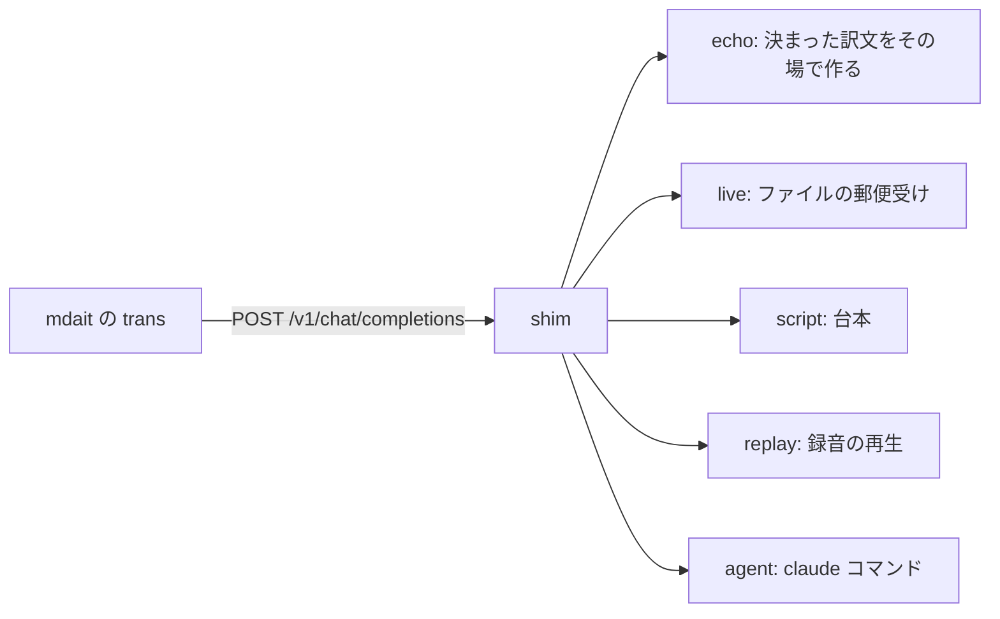

# AI shim — mdait の翻訳相手を手元に用意する

（旧 `scripts/byok-shim/`。lab の AI 係として `scripts/lab/ai/` へ移した）

mdait は `ai.provider` を `openai` にすると、翻訳の依頼を `ai.openai.baseURL` の宛先へ HTTP で送る。
宛先は本家 OpenAI である必要がない。この道具は、その宛先として手元に立てる小さなサーバーである。

向こう側に誰が座るかは選べる。台本でも、`claude` コマンドでも、あなた自身でもよい。



Node の組み込みモジュールだけで書いてある。インストールするものは無い。

---

## 何のための道具か

三つある。

**実物を見る。** mdait が LLM に何を送っているのかは、コードを読めば分かる。だが読んだ内容が正しいとは限らない。
shim は届いた依頼を丸ごとファイルに残すので、推測せずに実物を確かめられる。

**わざと壊す。** 本物の LLM に「30秒黙ってから壊れた JSON を返して」と頼むことはできない。
shim には遅延・状態コード・壊れた断片を指定するつまみがあるので、狙った場面を毎回同じように作れる。

**鍵なしで通す。** API キーが無い環境でも、翻訳の流れを端から端まで走らせられる。
録っておいた往復を再生すれば、LLM を1回も呼ばずに同じ結果を再現できる。

---

## 立てる

```bash
node scripts/lab/ai/shim.mjs --mode script --script scripts/lab/ai/scenarios/echo-translation.jsonl
```

起動すると標準出力に `PORT=8080` の1行が出る。`--port 0` を渡すと空いているポートを自動で取るので、
この行から実際のポートを拾える。待ち受けるのは `127.0.0.1` だけで、外からは繋がらない。

mdait 側の設定はこうする。

```json
{
	"ai": {
		"provider": "openai",
		"model": "byok-shim",
		"openai": {
			"apiKey": "shim-does-not-check-this",
			"baseURL": "http://127.0.0.1:8080/v1",
			"timeoutSec": 600
		}
	}
}
```

`apiKey` は shim が中身を見ないが、空にすると mdait 側が起動時に落ちるので何か入れておく。
`timeoutSec` は長めにする。人が答える `live` では、考えている時間がそのまま待ち時間になる。

`--help` で全オプションが出る。

---

## 誰が答えるかを選ぶ

### echo — 原文から決まった訳文をその場で作る

無人で速く、同じ原文なら毎回同じ答えを返す。決定的な検証（スイープ・UI の見た目確認）はこれを使う。

```bash
node scripts/lab/ai/shim.mjs --mode echo --port 0
node scripts/lab/ai/shim.mjs --mode echo --delay 1500   # 「翻訳中」の見た目を撮りたいとき
```

やっていることは単純である。要求から原文（`=== SOURCE TEXT ===` より後ろ。目印が無ければ本文まるごと）を
取り出し、空白を1つに潰し、先頭 200 文字に `[MT]` を付けて `{"translation": "..."}` の形で返す。
時刻も乱数も混ぜないので、同じ入力なら何度でも同じ答えになる。

2つだけ気をつけていることがある。

- **コードブロックの目印は必ず残す。** mdait はコードブロックを `__CODE_BLOCK_PLACEHOLDER_0__` に
  置き換えて送る。これを落とすと戻すものが無くなり、本文からコードブロックが消える。
  だから目印は長さの勘定に入れず、全部そのまま訳文に入れる
- **`{` `}` は取り除く。** 応答は JSON なので、原文の波括弧がそのまま混ざると形が壊れる

`--delay <ミリ秒>` は答えるまで黙っている時間。UI の「翻訳中」の表示を見るときに使う。
`--echo-limit <文字数>` で訳文に使う本文の長さを変えられる（既定 200）。

### live — あなたが答える

依頼が届くと郵便受けに3つのファイルが現れる。置き場所は環境変数 `MDAIT_LAB_DIR` があれば
`<MDAIT_LAB_DIR>/mailbox`、無ければ `scripts/lab/ai/mailbox`（`--mailbox` で変えられる）。

| ファイル | 中身 |
|---|---|
| `req-001.json` | 届いた依頼の全文 |
| `digest-001.md` | 読むための要約 |
| `res-001.json` | ここに答えを書く。書くまで shim は待つ |

依頼1回には、長い指示文と会話の履歴が丸ごと乗る。毎回それを全部読むと、数往復で読み手の頭が一杯になる。
だから `digest-001.md` には**前回から変わったところだけ**を書く。同じ指示文は「前回と同じ」の1行で済ませる。
全文はいつでも `req-001.json` にあるので、必要になったときだけ開けばよい。

答えを書くには `reply.mjs` を使う。

```bash
node scripts/lab/ai/reply.mjs --next --translation "訳した文をここに"
```

`--translation` は、mdait が待っている形（`{"translation": "..."}`）に包んでから渡す。
手で JSON を書くと引用符の入れ子でほぼ必ず間違えるので、翻訳を返すときはこれを使う。

エージェントは自分で眠って待つことができない。かわりに `wait.mjs` を後ろで走らせておく。
次の依頼が届くまで止まっていて、届いたら要約の場所を1行出して終わる。**終わることが合図になる**。

```bash
node scripts/lab/ai/wait.mjs   # 依頼が来るまで戻ってこない
```

答えを書いたら、また `wait.mjs` を起こし直す。これで1往復の型になる。

### script — 台本を順に返す

`scenarios/*.jsonl` に1行1件で答えを並べておく。無人で動く。
台本を使い切ると 409 で止まる。黙って先頭へ戻ったりはしない（`--script-loop` を渡したときだけ戻る）。

### replay — 録音を再生する

`--record` で録っておいた往復を、そのまま再生する。LLM は呼ばない。
届いた依頼が録音と食い違えば **409 を返して止まる**。合わない再生を黙って続けたりはしない。

突き合わせは並び順ではなく中身で引く。ファイル単位の並列翻訳では依頼の到着順が毎回変わるので、
並び順で照合すると、同じ仕事なのに再生が失敗してしまう。

### agent — `claude` コマンドを翻訳役として起動する

依頼が来るたびに `claude -p` を1回起こし、その答えをそのまま返す。無人で、並列に走る。

```bash
node scripts/lab/ai/shim.mjs --mode agent --agent-concurrency 6
```

mdait の指示文はそのまま `--system-prompt` に渡し、本文を標準入力から流す。
翻訳役には道具を1つも持たせず（`--tools ""`）、この作業場の決まりごとも読ませない（`--safe-mode`、
作業場所は空のディレクトリ）。同時に走る数は `--agent-concurrency` で抑える。既定は4。

#### 翻訳役が何を知っているか

起こされた `claude` が受け取るのは、**渡した指示文と本文だけ**である。実際に確かめた。

| 調べたこと | 結果 |
|---|---|
| 「mdait とは何か」と聞く | `I DO NOT KNOW.` と答えた |
| 指示文以外に文脈があるか | 日付と利用者のメールアドレスを載せた短い注記が1つ（約250トークン） |
| この作業場のファイル | 見えない（道具なし・作業場所は空のディレクトリ） |
| `CLAUDE.md` やプラグイン | 読まれない（`--safe-mode`） |

つまり翻訳役は、**この作業場のことも mdait のことも知らない**。指示文の出来がそのまま結果に出る。

`--bare`（注記すら渡さない、さらに素の起動）はこの環境では使えない。認証を
`ANTHROPIC_API_KEY` だけに限る指定なので、鍵の無い場所では起動に失敗する（実測で確認）。

---

## 答えの書き方

`res-NNN.json` と台本の各行は、同じ形をしている。SSE や OpenAI の外枠は shim が組み立てるので、
書くのは中身だけでよい。

```json
{ "text": "{\"translation\": \"訳した文\", \"termSuggestions\": []}" }
```

使える鍵は次のとおり。知らない鍵を書くと、その場で理由を教えて止まる。

| 鍵 | 何が起きるか |
|---|---|
| `text` | 応答の本文 |
| `tool_calls` | ツール呼び出しを返す。`[{ "name": "...", "arguments": {...} }]` |
| `delay` | 指定した秒数だけ黙ってから返す |
| `finish_reason` | `stop` / `length` / `tool_calls` / `content_filter` を指定する |
| `http_status` | 500 や 429 をわざと返す |
| `raw_chunks` | SSE の生の断片をそのまま流す。中身は一切検査しない |
| `usage` | トークン数を上書きする |

`scenarios/nasty.jsonl` に、意地の悪い場面を並べた台本を置いてある。

---

## 実際に翻訳を通す

実際に mdait の `trans` を走らせる役（駆動役）は、ここには無い。lab のホストが受け持つ。
この道具は「AI の代役を立てて、繋ぎ先を教える」ところまでを引き受ける。

同じプロセスの中に立てたいときは `embed.mjs` を使う。外にプロセスを増やさない。

```js
import { startShim } from "./scripts/lab/ai/embed.mjs";

const ai = await startShim({ mode: "echo", delay: 0 });
// ai.baseURL を mdait.json の ai.openai.baseURL に書いてから trans を走らせる
console.log(ai.baseURL); // http://127.0.0.1:53211/v1
await ai.close();
```

`startShim` が受け取る名前はコマンド行のオプションと同じ（`--answer-timeout` は `answerTimeout`）。
既定は `mode: "echo"` と `port: 0`（空きポートを自動で取る）。返るのは
`{ baseURL, port, mode, server, backend, stats(), close() }` である。

別プロセスとして立てるなら、これまでどおり `shim.mjs` を起動して標準出力の1行目
（`PORT=8080`）からポートを拾う。

`GET /__shim/stats` を叩くと、何件受けたか・同時に何本走ったかが分かる。

---

## 実測した事実

翻訳役に `claude` を据えて、`content/ja/child` 以下の3ファイル（本文9ユニット）を訳したときの記録である。

| 見たこと | 結果 |
|---|---|
| 依頼の回数 | 12回（本文9ユニット＋フロントマターの `title` 3件） |
| 1依頼あたり | 約4〜5秒 |
| 全体 | 28.4秒 |
| 同時に走った依頼 | 最大3本 |
| 失敗 | 0件 |

同時に走ったのが3本なのは、**mdait がファイル単位でしか並列にしない**からである。
1つのファイルの中のユニットは順番に処理される（`trans.concurrency` は既定3、上限8）。
つまり並列度を上げたければ、shim ではなく mdait 側の `trans.concurrency` と対象ファイル数が効く。

コードブロックは `__CODE_BLOCK_PLACEHOLDER_0__` に置き換えられて送られ、返ってきた答えの中で元に戻る。
翻訳役がこの目印をそのまま返さないと、コードブロックが落ちる。

同じ12往復を `replay` で再生すると **0.1秒**で終わる。LLM は1回も呼ばない。

意地悪な台本（`scenarios/nasty.jsonl`）を相手にしたときの振る舞いも確かめた。

| 返したもの | mdait の振る舞い |
|---|---|
| 503 | 約2秒おいて同じ内容を送り直し、翻訳は最後まで通った |
| 429 | 同上 |
| 409 | 送り直さず、その場で `outcome: "failed"` になった |

503 と 429 の送り直しは `ai-stats.log` に現れない。1回分としてまとめて記録されるので、
ログの所要時間だけが伸びる。何回送り直したかを知りたいときは shim 側の記録を見る。

---

## 質を比べたいとき

`agent` モードの翻訳役は指示文と本文しか知らないので、**指示文の善し悪しを比べる用途には使える**。
`mdait.json` の `prompts` で指示文を差し替え、同じ原稿を訳して結果を見比べればよい。
やり取りは `--record` に残るので、あとから何を送って何が返ったかを確かめられる。

ただし、比べていることの中身は次の3つに縛られる。

- **測っているのは「その指示文 × Claude」であって、指示文そのものではない。** 本番で別のモデルを
  使うなら、その組み合わせで測り直すことになる
- **同じ入力でも毎回同じ答えにはならない。** 温度や種を指定する口が無いので、1回の結果で決めない
- **1依頼あたり数秒かかり、実費がかかる。** 対象は絞る

一方、`live` モード（郵便受けで人やエージェントが答える）は**質の比較に使えない**。
答える側がその作業場の事情を知っているので、指示文が悪くても補って答えてしまう。
`live` は実物の観察と、意地悪な場面の注入のためのものである。

---

## この道具でできないこと

**Windows 固有のことは確かめられない。** 動かしたのは Linux なので、Windows での挙動は分からない。

**本番の代わりにはならない。** 認証を検証せず、`127.0.0.1` にしか耳を貸さない。

---

## テスト

```bash
npm run test:byok       # shim 自体の単体テスト。外につながず、claude も偽物を使う
npm run test:byok:e2e   # 録音を再生して trans が同じ結果になるかを見る。LLM は呼ばない
```

直に叩くならこう。

```bash
npx mocha --ui tdd --timeout 30000 "scripts/lab/ai/test/**/*.test.mjs"
```

`npm run test:byok` は `npm test` から呼ばれるので、CI でも走る。

`npm run test:byok:e2e` は CI に入れていない。テスト用ワークスペースの `mdait.json` と `content/` を
書き換えるため、`npm run test:explore` と同じ扱いで手動実行にしてある。

録音の再生（`replay-e2e.mjs`）は、駆動役を `--` の後ろから受け取る。

```bash
node scripts/lab/ai/replay-e2e.mjs -- <駆動役のコマンド> [引数...]
```

引数の中の `{baseURL}` は shim の繋ぎ先に置き換わる。環境変数 `MDAIT_AI_BASE_URL` でも渡す。
駆動役に求めるのは2つだけで、成功したら終了コード 0 で終わること、ファイルごとに1行、
対象のパス・`"translatedCount":N`・`残った need: {"-"...}` を含む行を出すことである。

---

## 秘密の扱い

`Authorization` などの値は記録に残さない。ヘッダの名前と「何文字あったか」だけを残す。
録音をそのままリポジトリに置けるのは、このためである。
