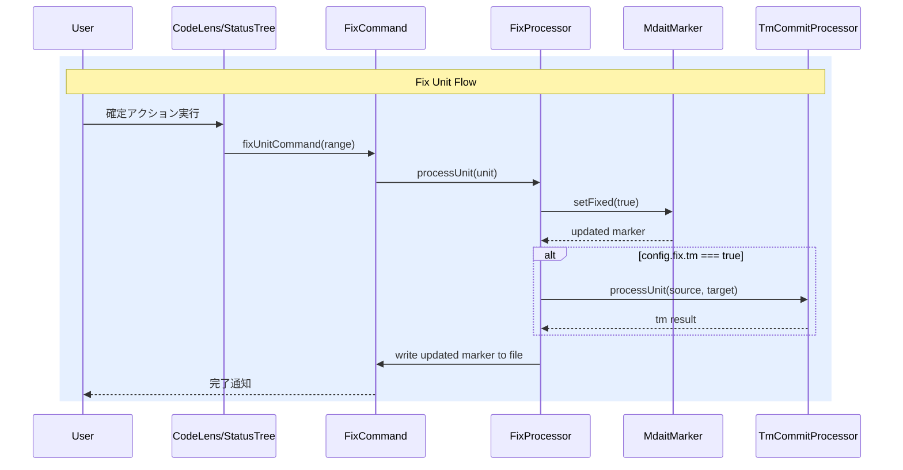

# チケット: fix機能実装

## 1. 概要と方針

wishlistに記載されたユニット確定機能（fixコマンド）を実装する。fixコマンドは翻訳済みユニットを「確定」状態にする汎用コマンドで、マーカーに`fixed`フラグを付与する。tm登録オプションはconfig設定で制御可能とする。termオプションは今回スコープ外。

## 2. 仕様

### 基本動作
- ユーザーが確定対象ユニット（単数・複数・ファイル・ディレクトリ）を指定
- マーカーに `fixed` フラグを付与: `<!-- mdait {hash} from:{hash} fixed -->`
- オプション指定がなければ、フラグ付与のみ

### コマンド体系
- `mdait.fix.unit` - ユニット単位（UI: CodeLens）
- `mdait.fix.file` - ファイル単位（UI: Status View）
- `mdait.fix.directory` - ディレクトリ単位（UI: Status View）

### オプション
- `--tm`: fix時にTM登録も同時実行（configで設定可能）
- `--terms`: 将来機能（今回スコープ外）

### config設定
```json
{
  "fix": {
    "tm": false  // fix実行時にTM登録も同時に行うかどうか（デフォルト: false）
  }
}
```

### 確定状態の管理
- マーカー形式: `<!-- mdait {hash} [from:{hash}] [need:{flag}] [fixed] -->`
- ユニット内容（hash）が変更されると`fixed`は消える（再確定が必要）
- 冪等性: 既に`fixed`なら何もしない

### CodeLens統合
- 未確定（fixedなし）でfrom属性あり・needなしのユニット → CodeLensに「確定する」アクション表示
- オプション状態も示す（確定する tm:ON/OFF）

### tm-commit-filterへの影響
- fixed済みユニットはtm-commitの処理対象外とする

## 3. シーケンス図



## 4. 設計

### MdaitMarker拡張
- `fixed: boolean` プロパティ追加
- `MARKER_REGEX` に `[fixed]?` キャプチャ追加
- `toString()` で `fixed` フラグを出力
- `parse()` で `fixed` フラグを読み取り
- `setFixed()` / `isFixed()` メソッド追加

### Configuration拡張
- `fix` セクション追加（`tm: boolean`）
- JSON Schema更新
- テンプレート更新

### fixコマンド
- `src/commands/fix/fix-command.ts` - コマンドエントリーポイント
- `src/commands/fix/fix-processor.ts` - 確定処理のコアロジック

### UI統合
- CodeLens: 未確定ユニットに「確定する」ボタン
- StatusTree: ファイル/ディレクトリレベルのfix

## 5. 考慮事項

- sync時にhashが変更されるとfixedフラグは消える（再確定が必要）→ これはsync処理側の責務。sync処理ではマーカーを再生成するため、fixedは自然に消える。
- tm-commit-filterにfixed判定を追加し、fixed済みユニットのtm-commitスキップ
- 冪等性の保証: 既にfixedなユニットに再度fixしても変化なし

## 6. 実装・テスト計画と進捗

- [x] MdaitMarker に fixed フラグ対応追加
- [x] MdaitMarker テスト追加
- [ ] Configuration に fix 設定追加
- [ ] JSON Schema に fix 設定追加
- [ ] mdait.template.json 更新
- [ ] fix-command.ts 実装（unit/file/directory）
- [ ] fix-processor.ts 実装
- [ ] package.json にコマンド登録
- [ ] CodeLens に「確定する」アクション追加
- [ ] StatusTree に fix ボタン追加
- [ ] extension.ts にコマンド登録
- [ ] l10n ファイル更新（en/ja）
- [ ] package.nls ファイル更新（en/ja）
- [ ] tm-commit-filter に fixed 判定追加
- [ ] ビルド・テスト確認

## 7. 品質要件チェック

- [ ] 既存テストが通ること
- [ ] 新規テストが通ること
- [ ] ビルドが成功すること
- [ ] lint が通ること
- [ ] 既存機能への影響がないこと

## 8. まとめと改善提案

（作業完了後に記載）

## 9. 参考

- wishlist.md の「ユニット確定機能（fix コマンド）」セクション
- tm-commit-command.ts の既存パターン
- codelens-provider.ts のCodeLens統合パターン
