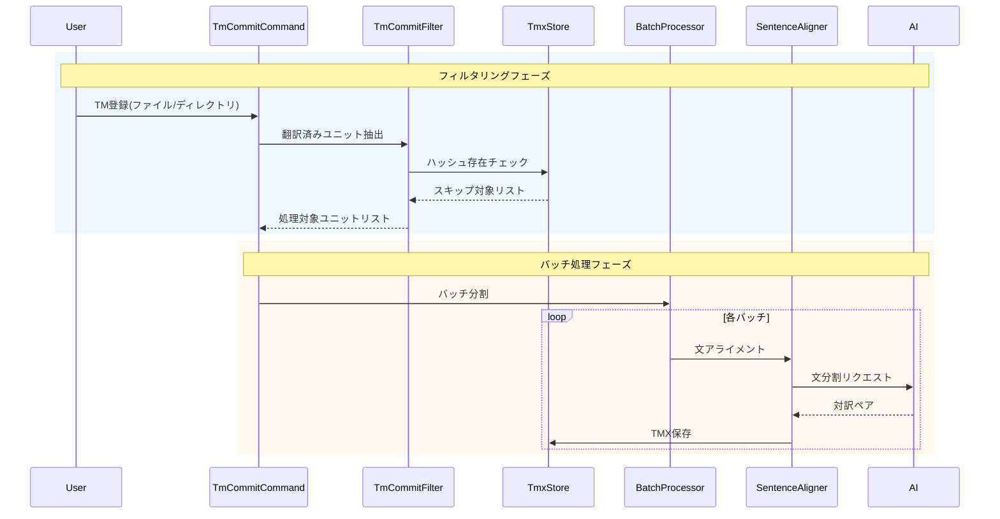

# チケット: TM登録リデザイン（ファイル/ディレクトリ単位バッチ処理化）

## 1. 概要と方針

TM登録をユニット単位から廃止し、ファイル/ディレクトリ単位の一括処理に変更する。用語登録と同様のシンプルな機能として、翻訳済みユニットに対していつでも使えるようにする。TMXのハッシュを活用してスキップ判定を行い、バッチ処理を導入する。

## 2. 仕様
- `mdait.tm-commit.unit` コマンドを廃止
- `mdait.tm-commit.file` / `mdait.tm-commit.directory` を改修
- 翻訳済み（`from`あり、`need`なし or `need`が translate/revise 以外）のユニットがTM登録対象
- TMXファイル内に該当ユニットのハッシュが存在する場合はスキップ（原文が変わっていれば再処理）
- 用語登録と同様の文字数ベースバッチ処理を導入
- ファイル・ディレクトリのステータスツリーコンテキストメニューから利用可能

## 3. シーケンス図

## 4. 設計

### 変更対象ファイル一覧

| ファイル | 変更内容 |
|---------|---------|
| `src/commands/tm-commit/tm-commit-command.ts` | unit系削除、file/directory系改修（バッチ処理導入） |
| `src/commands/tm-commit/tm-commit-filter.ts` | isFixed()条件廃止（前チケットで済）、ハッシュベーススキップ導入 |
| `src/commands/tm-commit/tm-commit-processor.ts` | バッチ処理対応 |
| `src/core/tm/tmx-store.ts` | ハッシュ存在チェックAPI追加 |
| `src/extension.ts` | unit系コマンド登録削除 |
| `package.json` | unit系コマンド・メニュー項目削除 |
| `src/ui/codelens/codelens-provider.ts` | TM commit CodeLens削除（ユニット単位廃止のため） |
| テストファイル | 更新 |

### ハッシュベーススキップロジック
- `TmxStore`に `hasHash(hash: string): boolean` メソッドを追加
- 各ユニットの`marker.hash`がTMXに存在するかチェック
- 存在すればスキップ（原文が変わっていなければ再処理不要）

### バッチ処理
- 用語登録と同様に文字数ベース（8000文字上限）でバッチ分割
- 各バッチごとにAI呼び出し→TMX保存

## 5. 考慮事項
- 前チケット（fixed状態削除）が完了している前提
- SentenceAlignerのAI呼び出しはユニット単位で行われるため、バッチ処理はユニットのグルーピングに留まる
- プログレス表示はバッチ単位で更新

## 6. 実装・テスト計画と進捗
- [x] `mdait.tm-commit.unit`コマンド廃止
- [x] `TmxStore`にハッシュ存在チェック追加
- [x] `tm-commit-filter.ts`にハッシュベーススキップ導入
- [x] `tm-commit-command.ts`のfile/directory系改修
- [x] `package.json`更新
- [x] `extension.ts`更新
- [x] CodeLens更新
- [x] テスト更新
- [x] ビルド確認

## 7. 品質要件チェック
- [x] ビルドエラーなし
- [x] 既存テストがパスする（289 passing）
- [x] ユニット単位TM登録への参照が残っていない（tasks/done内の過去ログのみ残存、問題なし）

## 8. まとめと改善提案
- ユニット単位TM登録の廃止、package.json/NLS/ドキュメントからの完全削除完了
- sourceHashベーススキップの導入により、大量ファイル処理時の効率が大幅に改善
- バッチ処理はSentenceAlignerがユニット単位でAI呼び出しを行う性質上、用語検出のような複数ユニット結合バッチではなく、ユニット単位の逐次処理+スキップ最適化が現実的な設計となった

## 9. 参考
- 用語登録のバッチ処理パターン: `src/commands/term/command-detect.ts`
