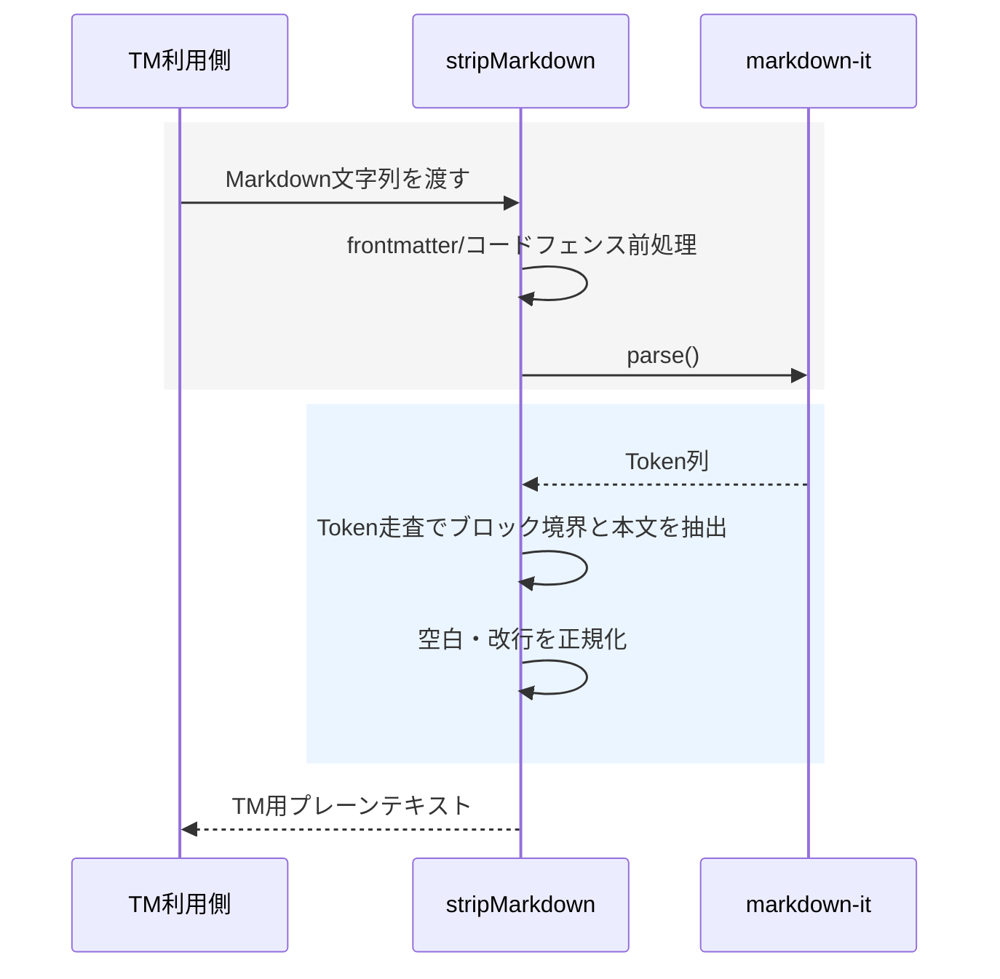

# チケット: StripMarkdown表改行修正

## 1. 概要と方針

StripMarkdown 実行時に表やブロック境界の改行が失われ、TM 用プレーンテキストが不自然に連結される問題を修正する。既存の markdown-it ベース抽出方針は維持しつつ、改行正規化とブロック境界の扱いを見直し、再発防止テストを追加する。

## 2. 仕様

- 表セルはセル単位で改行分離したまま保持する
- 表の前後にある段落やラベル文と表内容が 1 行に潰れない
- 見出し、段落、引用、区切り線、表などのブロック境界は意味を失わない範囲で保持する
- 既存の frontmatter 除去、リンク/画像/装飾除去、インラインコード保持、コードブロック除外は維持する

## 3. シーケンス図

## 4. 設計

- 原因調査では token 抽出段階と最終正規化段階の両方を確認する
- 必要ならブロック境界を空白ではなく改行として表現し、後段の正規化で過剰圧縮しない
- テストは表単体だけでなく、表の前後に段落やラベル文があるケースを含める

## 5. 考慮事項

- MarkdownIt の token 種別ごとの差異で既存ケースを壊さないこと
- 既存テスト期待値の一部が現実装依存で不自然な可能性があるため、仕様として妥当かを確認して更新する
- TM 検索/登録双方で stripMarkdown が使われるため、正規化変更の影響に注意する

## 6. 実装・テスト計画と進捗

- [ ] 現象再現と原因特定
- [ ] stripMarkdown のブロック境界処理を修正
- [ ] 表とブロック境界に関する回帰テストを追加
- [ ] 関連テストを実行して結果確認
- [ ] 完了内容をチケットへ反映

## 7. 品質要件チェック

- [ ] 既知の再現ケースで改行崩れが解消している
- [ ] 既存の主要 markdown 除去仕様を維持している
- [ ] 追加テストが失敗から成功へ変わることを確認している

## 8. まとめと改善提案

作業完了後に記載する。

## 9. 参考

- 対象実装: src/core/tm/tm-text-normalizer.ts
- 対象テスト: src/test/core/tm/tm-text-normalizer.test.ts