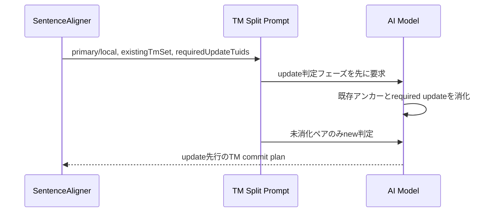

# チケット: TMプロンプトnew_update明確化

## 1. 概要と方針

TM登録計画生成プロンプトで new と update の判断基準が混在しており、LLM が同一整列ペアに対して誤って new/update を混同する余地がある。判定を update フェーズと new フェーズに分離し、排他条件と出力順序を明文化して挙動を安定化する。

## 2. 仕様

- update 判定は new 判定より先に行う
- requiredUpdateTuids がある場合は update を優先し、新規登録へ逃がさない
- 同一整列ペアに対して new と update を同時に出力しない
- 出力順は update を先、new を後とする
- 単語単位や短い熟語、短いラベル断片は TM ではなく用語集向けとして扱う

## 3. シーケンス図

## 4. 設計

- プロンプト内に PHASE 1: UPDATE DECISIONS と PHASE 2: NEW DECISIONS を設ける
- 排他条件を独立セクションで明記し、同一整列ペアの重複出力を禁止する
- 利用側テストで system prompt に必要文言が含まれることを確認する
- 品質基準を sentence-level TM に寄せ、短語句は glossary/termbase へ寄せる方針を明文化する

## 5. 考慮事項

- 文言だけでなく出力順の期待も固定し、将来のプロンプト調整で後退しないようにする
- 実装ロジックではなく prompt の責務なので、パーサの仕様変更は行わない

## 6. 実装・テスト計画と進捗

- [x] 現行プロンプトの曖昧さを整理
- [x] new/update の判定フェーズを分離
- [x] prompt 回帰テストを追加
- [x] 関連テストを実行して結果確認
- [x] 完了内容をチケットへ反映

## 7. 品質要件チェック

- [x] update 優先の規則が明文化されている
- [x] new/update 排他条件が明文化されている
- [x] 回帰テストが成功している

## 8. まとめと改善提案

TM登録計画プロンプトに update/new の二段階判定と排他規則を追加し、曖昧な出力余地を減らした。今回さらに、短い単語や熟語は TM ではなく用語集向けであることを明文化し、全体の文面も少し圧縮した。今後も prompt 文字列の回帰テストは重要な契約に限定して保守する。

## 9. 参考

- 対象実装: src/prompts/defaults.ts
- 対象テスト: src/test/commands/tm/sentence-aligner.test.ts
- テスト結果: sentence-aligner.test.ts 9件成功