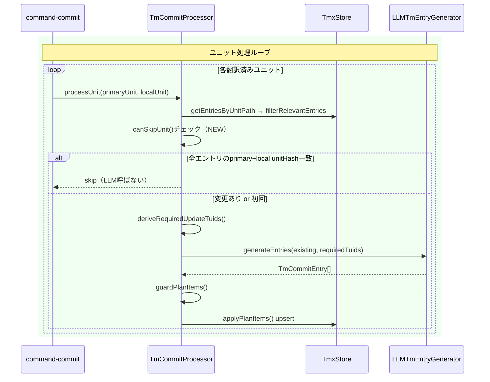

# チケット: tm-commit hashスキップ最適化

## 1. 概要と方針

tm-commit が「ソースも訳文も変わっていないユニット」に対しても毎回 LLM を呼び出してしまうため、大量ユニットがある場合に処理が重くなる問題を解決する。
`TmVariant` にはすでに `unitHash` が言語ごとに保持されているため、LLM 呼び出し前に「primaryVariant + localVariant 両方のunitHashが現在と一致する」かを確認し、一致していればスキップする。

## 2. 仕様

### スキップ条件（以下をすべて満たす場合、LLMを呼び出さずユニットをスキップ）

1. そのunitPathに紐づく `ExistingTmEntries` が **1件以上** ある
2. 全エントリの **primaryVariant.unitHash** が現在の `primaryUnit.unitHash` と一致する
3. 全エントリの **localVariant.unitHash** が現在の `localUnit.unitHash` と一致する

### スキップしない条件

- `ExistingTmEntries` が0件（初回コミット）→ LLM 必須
- いずれかのエントリのunitHashが一致しない → 変更あり → LLM 呼び出す

### 廃止された旧実装との違い

| | 旧実装 | 今回 |
|---|---|---|
| ハッシュ対象 | primaryUnit.unitHash のみ | primary + local 両方 |
| 問題 | 訳文を手動修正してもTMXに反映されない | なし（local変更を検出できる） |

## 3. シーケンス図



## 4. 設計

### 変更対象ファイル

- `src/commands/tm/commit-processor.ts` — `processUnit()` 内で LLM 呼び出し前に `canSkipUnit()` チェックを追加

### 実装

`commit-processor.ts` の `processUnit()` に以下を追加：

```typescript
// LLM呼び出し前にhashベーススキップチェック
const canSkip = existingEntries.length > 0 &&
    existingEntries.every(entry => {
        const primaryVar = entry.variants.get(this.primaryLang);
        const localVar = entry.variants.get(localUnit.lang);
        return primaryVar?.unitHash === primaryUnit.unitHash &&
               localVar?.unitHash === localUnit.unitHash;
    });

if (canSkip) {
    return { type: 'skipped' };
}
```

戻り値の型調整が必要な場合は `processUnit()` の戻り値型を適宜更新する。

## 5. 考慮事項

- **任意更新（LLMによるrefine）を失う**: ソースも訳文も変わっていないユニットのoptional refinementはスキップされる。ただし「何も変わっていないのに精度をrefineする必要はない」と割り切れる。
- **TMX手動編集との非互換**: ユーザーがTMXを直接編集した場合、unitHashはストアに変化がないためスキップされる。ただしこれは現在の設計上の範囲外。
- **syncとの連携**: syncやり直し時は必ずunitHashが変わるため、新文の追加・削除は自然に検出できる。

## 6. 実装・テスト計画と進捗

- [x] `commit-processor.ts` に `canSkipUnit()` ロジック追加
- [x] ユニットテスト追加（スキップされるケース / されないケース）
- [x] 既存テストが通ることを確認

## 7. 品質要件チェック

- [x] 旧実装の廃止理由（localハッシュ未検証）を踏まえた実装になっている
- [x] 初回コミット（0件）は必ずLLM呼び出しになる
- [x] primary / local 両方のunitHashを確認している
- [x] テスト追加済み

## 8. まとめと改善提案

LLM呼び出し前に `canSkipUnit()` でdual-hash（primary + local）チェックを追加し、変更のないユニットをスキップする最適化を実装した。旧実装の廃止理由だった「localハッシュ未検証問題」を解消しつつ、コスト・速度の両面を改善できた。

設計上の冗長性として `canSkipUnit()` が `store.findByTuid()` でストアを再参照している点があり（推奨事項）、将来的には `ExistingTmEntriesItem` にunitHashを持たせることで解消できる。今回は影響範囲の観点から対応を見送った。

## 9. 参考

- 旧実装廃止理由: `unitHash` がprimaryのみでlocalを追っていなかったため、訳文手動修正がTMXに反映されなかった
- 設計詳細: [command_tm.md](../docs/design/command_tm.md)
- 関連実装: `src/commands/tm/commit-processor.ts`, `src/core/tm/tmx-store.ts`, `src/core/tm/types.ts`
