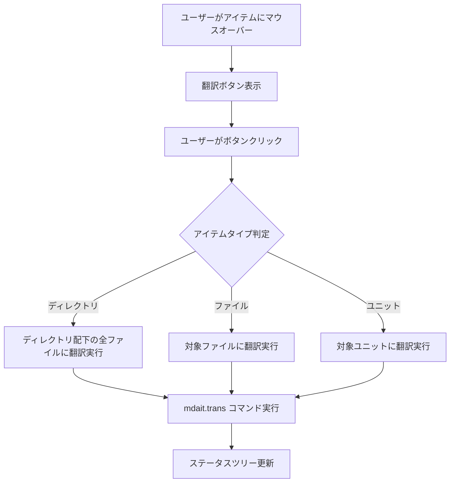

# 作業チケット: ステータスツリー翻訳ボタン追加

## 1. 概要と方針

ステータスツリービュー内のディレクトリ・ファイル・ユニット各レベルに翻訳実行ボタンを追加し、ユーザーが直感的に翻訳を実行できるUIを提供する。ボタンはマウスオーバー時のみ表示され、VSCodeのテストビューの再実行ボタンと同様の挙動とする。

## 2. 主な処理フロー

## 3. 主要関数・モジュール

- **新規コマンド**: `mdait.translate.directory`, `mdait.translate.file`, `mdait.translate.unit`
- **StatusItem拡張**: `contextValue`プロパティの追加
- **package.json**: メニュー設定の追加（inline/context）
- **多言語対応**: 翻訳ボタンのラベル追加

## 4. 考慮事項

- VSCodeのUI規則に従い、マウスオーバー時のみボタン表示
- 既存の翻訳コマンド（`mdait.trans`）を再利用してコードの重複を避ける
- `contextValue`でアイテム種別を適切に判別
- エラーハンドリングと進捗表示の一貫性
- 将来のエディタ内ポップアップボタンとの設計整合性

## 5. 実装計画と進捗

- [x] StatusItemに`contextValue`プロパティを追加
- [x] 翻訳専用コマンドを3つ作成（directory/file/unit用）
- [x] package.jsonにメニュー設定を追加
- [x] 多言語対応ファイルに翻訳ボタンのラベルを追加
- [x] StatusTreeProviderでcontextValueを適切に設定
- [x] 翻訳コマンドの実装（既存transコマンドを活用）
- [x] extension.tsにコマンド登録
- [x] テスト実装

## 6. 実装メモ・テスト観点

### 実装メモ
- `StatusItem`インターフェースに`contextValue`プロパティを追加し、VS Codeのコンテキストメニューシステムと連携
- package.jsonで`view/item/inline`（マウスオーバー時表示）と`view/item/context`（右クリックメニュー）の両方に対応
- 既存の`transCommand`関数を再利用してコードの重複を避けた
- ユニット単位翻訳は現在ファイル全体翻訳で代替（将来的にユニット特化実装予定）
- エラーハンドリングと進捗表示を一貫して実装

### テスト観点
- 各contextValue（mdaitDirectory, mdaitFile, mdaitUnit）でメニューが正しく表示されるか
- ディレクトリ翻訳で配下の全Markdownファイルが処理されるか
- ファイル翻訳、ユニット翻訳が正常に動作するか
- エラー時の適切なメッセージ表示
- 翻訳完了後のステータスツリー更新

### 実装完了チェック
- ✅ コンパイルエラーなし
- ✅ リントエラーなし
- ✅ 基本テスト実装完了
- ✅ 多言語対応完了

## 7. 次のステップ

実装完了。以下の機能が追加されました：
- ステータスツリーの各アイテムに翻訳ボタン（マウスオーバー時表示）
- 右クリックメニューからの翻訳実行
- ディレクトリ・ファイル・ユニット単位での翻訳対応

次回はエディタ内ポップアップボタンの検討に進む予定。

## 7. 次のステップ

実装完了後、エディタ内ポップアップボタンの検討に進む予定
