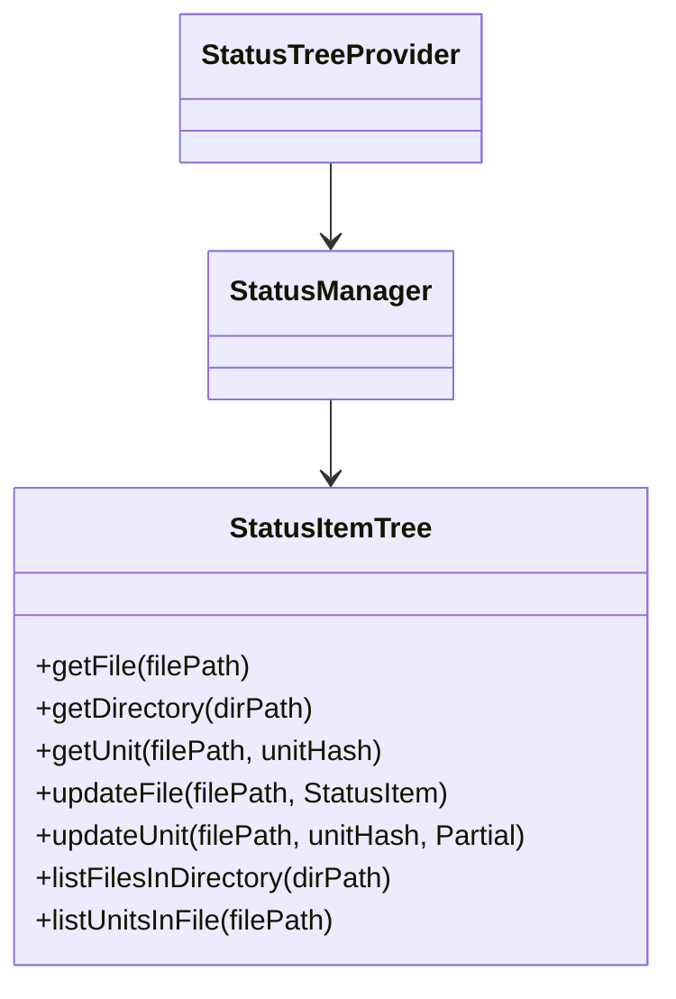

# 作業チケット: StatusItemコレクション構造リファクタリング

## 1. 概要と方針

- 状態管理の責務分離とパフォーマンス向上を目的に、StatusItemのコレクション構造を「StatusItemTree」としてファーストクラスコレクション化する。
- StatusManagerがStatusItemTreeを保持し、UI層はAPI経由で状態取得・更新を行う。
- 検索・集計・部分更新などのロジックを専用ツリーコレクションに集約し、UI層のコードを簡潔化。

## 2. 主な処理フロー

## 3. 主要関数・モジュール

- StatusItemTree: 状態管理用ツリーコレクション（Map/ツリー構造）
  - getFile, getDirectory, getUnit, updateFile, updateUnit, listFilesInDirectory, listUnitsInFile
- StatusManager: ツリーコレクションの生成・管理・API提供
- StatusTreeProvider: UI表示・イベント処理

## 4. 考慮事項

- 既存のStatusItem配列からの移行時、API互換性・UI表示の影響範囲を十分に検証する。
- ディレクトリ・ファイル・ユニットの階層構造を意識した設計とする。
- テスト容易性・拡張性を重視し、今後の機能追加に備える。
- パフォーマンス効果（検索・集計の高速化）を定量的に確認する。

## 5. 実装計画と進捗

- [ ] StatusItemTree.tsの新規作成
- [ ] StatusManagerのStatusItemTree対応（StatusItem配列利用からStatusItemTree利用に変え、コードを簡潔に）
- [ ] UI層（StatusTreeProvider）のAPI参照修正
- [ ] 既存StatusItem配列からの移行処理
- [ ] テスト実装・検証

## 6. 実装メモ・テスト観点

- 階層構造の正確な再現
- API互換性の維持
- パフォーマンス測定（before/after）

## 7. 次のステップ

- StatusItemTreeのインターフェース設計
- StatusManagerとの連携部分の詳細設計
- ユーザー承認後、実装開始
