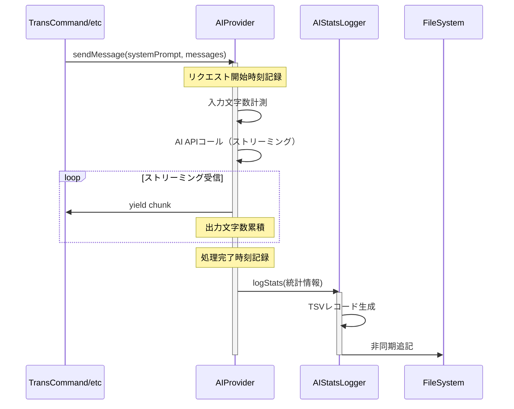

# 作業チケット: AI通信統計ログ機能

## 1. 概要と方針

AIサービスの通信統計情報をログファイルに記録する機能を実装します。デバッグ時の分析を容易にするため、1回のAI通信を1行のTSVレコードとして記録し、`.mdait/logs/ai-stats.log`に追記していきます。

**設計方針:**
- プロンプト内容は記録せず、統計情報（文字数、処理時間、ステータス）のみ
- 設定で有効化した場合のみ動作（デフォルトは無効）
- 既存プロバイダー実装への影響を最小化
- ログ書き込みはベストエフォート（書き込み失敗でも本処理に影響なし）

## 2. 主な処理フロー



## 3. 主要関数・モジュール

### 新規作成: `src/api/ai-stats-logger.ts`

```typescript
interface AIStatsRecord {
  timestamp: string;
  provider: string;
  model: string;
  inputChars: number;
  outputChars: number;
  durationMs: number;
  status: 'success' | 'error';
  errorMessage?: string;
}

class AIStatsLogger {
  async log(record: AIStatsRecord): Promise<void>
  private formatAsTSV(record: AIStatsRecord): string
  private ensureLogDirectory(): Promise<void>
}
```

### 変更対象: 各プロバイダー

**`vscode-lm-provider.ts`**, **`ollama-provider.ts`**
- `sendMessage`メソッド内で統計情報を収集
- 開始時刻・終了時刻の記録
- 入力・出力文字数の計測
- 完了時に`AIStatsLogger.log()`を呼び出し

### 変更対象: `src/config/configuration.ts`

設定項目追加:
```typescript
ai: {
  debug: {
    enableStatsLogging: boolean  // デフォルト: false
  }
}
```

## 4. 考慮事項

- **文字数計測**: トークン数ではなく文字数で概算（プロバイダー非依存）
- **エラーハンドリング**: ログ書き込み失敗は警告のみで本処理継続
- **ファイルサイズ**: ログローテーション機能は今回実装せず（将来的に検討）
- **マルチスレッド**: 複数リクエストの同時実行でも追記順序が保証されるようNode.jsの`fs.appendFile`を使用
- **テスト**: 単体テストではモックを使用、統合テストで実際のログ書き込みを確認

## 5. 実装計画と進捗

- [x] `AIStatsLogger`クラスの実装
- [x] 設定インターフェースに`debug.enableStatsLogging`追加
- [x] `vscode-lm-provider.ts`への統計収集機能追加
- [x] `ollama-provider.ts`への統計収集機能追加
- [x] `default-ai-provider.ts`への統計収集機能追加
- [x] ログディレクトリ`.mdait/logs/`の自動作成
- [x] package.json設定スキーマ追加
- [x] l10n（英語・日本語）説明追加
- [ ] 単体テスト実装
- [ ] 実際の動作確認とログ検証

## 6. 実装メモ・テスト観点

### 実装完了内容

#### 1. `AIStatsLogger`クラス (`src/api/ai-stats-logger.ts`)
- シングルトンパターンで実装
- TSV形式でログを記録（タブ区切り）
- ヘッダー行付き: `timestamp`, `provider`, `model`, `input_chars`, `output_chars`, `duration_ms`, `status`, `error_message`
- ログディレクトリ `.mdait/logs/` を自動作成
- 設定で`enableStatsLogging`が有効な場合のみ動作

#### 2. 各プロバイダーへの統計収集機能追加
**共通実装パターン:**
- リクエスト開始時刻を記録
- 入力文字数を計測（systemPrompt + messages）
- ストリーミング中に出力文字数を累積
- 完了時に処理時間を計算
- `finally`ブロックで必ず統計ログを記録

**実装済みプロバイダー:**
- `vscode-lm-provider.ts`: GitHub Copilot LM API
- `ollama-provider.ts`: Ollama API
- `default-ai-provider.ts`: モックプロバイダー

#### 3. 設定の追加
- `AIConfig`インターフェースに`debug?: { enableStatsLogging: boolean }`を追加
- `Configuration.load()`で設定を読み込み
- package.json に設定項目を追加（デフォルト: `false`）
- 英語・日本語のl10n説明を追加

### テスト観点

1. **ログファイル作成テスト**
   - 設定有効時に`.mdait/logs/ai-stats.log`が作成されること
   - ヘッダー行が正しく書き込まれること

2. **統計情報の記録テスト**
   - 各プロバイダーで正しくログが記録されること
   - タイムスタンプ、プロバイダー名、モデル名が正しいこと
   - 入力・出力文字数が計測されていること
   - 処理時間が記録されていること

3. **エラー時のログテスト**
   - エラー発生時も統計が記録されること
   - `status`が`error`になること
   - エラーメッセージが記録されること

4. **設定無効時のテスト**
   - `enableStatsLogging: false`の場合、ログが作成されないこと

5. **マルチリクエストテスト**
   - 複数のAIリクエストが並行しても正しく記録されること
   - ログ行が正しく追記されること

### 今後の検討事項
- ログローテーション機能（ファイルサイズ制限など）
- トークン数の正確な計測（現在は文字数ベース）
- 統計サマリー表示機能（合計リクエスト数、合計文字数など）

