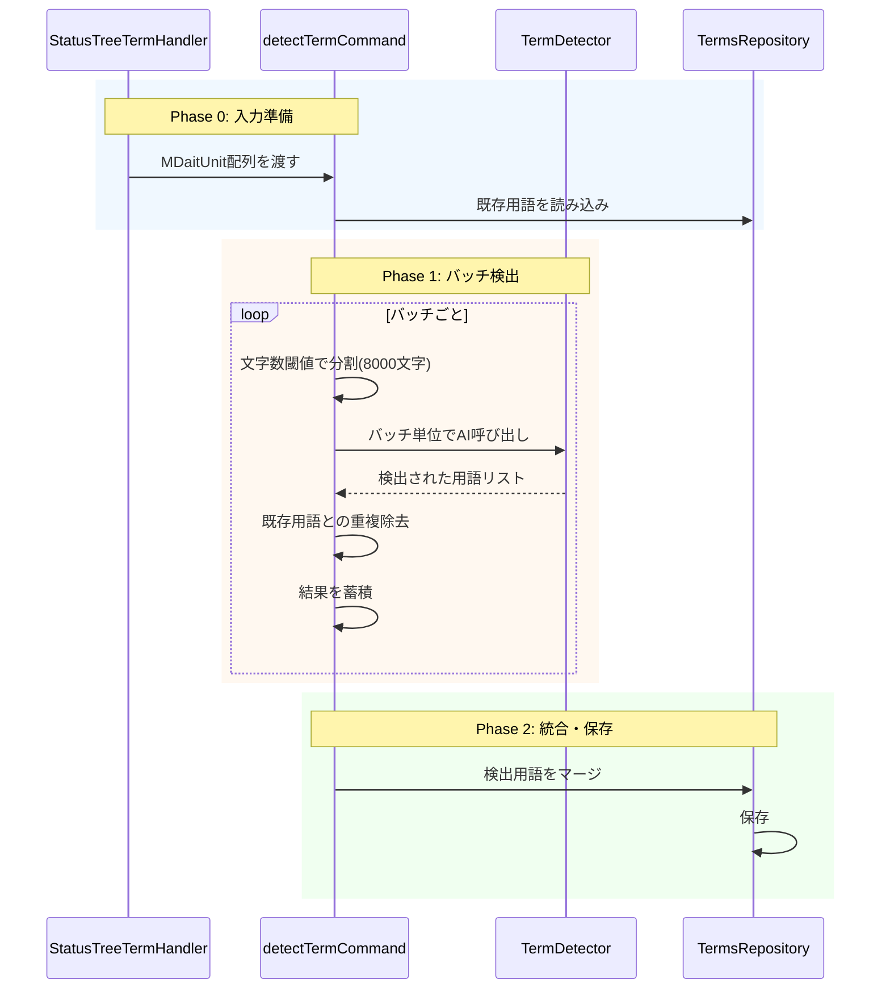

# 作業チケット: detectコマンドバッチ処理化

## 1. 概要と方針

`mdait.term.detect`コマンドを、`expand`コマンドと同様のバッチ処理アーキテクチャに変更する。現在はUnit単位でループしてAI呼び出しを行っているが、これをバッチ単位に変更することで以下を実現する:

- **AI呼び出し削減**: 500Unit → 10-20回（95-98%削減）
- **精度向上**: バッチ内の他Unitの検出結果を文脈として活用
- **コード統一**: expandと同じ構造で保守性向上
- **進捗表示改善**: バッチ単位の進捗表示

## 2. 主な処理フロー



## 3. 主要関数・モジュール

### 3.1 `detectTermCommand`の変更

**新しい引数**:
```typescript
async function detectTermCommand(
  units: readonly MdaitUnit[],
  sourceLang: string,
  options?: { showProgress?, showCompletionMessage?, cancellationToken? }
): Promise<void>
```

- MDaitUnit配列をバッチ処理
- sourceLangは呼び出し側で決定
- ファイル読み込み・パース処理は完全に削除
- 内部で`detectTermBatch`を呼び出す

### 3.2 `StatusTreeTermHandler`の変更

**termDetectFile/termDetectDirectory**:
- ファイル→MDaitUnit変換を実行
- 複数ファイルの場合は全Unitを配列に集約
- Unit配列と`sourceLang`を`detectTermCommand`に渡す
- 進捗表示・isTranslating制御はハンドラ側

### 3.3 `detectTermBatch`関数（新規作成）

```typescript
async function detectTermBatch(
  units: readonly MdaitUnit[],
  sourceLang: string,
  config: Configuration,
  progress: vscode.Progress<{ message?: string; increment?: number }>,
  cancellationToken?: vscode.CancellationToken
): Promise<void>
```

- バッチ分割ロジック（8000文字閾値）
- AI呼び出し（バッチ単位）
- 既存用語との重複チェック
- 用語集への保存

## 4. 考慮事項

### 4.1 バッチサイズの調整

- expandと同じ8000文字閾値を使用
- Unit数ではなく文字数ベースで分割（AI入力サイズ制限対策）

### 4.2 既存用語の重複チェック

- バッチ内で検出された用語は次のバッチで既存扱いにする
- `existingTermTexts` Setを動的に更新

### 4.3 エラーハンドリング

- バッチ単位でエラーが発生しても他のバッチは継続
- 失敗したバッチ数を統計情報として記録

### 4.4 `term-detector.ts`のAI呼び出し

- 既存の`detectTerms`は内部実装として使用
- バッチ内の各Unitに対して呼び出し
- 検出済み用語を文脈として次のUnit検出に活用

## 5. 実装計画と進捗

- [x] `command-detect.ts`に`detectTermBatch`関数を追加（バッチ処理ロジック）
- [x] `detectTermCommand`を完全に書き換え（MDaitUnit配列を受け取る）
- [x] 既存の`detectTerm`関数は削除（`detectTermBatch`に統合）
- [x] `StatusTreeTermHandler.termDetectFile`を修正（Unit変換ロジック）
- [x] `StatusTreeTermHandler.termDetectDirectory`を修正（複数ファイル→Unit配列）
- [ ] 既存テストの修正
- [ ] `commands_term.md`の更新（実装完了の記載）

## 6. 実装メモ・テスト観点

### 実装完了内容

**command-detect.ts**:
- `detectTermCommand`の引数を`uri: vscode.Uri`から`units: readonly MdaitUnit[], sourceLang: string`に変更
- 新規に`detectTermBatch`関数を実装
  - バッチ分割ロジック（8000文字閾値）
  - バッチ内でUnit単位のループ処理
  - 検出済み用語を次のUnit検出時の文脈として活用
  - `createBatches`ヘルパー関数でバッチ分割
  
**status-tree-term-handler.ts**:
- `termDetectDirectory`: 全ファイルからUnit配列を収集し、まとめて`detectTermCommand`に渡す
- `termDetectFile`: 単一ファイルをパースしてUnit配列に変換し、`detectTermCommand`に渡す
- いずれもハンドラ側でsourceLangを決定して渡す

### 設計との整合性

- ✅ expandと同様のバッチ処理アーキテクチャに統一
- ✅ ファイル読み込み・パース処理は呼び出し側（ハンドラ）に移動
- ✅ MDaitUnit配列をバッチ処理する構造
- ✅ 8000文字閾値でバッチ分割（expandと同じ）
- ✅ 進捗表示はバッチ単位

### テスト観点

- [ ] 単一ファイルの用語検出が正常に動作するか
- [ ] 複数ファイルの用語検出が正常に動作するか
- [ ] バッチ分割が正しく機能するか（8000文字閾値）
- [ ] 既存用語との重複チェックが正しく機能するか
- [ ] キャンセル処理が正しく機能するか
- [ ] エラーハンドリングが適切か
