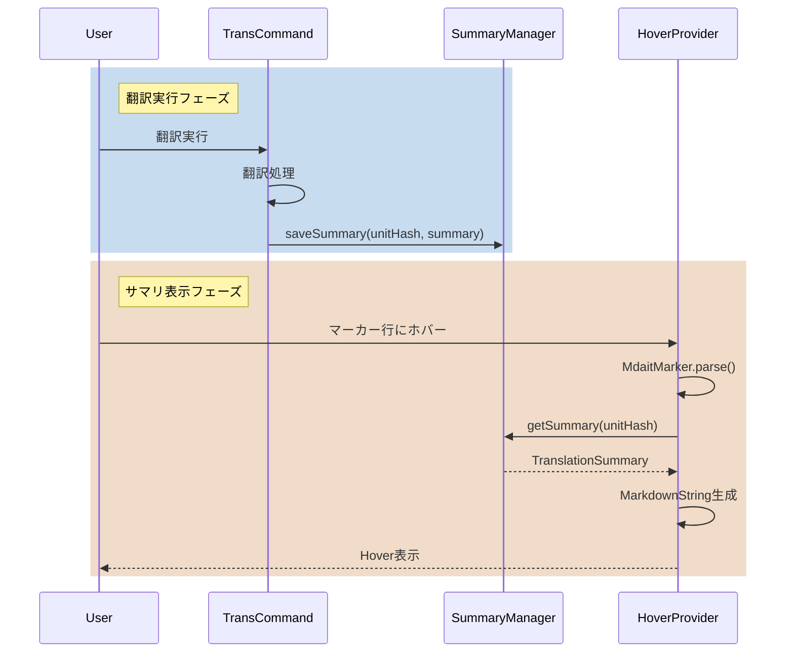

# 作業チケット: 翻訳サマリHover表示機能

## 1. 概要と方針

mdaitマーカー行にマウスホバーしたとき、翻訳実行後の統計・用語候補・注意事項などをHoverで表示する。永続化は不要で、翻訳コマンド実行時の結果をメモリ上で保持する。

## 2. シーケンス図

## 3. 考慮事項

- **検索キー**: 各翻訳ユニットを一意に識別するためにunitHash（ハッシュ値）を使用
- **データのライフサイクル**: ファイルクローズ時やVS Code再起動時にクリア（永続化不要）
- **パフォーマンス**: Hoverは頻繁に発火するため、マーカーパースとMap検索は十分高速である必要
- **用語候補の生成**: 既存の`term-extractor.ts`を活用してAI翻訳時に候補抽出
- **l10n対応**: Hover内のテキストも`vscode.l10n.t()`で多言語対応
- **StatusManagerとの関係**: StatusManagerは翻訳状態管理に集中、サマリは別管理（責務分離）

## 4. 実装計画と進捗

- [x] `src/ui/hover/summary-manager.ts`の実装
  - TranslationSummaryインターフェース定義
  - SummaryManagerクラス実装（Map<unitHash, summary>でユニットハッシュをキーに検索）
  - saveSummary / getSummary / clearSummary メソッド
  
- [x] `src/ui/hover/translation-summary-hover-provider.ts`の実装
  - HoverProvider実装
  - マーカー行検出ロジック
  - MarkdownString生成（統計、用語候補、注意事項）
  - commandリンク埋め込み（用語集追加など）
  
- [x] `src/commands/trans/trans-command.ts`の修正
  - 翻訳実行時にサマリデータ生成
  - SummaryManager.saveSummary()呼び出し
  - 用語候補抽出（term-extractor活用）
  
- [x] `src/extension.ts`の修正
  - SummaryManagerインスタンス生成
  - HoverProvider登録
  
- [x] l10n対応
  - Hover表示文言を`l10n/bundle.l10n.json`に追加
  - 日本語版も追加

- [x] 動作確認
  - 翻訳実行後にホバー表示されることを確認
  - 用語候補リンククリックの動作確認
  - 複数ユニット翻訳時の動作確認
