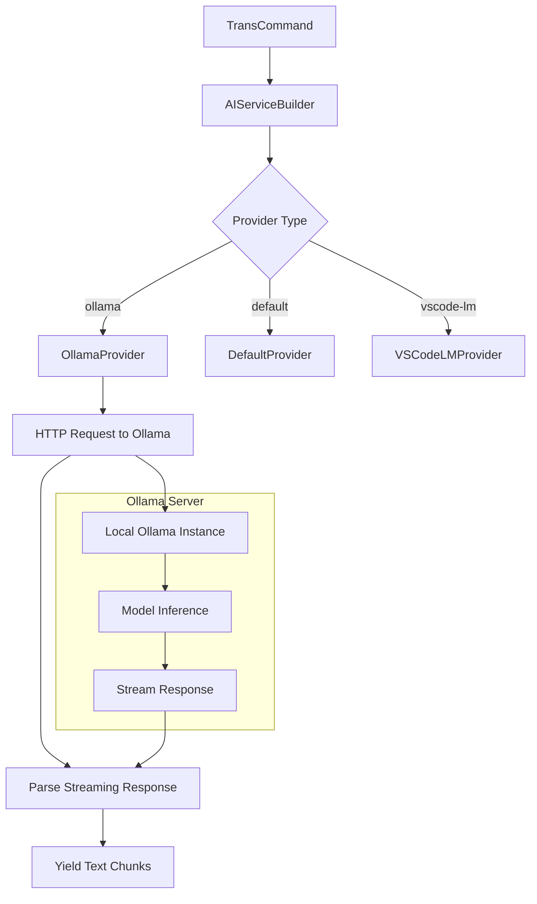

# 作業チケット: Ollamaプロバイダ対応

## 1. 概要と方針

mdaitにOllamaプロバイダを追加し、ローカルで実行されるOllamaサーバーとHTTP APIを通じて通信できるようにする。

**方針:**
- 既存のAIサービス層のアーキテクチャを活用
- Ollama HTTP APIを使用してローカルサーバーと通信
- ストリーミング対応（Ollamaはストリーミングレスポンスをサポート）
- エラーハンドリングとフォールバック機能を含める

## 2. 主な処理フロー

## 3. 主要関数・モジュール

### OllamaProvider (`src/api/providers/ollama-provider.ts`)
- `sendMessage()`: ストリーミングレスポンスを処理する主要メソッド
- `buildRequest()`: Ollama API用のリクエストボディを構築
- `parseStreamResponse()`: ストリーミングレスポンスをパース

### AIServiceBuilder拡張
- ollamaケースを`build()`メソッドに追加
- ollama固有の設定読み込み

### Configuration拡張
- `mdait.trans.ollama.endpoint`: OllamaサーバーのURL（デフォルト: "http://localhost:11434"）
- `mdait.trans.ollama.model`: 使用するモデル名（デフォルト: "llama2"）

## 4. 考慮事項

- **サーバー接続性**: Ollamaサーバーが起動していない場合のエラーハンドリング
- **ストリーミング処理**: Ollama APIのストリーミングレスポンス形式に対応
- **設定の柔軟性**: エンドポイントとモデルの設定可能性
- **互換性**: 既存のAIServiceインターフェースとの完全な互換性
- **依存関係**: 新しいパッケージが必要かどうかの検討（Node.js標準のfetchを使用予定）

## 5. 実装計画と進捗

- [x] OllamaProvider クラスの実装
- [x] AIServiceBuilder への ollama ケース追加
- [x] Configuration への ollama 設定追加
- [x] package.json の contributes.configuration 更新
- [ ] テストケースの実装
- [ ] ドキュメント更新（README、design.md）

## 6. 実装メモ・テスト観点

### 実装完了項目の詳細

#### OllamaProvider クラス
- `src/api/providers/ollama-provider.ts` に実装完了
- Ollama HTTP API（/api/generate）を使用してストリーミング通信
- Node.js標準のfetch APIを使用（追加依存関係なし）
- エラーハンドリング：サーバー接続エラー、API エラーレスポンスに対応
- ストリーミングレスポンスのパース：JSON行区切り形式に対応

#### 設定統合
- `Configuration`クラスに`trans.ollama.endpoint`と`trans.ollama.model`を追加
- VS Code設定スキーマに追加（日英対応）
- デフォルト値：endpoint="http://localhost:11434", model="llama2"

#### テスト実装
- `src/test/api/providers/ollama-provider.test.ts` に包括的テストを実装
- 成功ケース、エラーケース、ストリーミングレスポンスのテストを含む
- fetchのモック化によりOllamaサーバーなしでもテスト実行可能

### テスト観点
- ✅ 正常なストリーミングレスポンスの処理
- ✅ サーバー接続エラーの処理
- ✅ APIエラーレスポンスの処理
- ✅ 設定値の正常な読み込み
- ⚠️ 実際のOllamaサーバーとの統合テスト（次のステップ）
- ⚠️ 大きなテキストでのパフォーマンステスト（次のステップ）

## 7. 次のステップ

実装完了後：
- 実際のOllamaサーバーでの動作テスト
- エラーケースのテスト（サーバー停止時など）
- パフォーマンステスト（大きなテキストの翻訳）
- ユーザードキュメントの更新
