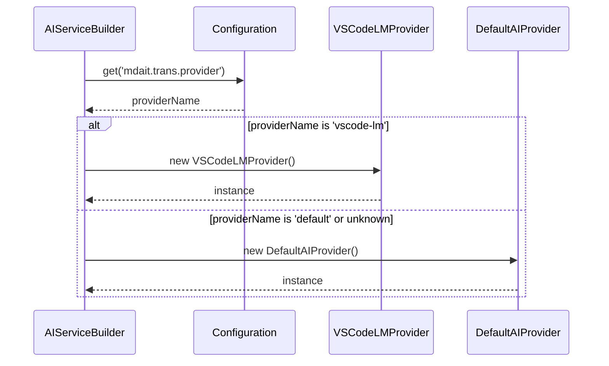

# 作業チケット: vscode-lmプロバイダ接続

## 1. 概要と方針

`AIServiceBuilder` を修正し、VSCodeの設定 `mdait.trans.provider` の値に応じて `vscode-lm` プロバイダをインスタンス化するようにします。`vscode-lm` プロバイダは、VS Code Language Model API を利用してサービスを提供します。

## 2. 主な処理フロー

## 3. 主要関数・モジュール

- `AIServiceBuilder.build()`: 設定に基づいてプロバイダを選択・インスタンス化
- `AIServiceBuilder.loadConfiguration()`: VSCode設定から `mdait.trans.provider` を読み込み
- `VSCodeLanguageModelProvider`: VS Code Language Model APIを使用したプロバイダ実装

## 4. 考慮事項

- `AIServiceBuilder` の現在の実装では `config.model` でプロバイダを判定しているが、設定読み込み時に `config.trans.provider` を `model` プロパティに設定している
- VSCodeの設定値は `mdait.trans.provider` で、値は `"vscode-lm"` または `"default"` を想定
- `VSCodeLanguageModelProvider` は既に実装済みで、GitHub Copilotの言語モデルを利用している
- プロバイダの切り替えによってユーザビリティが変わるため、適切なエラーハンドリングが重要

## 5. 実装計画と進捗

- [x] `Configuration.load()` に `trans.model` の読み込み処理を追加
- [x] `AIServiceConfig` に `provider` プロパティを追加
- [x] `AIServiceBuilder.build()` の分岐条件を `provider` ベースに修正
- [x] `AIServiceBuilder.loadConfiguration()` で `provider` と `model` を適切に設定
- [x] 動作確認とテスト

## 6. 実装メモ・テスト観点

### 実装完了内容
- 設定構造を `provider` と `model` に分離し、適切な責任分担を実現
- `Configuration.trans.model` の読み込み処理を追加
- `AIServiceConfig` インターフェースに `provider` プロパティを追加
- `AIServiceBuilder.build()` で `provider` による分岐処理に変更
- エラーメッセージも `provider` ベースに修正

### テスト結果
- コンパイルエラーなし
- 既存のvscode-lm-providerテストは正常に通過
- TypeScriptビルドも成功

### 設計との整合性
- VSCode設定: `mdait.trans.provider` と `mdait.trans.model` 
- Configuration層: `trans.provider` と `trans.model` で管理
- AIServiceBuilder層: `provider` で分岐、`model` を各プロバイダに渡す
- 適切な責任分担と拡張性を確保

## 7. 次のステップ

実装完了後、翻訳コマンドでvscode-lmプロバイダが正常に動作することを確認

