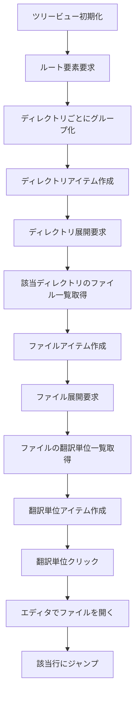

# 作業チケット: ステータスツリー子要素サポート

## 1. 概要と方針

ステータスツリービューにディレクトリ → ファイル → 翻訳単位の3階層表示機能を追加し、翻訳単位クリック時のエディタジャンプ機能を実装する。現在のフラットなファイル一覧表示から、より詳細で使いやすい階層表示に拡張する。

## 2. 主な処理フロー

## 3. 主要関数・モジュール

### StatusItem型の拡張
- `type`に`"directory"`と`"unit"`を追加
- 位置情報（`startLine`, `endLine`）を追加
- 親子関係の管理

### StatusTreeProvider の拡張
- `getChildren()`: 階層に応じた子要素の返却
- `createDirectoryItems()`: ディレクトリアイテム作成
- `createUnitItems()`: 翻訳単位アイテム作成

### ジャンプ機能
- `onDidChangeSelection`イベントハンドラ
- VS Code の`showTextDocument`と`Selection`API使用

## 4. 考慮事項

- **パフォーマンス**: 遅延読み込みなしの要求のため、全データを事前に読み込み
- **位置情報**: `MdaitUnit`に行番号情報が含まれているか確認が必要
- **エラーハンドリング**: パースエラーがあるファイルの扱い
- **既存機能の互換性**: 現在のコンテキストメニューやアイコン表示の維持

## 5. 実装計画と進捗

- [ ] `StatusItem`型の拡張（directory, unit タイプ追加、位置情報追加）
- [ ] `FileStatus`に翻訳単位詳細情報の追加
- [ ] `StatusCollector`で翻訳単位情報の収集機能追加
- [ ] `StatusTreeProvider.getChildren()`の階層対応実装
- [ ] ディレクトリレベルのアイテム作成機能
- [ ] 翻訳単位レベルのアイテム作成機能
- [ ] 各階層のアイコンとツールチップ設定
- [ ] ジャンプ機能の実装（コマンド登録とイベントハンドラ）
- [ ] 既存テストの更新と新規テスト追加

## 6. 実装メモ・テスト観点

## 7. 次のステップ

実装承認後、`StatusItem`型の拡張から開始し、段階的に機能を追加していく。
