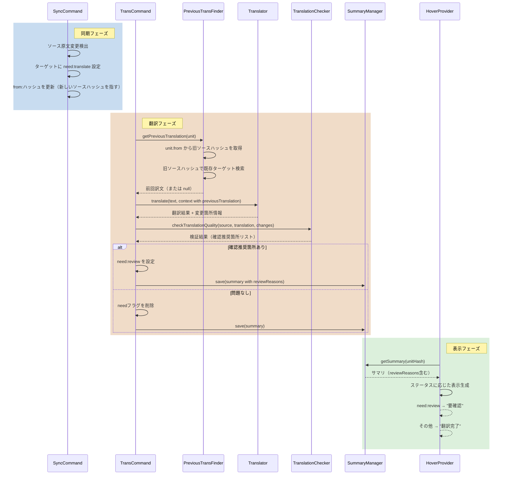

# 作業チケット: 改訂時の前回訳文参照

## 1. 概要と方針

すでに翻訳済みのユニットの原文が改訂された場合、前回の訳文を参照して以下を実現する：
1. 翻訳プロンプトに前回の訳文を明記
2. 変更不要なセンテンスは既訳を尊重し、変更が必要な箇所のみを変更
3. 翻訳後に原文と訳文の対訳チェックを行い、確認推奨箇所がある場合は`need:review`ステータスを設定し、ツールチップに理由を表示

## 2. シーケンス図

## 3. 考慮事項

### 3.1 前回訳文の特定方法

- **問題**: ソース原文が更新されると、ターゲットユニットの`from`フィールドも新しいソースハッシュに更新される。そのため、前回訳文を取得するには旧ソースハッシュを知る必要がある
- **解決策**: 
  - 翻訳前の時点では、ターゲットユニットの`from`フィールドはまだ旧ソースハッシュを指している
  - この旧ソースハッシュを使って、現在のターゲットファイル内から対応する訳文（ハッシュが一致するユニット）を探す
  - つまり、翻訳実行前にターゲットファイルの全ユニットを読み込み、`from`が一致するユニットを検索する

### 3.2 翻訳プロンプトの拡張

- `TranslationContext`に`previousTranslation?: string`フィールドを追加
- プロンプトに「Previous Translation (for reference):」セクションを追加
- AIに対して、前回訳文を参考にし、変更が不要な部分は維持するよう指示

### 3.3 変更箇所の追跡

- AIの応答フォーマットに`changes`フィールドを追加（オプショナル）
- 変更箇所の情報を含めることで、後続のチェック処理で重点的に確認すべき箇所を把握

### 3.4 翻訳品質チェック

- 原文と訳文を比較し、以下のような問題を検出：
  - 数値の不一致
  - リスト項目数の不一致
  - コードブロック数の不一致
  - その他の構造的不一致
- 検出された問題が変更箇所外にある場合、確認推奨として記録

### 3.5 need:reviewステータスの管理

- 確認推奨箇所がある場合、`need:review`を設定
- `TranslationSummary`に`reviewReasons: string[]`フィールドを追加
- Hover表示で「要確認」と表示し、理由をリスト表示

## 4. 実装計画と進捗

- [x] `src/commands/trans/previous-translation-finder.ts` の新規作成
  - getPreviousTranslation(unit, targetFilePath, config) メソッド
  - ターゲットファイルをパースしてユニット一覧を取得
  - unit.fromと一致するハッシュを持つユニットを検索
  
- [x] `src/commands/trans/translation-context.ts` の拡張
  - `previousTranslation?: string` フィールドを追加
  
- [x] `src/commands/trans/translator.ts` の修正
  - プロンプトに前回訳文セクションを追加
  - AIに変更が必要な箇所のみを変更するよう指示
  
- [x] `src/commands/trans/translation-checker.ts` の新規作成
  - checkTranslationQuality(source, translation, changes?) メソッド
  - 数値、リスト項目数、コードブロック数などを比較
  - 確認推奨箇所のリストを返す
  
- [x] `src/commands/trans/trans-command.ts` の修正
  - translateUnit 内で前回訳文を取得
  - 翻訳結果を検証
  - 確認推奨箇所がある場合は need:review を設定
  - サマリにレビュー理由を含める
  
- [x] `src/ui/hover/summary-manager.ts` の拡張
  - TranslationSummary に `reviewReasons?: string[]` を追加
  
- [x] `src/ui/hover/translation-summary-hover-provider.ts` の修正
  - need:review の場合に「要確認」と表示
  - reviewReasons をツールチップに表示
  
- [x] `design/commands.md` の更新
  - 前回訳文参照機能の記載を追加
  
- [ ] テスト実装
  - previous-translation-finder のテスト
  - translation-checker のテスト
  - 統合テスト（翻訳からレビューステータス設定まで）
  
- [ ] 動作確認
  - 実際のMarkdownファイルで動作確認
  - 前回訳文が正しく参照されることを確認
  - need:review が適切に設定されることを確認
