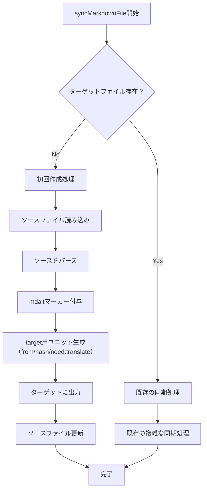

# 作業チケット: sync処理の初回作成時最適化

## 1. 概要と方針

現在のsync処理では、ターゲットファイルが存在しない場合でも複雑な同期処理（SectionMatcher、DiffDetector）を実行している。初回作成時はソースにmdaitマーカーを付与し、ターゲットにはfrom/hash/need:translateを正しく付与してコピーするだけで十分なため、処理を分岐して最適化する。

## 2. 主な処理フロー

## 3. 主要関数・モジュール

- `syncMarkdownFile`: メイン処理を初回作成と更新で分岐
- `createInitialTargetFile`: 新規作成専用の処理（新規実装）
- `syncExistingMarkdownFile`: 既存ファイル同期処理（既存コードをリファクタ）

## 4. 考慮事項

- 既存の同期処理ロジックは変更しない（影響範囲を最小限に）
- 初回作成時のmdaitマーカー付与は確実に行う（sourceにはneed,fromを付与しない）
- targetにはfrom:hash, need:translateを必ず付与する
- エラーハンドリングは両方の処理パスで適切に実装
- 差分検出結果の整合性を保つ（初回作成時は全て追加として扱う）

## 5. 実装計画と進捗

- [x] `createInitialTargetFile`関数の実装
- [x] `syncMarkdownFile`の処理分岐実装
- [x] 既存同期処理の`syncExistingMarkdownFile`への分離
- [x] 差分検出結果の調整
- [ ] テストケースの追加・修正

## 6. 実装メモ・テスト観点

- source側にはneed,fromを付与しないことを確認
- target側にはfrom:hash, need:translateが正しく付与されていること
- 既存同期処理の動作に影響がないこと
- 既存テストの通過と、初回作成時の新規テスト追加

## 7. 次のステップ

- テストケースの追加・修正を完了し、パフォーマンステストを実施
- 大量ファイル処理時の改善効果を測定する
