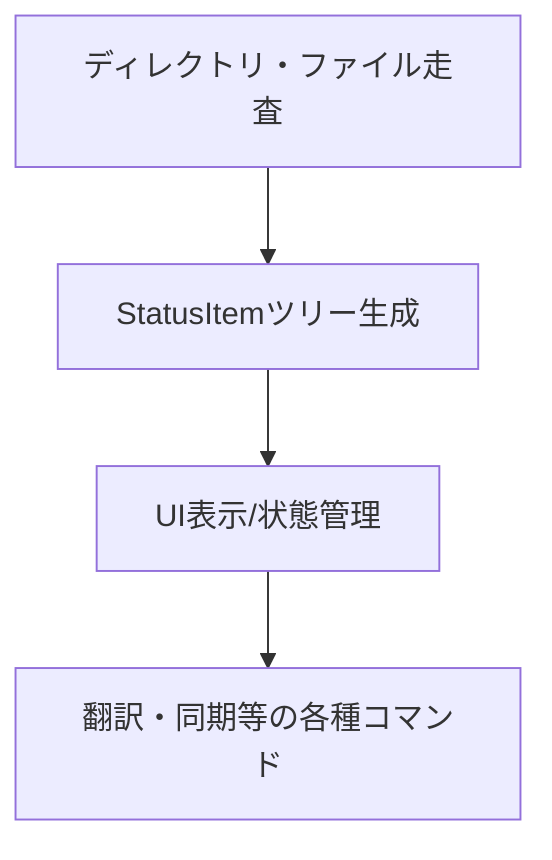

# 作業チケット: StatusItem一元化によるインデックス廃止

## 1. 概要と方針
- これまで `index-manager.ts` および `index-types.ts` で管理していたインデックス情報を廃止し、`StatusItem` 型に一元化する。
- ファイル・ユニット情報の管理、状態判定、ツリー生成など全てStatusItemベースで行う。
- インデックスファイル（index.json）の生成・永続化は一旦廃止。
- 既存のインデックス関連ロジック・型定義・利用箇所を全面的にリファクタリング。

## 2. 主な処理フロー

## 3. 主要関数・モジュール
- StatusItem生成・管理関数（新規/既存拡張）
- status-tree-provider.ts（ツリー表示ロジック）
- status-collector.ts（状態収集ロジック）
- index-manager.ts, index-types.ts（削除・統合）

## 4. 考慮事項
- fromHash等でのユニット検索や、ファイル単位の再パースなど、インデックス的な用途もStatusItemでカバーできるよう設計する
- パフォーマンス（特に大規模ディレクトリでの走査・生成コスト）
- テスト・既存コマンドへの影響範囲
- 設計ドキュメントの整合性

## 5. 実装計画と進捗
- [x] design.mdの修正
- [x] StatusItem生成・管理ロジックの拡張
- [x] status-tree-provider.tsのリファクタ
- [x] status-collector.tsのリファクタ
- [x] index-manager.ts, index-types.tsの削除/統合
- [x] テスト修正
- [x] 設計・実装メモ反映

## 6. 実装メモ・テスト観点
- StatusItemの構造が十分か、必要な情報を網羅できているか都度確認
- 既存のUI・コマンドが正しく動作するか
- 大規模ディレクトリでのパフォーマンス

### 実装完了項目
- `status-item-utils.ts`を新規作成：StatusItemツリーの検索・集計・操作用ユーティリティ関数群
- `status-tree-provider.ts`をリファクタ：index-manager依存を削除、StatusItemベースの状態管理に変更
- `status-collector.ts`をリファクタ：インデックスファイル依存を削除、直接ディレクトリ走査によるStatusItem収集に変更
- `sync-command.ts`および`trans-command.ts`をリファクタ：index-manager依存を削除、StatusItemベース検索に変更
- `src/core/index/`ディレクトリ全体を削除：index-manager.ts, index-types.tsを削除
- `design.md`の第12章をStatusItem一元化設計に更新

### テスト観点
- StatusItemツリー検索（fromHash、unitHash）が正しく動作するか
- 進捗集計・エラー抽出が期待通りに機能するか
- UI（ツリー表示）が従来通り動作するか
- sync/transコマンドが正常に実行できるか

## 7. 次のステップ
- 実装が完了しました。StatusItem一元化によりインデックスファイルが廃止され、シンプルで保守性の高いアーキテクチャに移行しました。
- 今後は必要に応じてStatusItemのシリアライズやキャッシュ機能の追加を検討してください。
