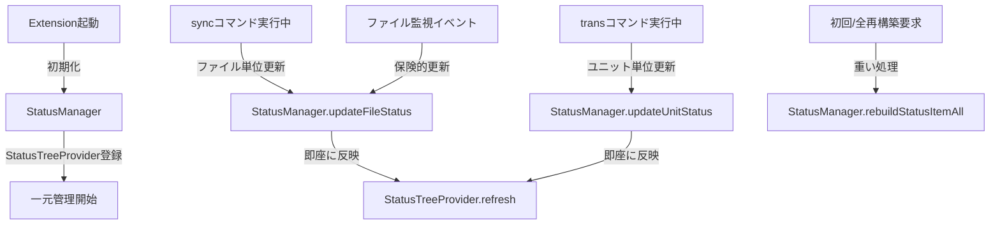

# 作業チケット: StatusItem全再構築メソッド設計

## 1. 概要と方針
St## 6. 実装メモ・テスト観点
- StatusManagerシングルトンの初期化タイミング（extension.ts起動時）
- ユニット単位更新によるUIパフォーマンスへの影響（transコマンド）
- ファイル単位更新によるリアルタイム反映（syncコマンド）
- 複数コマンド同時実行時の排他制御
- status-item-utilsからの移行（既存利用箇所の更新）
- ファイル数が多い場合のrebuildStatusItemAllパフォーマンス計測
- エラー時のStatusItem更新動作確認
- 型安全化完了：IStatusTreeProviderインターフェースによりany型を排除し、循環参照を回避しつつ型安全な連携を実現
- StatusManagerクラスのexport問題解消：TypeScriptコンパイルエラー・lintエラー共に解消
- StatusTreeProviderの設計思想修正：StatusCollector直接利用からStatusManager一元管理への変更完了rシングルトンクラスを作成し、StatusItemの一元管理を行う。全再構築（全ファイルパース）は重い処理であることを明示し、通常はコマンド経由のリアルタイム更新を推奨する。status-item-utilsの機能も統合し、StatusItemの操作を一元化する。

## 2. 主な処理フロー

## 3. 主要関数・モジュール
- `StatusManager（シングルトン）`: StatusItemの一元管理クラス
  - `rebuildStatusItemAll()`: 全ファイルをパースしStatusItemツリーを再構築（重い処理）
  - `updateFileStatus()`: ファイル単位でStatusItemを更新（sync用）
  - `updateUnitStatus()`: ユニット単位でStatusItemを更新（trans用）
  - `changeFileStatusWithError()`: エラー発生時のStatusItem更新
  - `findUnitsByFromHash()`, `findUnitByHash()` など：status-item-utilsから移管
- `StatusCollector`: 実際のファイルパース処理（StatusManagerから呼び出し）
- `StatusTreeProvider`: UI表示（StatusManagerから更新通知を受ける）

## 4. 考慮事項
- StatusManagerはシングルトンパターンで実装し、全コマンド・UIから同一インスタンスにアクセス
- rebuildStatusItemAllは重い処理であることをメソッド名・コメントで明示
- コマンド実行中のリアルタイム更新により、UIへの即座な反映を実現
- ファイル監視はVSCode外からの変更の保険として利用
- StatusItemの一貫性担保（同時実行・排他制御）
- status-item-utilsの機能をStatusManagerに統合し、操作を一元化

## 5. 実装計画と進捗
- [x] StatusManagerシングルトンクラス設計・実装
- [x] rebuildStatusItemAllメソッド実装（重い処理であることを明示）
- [x] updateFileStatusメソッド実装（syncコマンド用ファイル単位更新）
- [x] updateUnitStatusメソッド実装（transコマンド用ユニット単位更新）
- [x] changeFileStatusWithErrorメソッド実装（エラー時更新）
- [x] status-item-utilsの機能をStatusManagerに移管
- [x] StatusTreeProviderとの連携実装
- [x] sync/transコマンドからのStatusManager呼び出し実装
- [x] ファイル監視イベントとの連携
- [x] StatusTreeProviderのinterface型安全化（any型排除）
- [ ] テスト追加

## 6. 実装メモ・テスト観点
- StatusManagerシングルトンの初期化タイミング（extension.ts起動時）
- ユニット単位更新によるUIパフォーマンスへの影響（transコマンド）
- ファイル単位更新によるリアルタイム反映（syncコマンド）
- 複数コマンド同時実行時の排他制御
- status-item-utilsからの移行（既存利用箇所の更新）
- ファイル数が多い場合のrebuildStatusItemAllパフォーマンス計測
- エラー時のStatusItem更新動作確認
- 型安全化完了：IStatusTreeProviderインターフェースによりany型を排除し、循環参照を回避しつつ型安全な連携を実現
- StatusManagerクラスのexport問題解消：TypeScriptコンパイルエラー・lintエラー共に解消

## 7. 次のステップ
- 実装後、tasks/doneへ移動し設計との整合性確認
- 実装内容のレビュー・フィードバック対応
