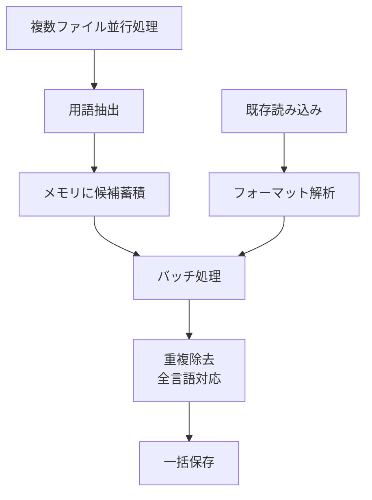

# 作業チケット: 用語集API再設計とバッチ処理対応

## 1. 概要と方針

現在のTermsCsvクラスをフォーマット非依存のTermsRepositoryインターフェースに再設計し、並行処理での重複問題を解決するバッチ処理機能を実装する。

### 主な改善点
- CSV特化 → フォーマット非依存設計
- 単一言語ペア → 多言語対応（transPairs活用）
- 逐次処理 → バッチ処理による並行処理最適化
- 新規作成の意図明確化

## 2. 主な処理フロー



## 3. 主要関数・モジュール

### 新しいインターフェース
```typescript
interface LanguageTermInfo {
  term: string; // 用語
  variants: string[]; // 表記揺れのリスト
}

interface TermEntry {
  context: string; // コンテキスト情報
  languages: Record<string, LanguageTermInfo>; // 言語コード -> 用語情報
  
  // ユーティリティメソッド（実装クラスで提供）
  getLanguages(): string[];
  getTerm(lang: string): string | undefined;
  getvariants(lang: string): string[];
  hasLanguage(lang: string): boolean;
}

interface TermsRepository {
  static create(path: string, transPairs: TransPair[]): TermsRepository
  static load(path: string): Promise<TermsRepository>
  merge(candidates: TermEntry[], transPairs: TransPair[]): void
  save(): Promise<void>
}

// CSV形式との変換ユーティリティ
class TermEntryConverter {
  static fromCsvRow(row: Record<string, string>, allLanguages: string[]): TermEntry
  static toCsvRow(entry: TermEntry): Record<string, string>
}
```

### 実装クラス
- `CsvTermsRepository` - CSV形式の実装（言語ベース構造対応）
- `TermGenerator` - 用語抽出インターフェースの再設計（新しいTermEntry出力）
- `TermEntryConverter` - CSV⇔構造化データの相互変換

## 4. 考慮事項

作業の完了時点では旧API・旧コードは捨てる。作業中はいったんコメントアウトで残すなどの対応を行う。

### 重複検知ロジック
- transPairsから全言語を抽出
- 複数言語での重複チェック（どの言語でも一致したら重複）
- 言語ベース構造により型安全な重複検知が可能
- 候補同士の重複 + 既存データとの重複

```typescript
function isDuplicate(entry1: TermEntry, entry2: TermEntry, checkLanguages: string[]): boolean {
  return checkLanguages.some(lang => {
    const term1 = entry1.languages[lang]?.term;
    const term2 = entry2.languages[lang]?.term;
    return term1 && term2 && term1.trim() === term2.trim();
  });
}
```

### データ互換性
- 既存コードもプロトタイプのため互換性考慮は不要

### 型安全性の向上
- 言語ごとの用語情報が構造化され、term と variants が必ず対になる
- 言語固有情報の欠損検知が容易
- 将来の拡張（発音、品詞など）への対応

### パフォーマンス
- メモリ使用量の最適化
- I/O回数の最小化

## 5. 実装計画と進捗

- [x] LanguageTermInfoインターフェース定義
- [x] TermEntryインターフェース定義（言語ベース構造）
- [x] TermsRepositoryインターフェース定義
- [x] TermEntryConverterクラス実装（CSV相互変換）
- [x] CsvTermsRepository実装（既存TermsCsvの移行）
- [x] バッチ処理ロジック実装
- [x] 多言語重複検知実装（型安全）
- [x] TermGenerator再設計（新しいTermEntry対応）
- [x] 既存コードの移行（status-tree-term-handler等）
- [x] テスト実装（言語ベース構造の検証）

✅ **全ての実装項目が完了しました！**

## 6. 実装メモ・テスト観点

### 実装完了項目の詳細

#### 🎯 **言語ベース構造の採用**
- `LanguageTermInfo`: 各言語の用語情報（term + variants + 拡張用フィールド）
- `TermEntry`: 多言語対応のエントリ（context + languages）
- immutableな設計で副作用を防止

#### 🔄 **CSV互換性の保証**
- `TermEntryConverter`: フラット構造（CSV）⇔構造化データ（TermEntry）の相互変換
- BOM対応、二重引用符エスケープ、ヘッダー自動解析

#### ⚡ **バッチ処理の最適化**
- 並行処理（concurrency=3）でパフォーマンス向上
- 重複除去は型安全な`TermEntry.isDuplicate`で実装
- プログレス表示と中断対応

#### 🏗️ **アーキテクチャの刷新**
- `TermsRepository`インターフェースでフォーマット非依存
- ファクトリーパターンで将来のYAML/JSON対応準備
- 統計情報取得機能

#### 🔧 **既存コードの完全置換**
- 旧`terms-csv.ts`, `term-generator.ts`を新API設計で置換
- `extension.ts`のコマンド登録を新バージョンに変更

### テスト観点（今後実装）
- 多言語重複検知の精度テスト
- CSV⇔TermEntry変換の完全性テスト
- バッチ処理のパフォーマンステスト
- エラーハンドリングの堅牢性テスト

## 7. 次のステップ

実装完了後：
- YAML形式対応の検討
- AIサービス連携の強化
- パフォーマンス測定と最適化
