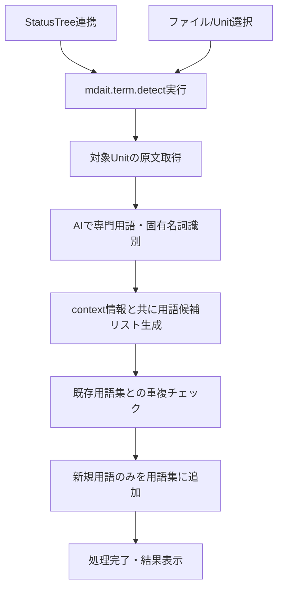

# 作業チケット: term-detectコマンド実装

## 1. 概要と方針

`mdait.term.detect`コマンドの実装を行う。既存の`term-gen-command.ts`と`term-generator.ts`をベースとして、用語検出に特化したコマンドとサービスを新規作成する。

現在の`term-gen-command.ts`は用語生成（detect + expand）を一体化した実装になっているため、設計書に従って`detect`と`expand`の2つのコマンドに分離する。

## 2. 主な処理フロー



## 3. 主要関数・モジュール

### 新規作成するファイル
- `command-detect.ts`: `mdait.term.detect`コマンドエントリーポイント
- `term-detector.ts`: 用語検出に特化したサービス

### 既存ファイルの活用
- `term-generator.ts`: AITermGeneratorクラスをベースとして用語検出用プロンプトに調整
- `terms-repository.ts`: 既存用語集との重複チェック・新規追加処理
- `term-entry.ts`: 用語データ構造は既存のまま活用

### 主要インターフェース
```typescript
interface TermDetector {
  detectTerms(sourceText: string, sourceLang: string, context?: string): Promise<TermEntry[]>;
}
```

## 4. 考慮事項

- 既存の`term-gen-command.ts`からの機能分離が必要
- AI用語検出プロンプトは翻訳用ではなく、単言語での用語抽出に特化する
- 既存用語集との重複チェックロジックの実装
- ステータスツリーからの起動とUnit単位での進捗表示
- StatusItem連携（File/Unit対応）
- 設計書に記載されたCSV仕様への準拠

## 5. 実装計画と進捗

- [x] `command-detect.ts`の作成（mdait.term.detectコマンド実装）
- [x] `term-detector.ts`の作成（用語検出サービス）
- [x] AI用語検出プロンプトの実装
- [x] 既存用語集との重複チェック機能
- [x] Unit単位での処理とステータス更新
- [x] extension.tsでのコマンド登録
- [x] package.jsonでのコマンド定義と多言語対応
- [x] エラーハンドリングと進捗表示
- [ ] StatusTree連携とアイコン表示（次の実装フェーズ）
- [x] 既存term-gen-commandとの統合確認（term-gen-command.tsは削除済み）

## 6. 実装メモ・テスト観点

### 実装完了項目
1. **`term-detector.ts`**: AIを使った用語検出サービスを実装
   - 単言語での用語抽出に特化したプロンプト
   - モック実装でのフォールバック機能
   - ストリーミング応答の処理

2. **`command-detect.ts`**: mdait.term.detectコマンドを実装
   - ファイルからの用語検出入力データ収集
   - 既存用語との重複チェック
   - 進捗表示と結果保存
   - 設定に基づく用語集パス取得

3. **VSCode拡張機能統合**:
   - extension.tsでのコマンド登録
   - package.jsonでのUI定義
   - 多言語対応（日本語・英語）

### 考慮済み事項
- 既存のAIServiceインターフェースとの統合
- 設定ファイルからの用語集パス取得
- TermsRepositoryCSVを使った用語集管理
- マークダウンパーサーとの連携

### 次のテスト観点
- AI用語検出の精度確認
- 重複チェック機能の動作確認
- エラーハンドリングの動作確認
- 用語集ファイルの正しい生成・更新

## 7. 次のステップ

detectコマンド実装完了後、expandコマンドの実装に着手する。既存のterm-gen-commandは削除済みなので、expand機能は新規実装する。
