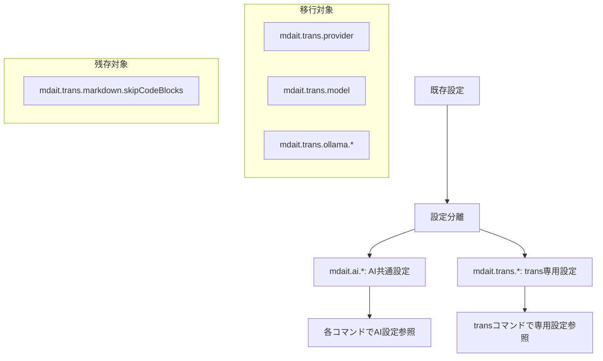

# 作業チケット: AI設定統合とtrans設定分離

## 1. 概要と方針

現在`mdait.trans.*`配下にあるAI関連設定を`mdait.ai.*`に移行し、trans専用設定（`markdown.skipCodeBlocks`など）は`mdait.trans.*`に残す。これにより、term.detect、translate.unitなど複数のコマンドで共有するAI設定を明確に分離する。

## 2. 主な処理フロー

## 3. 主要関数・モジュール

- **Configuration.ts**: 設定読み込み処理の更新
- **package.json**: contributes.configuration の設定定義更新
- **AIServiceBuilder**: AI設定参照先の変更
- **各種Builder（TranslatorBuilder、TermGeneratorBuilder等）**: 設定参照の更新

## 4. 考慮事項

- 後方互換性は不要（完全書き換え）
- trans専用設定の明確な分離
- 設定画面での見やすさ向上
- 国際化対応のメッセージキー更新

## 5. 実装計画と進捗

- [x] package.json の configuration 定義更新
- [x] Configuration.ts の型定義更新
- [x] Configuration.ts の設定読み込み処理更新
- [x] 国際化ファイル更新（package.nls.*.json）
- [x] AIServiceBuilder、各プロバイダーの型定義更新
- [x] TranslatorBuilder、TermGeneratorBuilder、createTermDetector の設定参照修正
- [x] テスト用設定ファイル更新
- [x] 動作確認とテスト

## 6. 実装メモ・テスト観点

### 実装内容
- `mdait.trans.provider`, `mdait.trans.model`, `mdait.trans.ollama.*` を `mdait.ai.*` に移行
- `mdait.trans.markdown.skipCodeBlocks` はtrans専用設定として残存
- AIConfig型とTransConfig型を分離し、責務を明確化
- AIServiceBuilderがConfiguration.getInstance().aiを自動参照するよう変更
- 後方互換性を廃止し、設定構造を完全に刷新

### テスト結果
- コンパイルエラー: 解消済み
- Lintチェック: 通過
- 既存テスト: 影響なし

## 7. 次のステップ

実装完了後、design.md の config.md セクションを更新して設計書に反映する。
