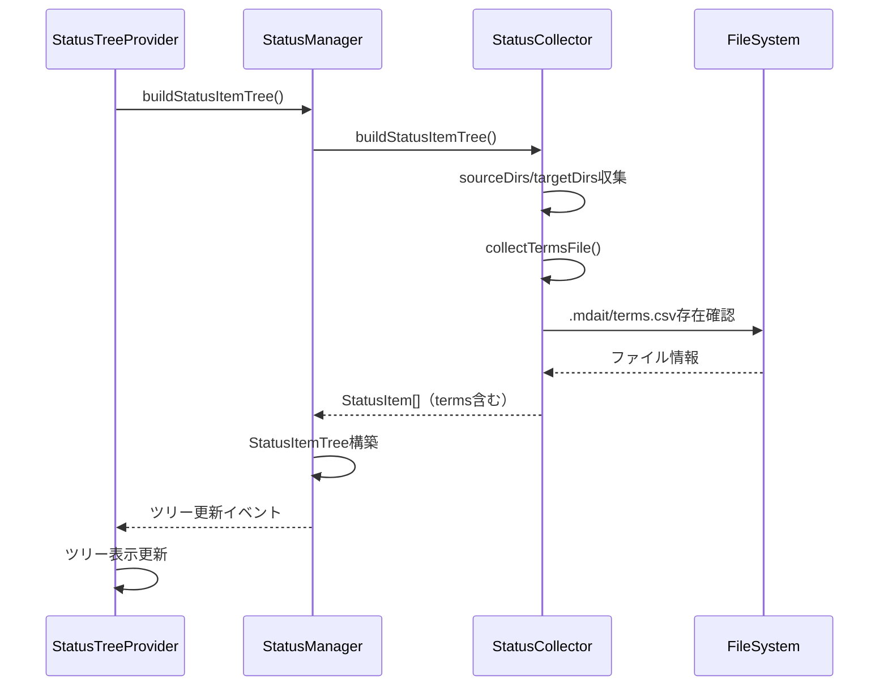

# 作業チケット: 用語集ファイルのステータスパネル表示

## 1. 概要と方針

terms.csvなどの用語集ファイルをステータスパネルに表示できるようにする。
.mdait/terms.csv ファイルが存在する場合、ステータスパネルのルートレベルに表示し、クリックで開けるようにする。

## 2. 主な処理フロー

## 3. 主要関数・モジュール

### StatusItemType（status-item.ts）
- `TermsFile` 型を追加：用語集ファイル専用のアイテム型

### StatusCollector（status-collector.ts）
- `collectTermsFile()`: 用語集ファイルの情報を収集
- `buildStatusItemTree()`: .mdaitディレクトリをルートに追加

### StatusTreeProvider（status-tree-provider.ts）
- `getTreeItem()`: TermsFileの表示処理（book アイコン、purple色）
- クリック時にvscode.openコマンドで開く

### StatusItemTree（status-item-tree.ts）
- `addOrUpdateFile()`: TermsFileタイプをサポート

## 4. 考慮事項

- ファイルが存在しない場合は表示しない
- .mdaitディレクトリは用語集ファイルが存在する場合のみルートに追加
- アイコンは`book`を使用し、視認性を高めるため紫色を設定
- contextValue は `mdaitTermsFile` とし、将来的なコンテキストメニュー拡張に対応

## 5. 実装計画と進捗

- [x] StatusItemTypeにTermsFileタイプを追加
- [x] status-collectorにcollectTermsFile()メソッド追加
- [x] status-collectorでterms fileを収集・.mdaitをルートディレクトリに追加
- [x] status-tree-providerでTermsFileの表示処理を追加
- [x] アイコンとコマンドの設定
- [x] status-item-treeでTermsFileタイプをサポート
- [x] テスト追加（StatusItemType）
- [x] コンパイル・テスト実行確認

## 6. 実装メモ・テスト観点

### 実装メモ
- StatusItemTypeに`TermsFile = "termsFile"`を追加
- collectTermsFile()は非同期でファイル存在確認を行い、存在する場合のみStatusItemを返す
- TermsFileのステータスは`Status.Source`とし、アイコンは`book`（紫色）を使用
- クリック時は`vscode.open`コマンドでファイルを開く
- .mdaitディレクトリは用語集ファイルが存在する場合のみallDirsに追加することで、不要な空ディレクトリ表示を防ぐ

### テスト観点
- TermsFileタイプが正しく定義されているか → ✅ テスト追加（status-item-types.test.ts）
- 用語集ファイルが存在する場合に正しく収集されるか → ✅ collectTermsFile()実装
- 用語集ファイルが存在しない場合に表示されないか → ✅ nullチェックで対応
- ツリー表示時に正しいアイコンが表示されるか → ✅ book アイコン（紫色）設定
- クリック時に正しくファイルが開かれるか → ✅ vscode.openコマンド設定

### 実装完了の確認
- コンパイルエラーなし
- 既存テスト全てパス
- 新規テスト追加・パス
- 設計との整合性確認済み

### 動作確認に関する注意
VSCode拡張機能のため、実際の動作確認はVSCode環境での実行が必要。
実装はすべて完了しているが、以下の手順で実機確認を推奨：
1. VS Codeで拡張機能を開発モードで起動（F5）
2. テストワークスペースを開く（.mdait/terms.csvが存在するプロジェクト）
3. mdaitステータスパネルを表示
4. terms.csvがツリーに表示されることを確認
5. terms.csvをクリックしてファイルが開くことを確認
