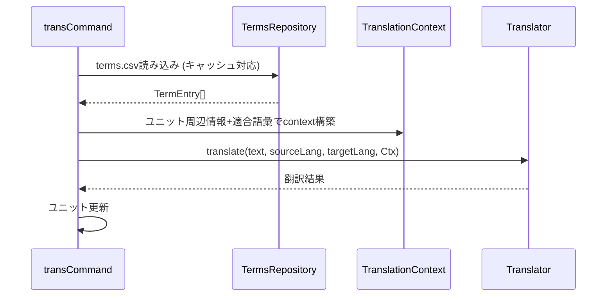

# 作業チケット: transコマンドへの用語集適用

## 1. 概要と方針

transコマンドで生成されたAIプロンプトに用語集を反映させ、翻訳結果の用語統一を図る。terms.csvが存在する場合は対象ユニットと関連する語彙のみを抽出してコンテキストに付与し、翻訳後はまずAI出力そのものを採用する（自動置換は将来検討とする）。

## 2. シーケンス図



## 3. 考慮事項

- 用語抽出は翻訳対象ユニットに出現する原語やvariantsに限定し、プロンプト肥大化を防ぐ。
- terms.csvが存在しない・壊れている場合は警告なしでフォールバック。
- キャッシュはファイルの更新検知（mtimeやハッシュ）を条件にし、trans→term→transの連続操作でも stale な語彙が残らないようにする。必要に応じて共有キャッシュをStatusManager等と共用せず、軽量に再読み込みできる構造を検討する。実装はmtime比較で差分検知し、更新されていればキャッシュ破棄→再読込。
- AIへのプロンプト例：
    ```text
    You are a professional translator. Translate the given text from ja to en.
    Context:
    Surrounding Text:
    前後の段落など...
    terms:
    [
        {"term":"アカウント","translation":"account","context":"ユーザー識別情報"},
        {"term":"開発プロセス","translation":"development process"}
    ]
    Keep the original meaning and tone.
    Do not translate placeholders like __CODE_BLOCK_PLACEHOLDER_n__.
    ```

## 4. 実装計画と進捗

- [x] TermsRepository読み込みをtransCommand初期化フローに追加
- [x] ユニット内容から用語候補を抽出するユーティリティ実装
- [x] TranslationContextにterms情報を設定しTranslatorへ受け渡し
- [x] テストケース／既存テストの観点更新
