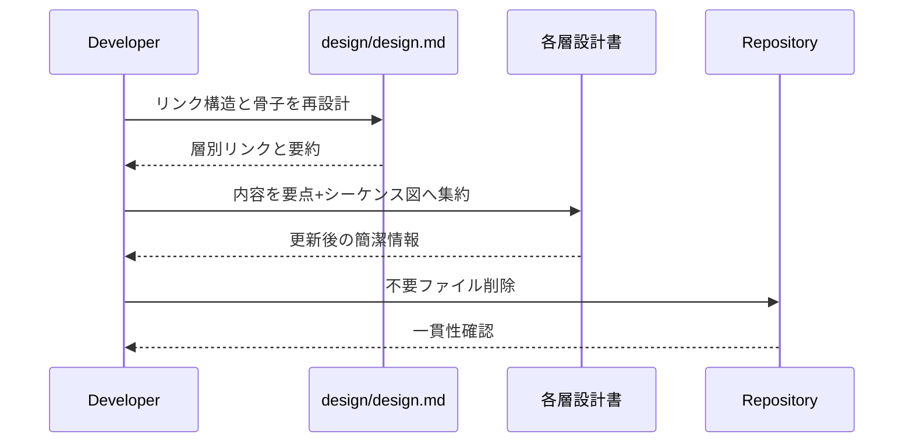

# 作業チケット: 設計ドキュメント再構成

## 1. 概要と方針

designフォルダ配下の設計書をスリム化し、上位ドキュメントから各層の要点へ最短で到達できる構成に刷新する。アーキテクチャ図直下に各層へのリンクをまとめ、重複した個別設計書を統合・削除する。

## 2. 主な処理フロー

### 概要
- 現状調査と必要な設計書の選定
- ルート設計書`design/design.md`の再編
- 各層設計書の簡潔化とシーケンス図の再構成
- 不要/統合済みファイルの削除と整合性確認

### シーケンス図

## 3. 主要関数・モジュール

- `design/design.md`：全体案内の刷新ポイント
- `design/ui.md`など各層設計書：要点とシーケンス図の再整理対象
- `design/commands_term.md`・`design/core_status.md`・`design/test_gui.md`：統合・削除予定

## 4. 考慮事項

- 既存の重要情報は、統合先のドキュメントで要点として保持する。
- シーケンス図はmermaidで要件に合わせて更新する。
- 記法やトーンを既存ドキュメントと揃えつつ簡潔さを優先する。
- リンク切れや冗長な参照が残らないよう最終確認する。

## 5. 実装計画と進捗

- [x] `design/design.md`のリンク再編と冗長リスト削除
- [x] 各層設計書の要約・再構成（UI/Commands/Core/Config/API/Utils/Test）
- [x] 統合対象ファイルの内容移管と削除
- [x] 文書全体のリンクおよび整合性確認

## 6. 実装メモ・テスト観点

- ドキュメント更新のみのためビルドやテストは未実施。
- Mermaid図はmdプレビューで描画確認済み。
- `design/`配下の不要ドキュメントは削除済み（commands_term/core_status/test_gui）。
