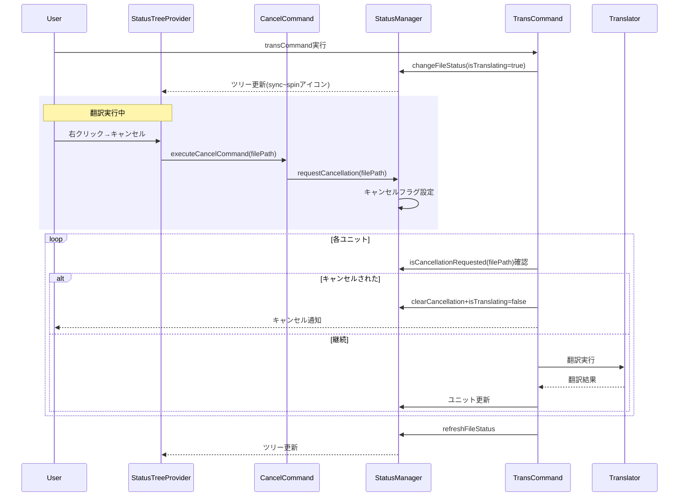

# 作業チケット: transコマンドキャンセル機能実装

## 1. 概要と方針

翻訳処理中のディレクトリ/ファイル/ユニットに対してステータスパネルのインラインアクションボタン（×ボタン）からキャンセルできる機能を実装する。`StatusItem`にキャンセル用の`contextValue`を追加し、翻訳中（`isTranslating=true`）のアイテムに対してツリーアイテムの右側にキャンセルボタンを表示する。キャンセル状態は`StatusManager`でファイル単位・ディレクトリ単位で管理し、各ユニット/ファイル翻訳前にチェックする。

## 2. シーケンス図

## 3. 考慮事項

- **StatusManagerにキャンセル管理機能を追加**: `Map<filePath, boolean>`でファイル単位、`Map<directoryPath, boolean>`でディレクトリ単位のキャンセル要求を管理
- **StatusItemのcontextValue**: `isTranslating=true`の場合に`translating-directory`/`translating-file`/`translating-unit`を設定
- **インラインアクションボタン**: `package.json`の`view/item/context`で`when`条件を使い、翻訳中のアイテム右側に「×」アイコンボタンを表示
- **並列実行対応**: ファイル単位でキャンセル状態を管理するため、複数ファイルの並列翻訳でも個別にキャンセル可能
- **ディレクトリキャンセル**: ディレクトリ翻訳時は各ファイル翻訳前にディレクトリのキャンセル状態をチェック、残りのファイルをスキップ
- **キャンセル後の状態**: 部分的に翻訳済みのユニットはファイルに保存され、`isTranslating`フラグはクリア
- **ユニット単位のキャンセル**: `transUnitCommand`でも同様にファイル単位のキャンセルフラグをチェック
- **アイコン選択**: VSCode標準の`close`アイコンを使用
- **package.json**: コマンド登録とインラインアクション設定を追加（`"group": "inline"`でツリーアイテム右側に表示）

## 4. 実装計画と進捗

### ファイル/ユニット単位のキャンセル
- [x] `StatusManager`にキャンセル管理メソッド追加（`requestCancellation`, `isCancellationRequested`, `clearCancellation`）
- [x] `StatusTreeProvider.getTreeItem`で`contextValue`を動的に設定（`isTranslating`に応じて`translating-file`/`translating-unit`）
- [x] キャンセルコマンド実装（`mdait.cancelTranslation`）
- [x] `transCommand`各ユニット翻訳前にキャンセルチェック追加
- [x] キャンセル時のクリーンアップ処理（`isTranslating=false`設定）
- [x] `transUnitCommand`にもキャンセルチェック追加
- [x] `package.json`にコマンド登録とインラインアクション設定（`group: inline`, `when`条件付き）

### ディレクトリ単位のキャンセル
- [x] `StatusManager`にディレクトリキャンセル管理メソッド追加（`requestDirectoryCancellation`, `isDirectoryCancellationRequested`, `clearDirectoryCancellation`）
- [x] `StatusItemTree`に`updateDirectoryPartial`メソッド追加
- [x] `StatusManager`に`changeDirectoryStatus`メソッド追加
- [x] `translateDirectory`でディレクトリの`isTranslating`設定とキャンセルチェック追加
- [x] `cancelTranslationCommand`でディレクトリ対応
- [x] `StatusTreeProvider`でディレクトリの`contextValue`動的設定（`translating-directory`）
- [x] `package.json`にディレクトリキャンセルのインラインアクション追加

### 動作確認
- [x] ファイル翻訳中にキャンセルボタンが表示され、クリックで正常にキャンセルされることを確認
- [x] ディレクトリ翻訳中にキャンセルボタンが表示され、クリックで残りのファイルがスキップされることを確認
