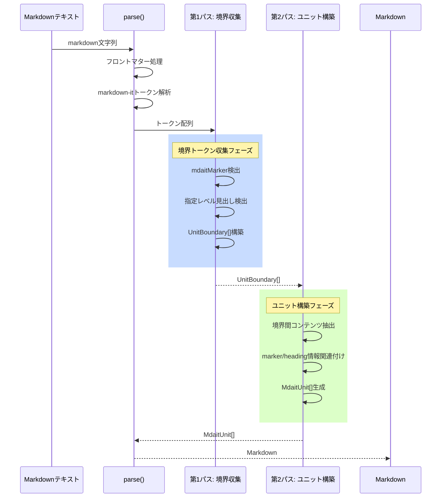

# 作業チケット: parser境界検出ロジック再設計

## 1. 概要と方針

現状のparser.tsは、mdaitMarkerと見出しを別々のタイミングでユニット確定のトリガーとしているため、見出しがない場所にmdaitMarkerがある場合に正しく処理できない。2パスアプローチ（境界収集→ユニット構築）に変更し、mdaitMarkerと見出しの両方を自然な形で境界要素として扱えるようにする。

## 2. シーケンス図

## 3. 考慮事項

- **既存のsyncファイル**: すべてのユニットがmdaitMarkerを持っているため、境界検出が明確
- **初回syncファイル**: 見出しのみで境界を判断し、sync後にmdaitMarkerが追加される
- **混在ケース**: 一部だけsync済みの場合、mdaitMarkerがある部分とない部分が混在
- **見出しのないmdaitMarker**: 任意の場所に配置可能な仕様を満たす必要がある
- **境界の優先順位**: mdaitMarkerが主要な境界指標、見出しは補助的な境界指標
- **後方互換性**: 既存のテストケースがすべて通ること
- **stringify処理**: 影響を受けないが、ユニット順序の整合性を確認

## 4. 実装計画と進捗

- [x] UnitBoundary型の定義を追加
- [x] 第1パス: 境界収集ロジックの実装（collectBoundaries関数）
  - [x] mdaitMarker検出処理
  - [x] 指定レベル見出し検出処理
  - [x] マーカーと見出しの統合ロジック（直後のみ、空行は別ユニット）
  - [x] 境界リストの構築とソート
- [x] 第2パス: ユニット構築ロジックの実装（buildUnitsFromBoundaries関数）
  - [x] 境界間のコンテンツ抽出
  - [x] contentからマーカー行の除去（toString時の重複回避）
  - [x] marker/heading情報の関連付け
  - [x] MdaitUnit生成
- [x] parse()メソッドの書き換え（2パスアプローチ適用）
- [x] 既存テストの実行と確認（21/21テスト通過）
- [x] syncコマンドテストの実行と確認（20/20テスト通過）
- [x] 設計ドキュメント（core.md）の更新
