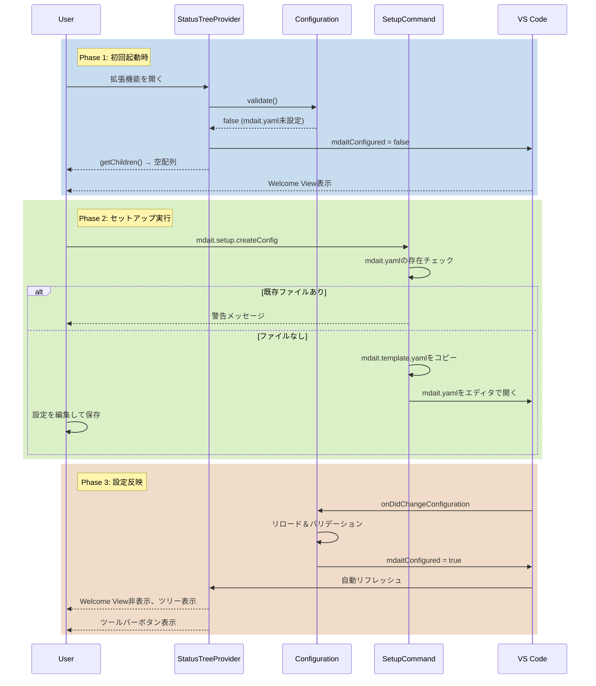

# 作業チケット: オンボーディングフロー実装

## 1. 概要と方針

mdait未設定時のリソース消費を抑制し、初期セットアップへの明確なパスを提供する。`mdait.yaml`ベースの現在の設計に適合する形で、Welcome View、設定バリデーション、テンプレート作成コマンドを実装する。

## 2. シーケンス図

## 3. 考慮事項

### 設計との整合性
- 現在の設計は`mdait.yaml`による設定管理を採用しており、`settings.json`は使用しない
- `Configuration`クラスのシングルトン設計と`mdait.yaml`ウォッチャーを活用
- バリデーション失敗時は`StatusManager`の初期化をスキップし、リソース消費を抑制

### ユーザー体験
- Welcome Viewはワークスペースが開かれている場合のみ表示（`workspaceFolderCount != 0`）
- ギアアイコンCTAで視覚的に設定へ誘導
- テンプレートには実用的なサンプル値とコメントを含める

### エラーハンドリング
- `mdait.template.yaml`が存在しない場合のフォールバック（組み込みテンプレート文字列を使用）
- 既存`mdait.yaml`への上書き防止
- ファイル作成失敗時のエラーメッセージ表示

### 影響範囲
- `StatusTreeProvider.getChildren()`: 早期リターンロジック追加
- `extension.ts`: コンテキスト変数管理とコマンド登録
- `package.json`: Welcome View、コマンド、メニューの追加
- l10nリソース: 日英両言語のメッセージ追加

## 4. 実装計画と進捗

### Phase 1: Configuration拡張
- [x] `Configuration.isConfigured()`メソッド実装
  - [x] `mdait.yaml`ファイルの存在チェック
  - [x] `transPairs`フィールドの妥当性チェック

### Phase 2: StatusTreeProvider更新
- [x] `getChildren()`にバリデーションゲート追加
  - [x] `Configuration.isConfigured()`失敗時は空配列を返す
  - [x] 既存ロジックへの影響確認

### Phase 3: SetupCommandコマンド実装
- [x] `src/commands/setup/setup-command.ts`作成
  - [x] `mdait.template.yaml`のコピーロジック
  - [x] 組み込みテンプレートへのフォールバック
  - [x] 既存ファイルチェックと警告表示
  - [x] エディタで開く処理
  - [x] エラーハンドリング

### Phase 4: UI統合
- [x] `package.json`更新
  - [x] `viewsWelcome`エントリ追加
  - [x] `mdait.setup.createConfig`コマンド登録
  - [x] ツールバーボタンの`when`条件に`mdaitConfigured`追加
- [x] `extension.ts`更新
  - [x] `mdaitConfigured`コンテキスト変数の初期化
  - [x] 設定変更監視と自動更新
  - [x] SetupCommandの登録

### Phase 5: l10n対応
- [x] `/l10n/bundle.l10n.json`に英語メッセージ追加
- [x] `/l10n/bundle.l10n.ja.json`に日本語メッセージ追加
- [x] `package.nls.json`と`package.nls.ja.json`更新

### Phase 6: テンプレートファイル
- [x] 組み込みテンプレート実装（`mdait.template.yaml`のフォールバック）
  - [x] 実用的なサンプル値
  - [x] 各フィールドの説明コメント
  - [x] 最小限の設定で動作可能な構成

### Phase 7: テスト
- [x] コンパイル・lintエラー確認
- [x] 既存単体テスト実行（36テスト全パス）
- [x] 設計ドキュメントとの整合性確認・更新
