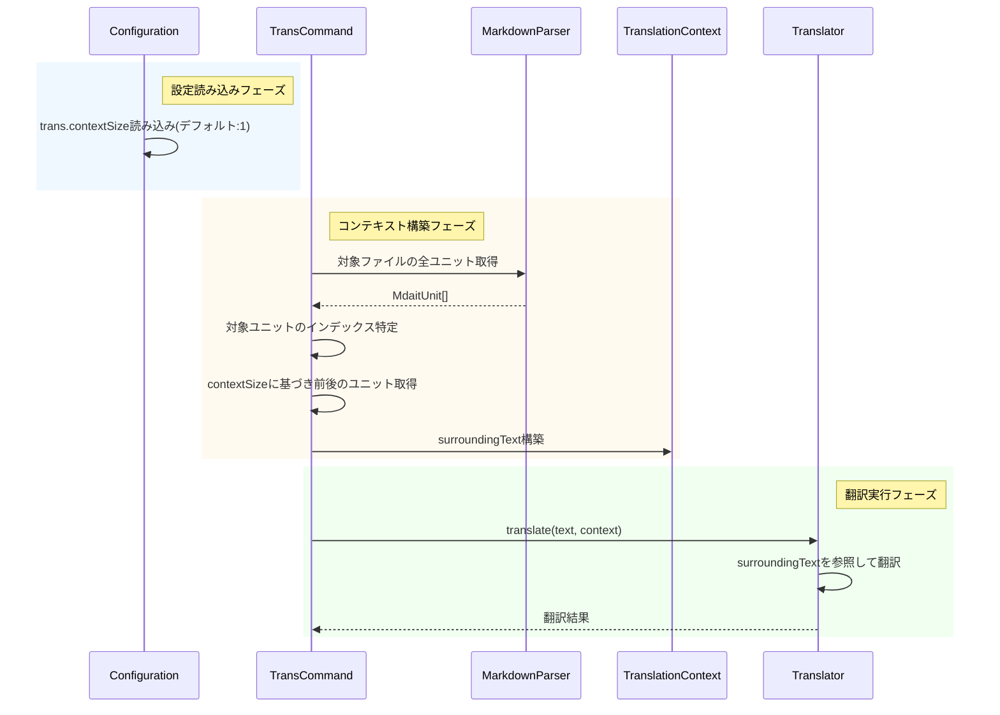

# 作業チケット: 翻訳コンテキストウィンドウサイズ設定

## 1. 概要と方針

翻訳時に参照する周辺ユニットの範囲（コンテキストウィンドウサイズ）を設定可能にする。`trans.contextSize`設定で前後に取得するユニット数を指定し、AI翻訳の文脈理解を向上させる。デフォルトは1（前後1ユニットずつ）とし、0で無効化、最大5程度を想定。

## 2. シーケンス図

## 3. 考慮事項

- **範囲チェック**: ファイルの先頭・末尾ユニットでは前後のユニットが存在しない場合を考慮
- **パフォーマンス**: contextSizeが大きい場合のトークン数増加に注意（設定値の妥当な上限を設ける）
- **用語集との共存**: 既存の用語集機能と組み合わせて使用されることを想定
- **設計ドキュメント**: `config.md`と`prompt.md`に設定項目を追記
- **スキーマ検証**: JSON Schemaで0以上の整数であることを検証
- **後方互換性**: 設定が未指定の場合はデフォルト値1を使用

## 4. 実装計画と進捗

- [x] JSON Schemaに`trans.contextSize`プロパティを追加（0-5の範囲、デフォルト1）
- [x] `Configuration`クラスの`TransConfig`型に`contextSize`を追加
- [x] `Configuration`クラスで`trans.contextSize`の読み込み処理を実装
- [x] `TranslationContext`クラスに`surroundingText`プロパティを追加（getter実装）
- [x] `trans-command.ts`に周辺ユニット取得ロジックを実装
- [x] プロンプトで`surroundingText`が適切に使用されているか確認（既に実装済み）
- [x] `config.md`に設定項目の説明を追加
- [x] `mdait.template.json`にデフォルト値を追加
