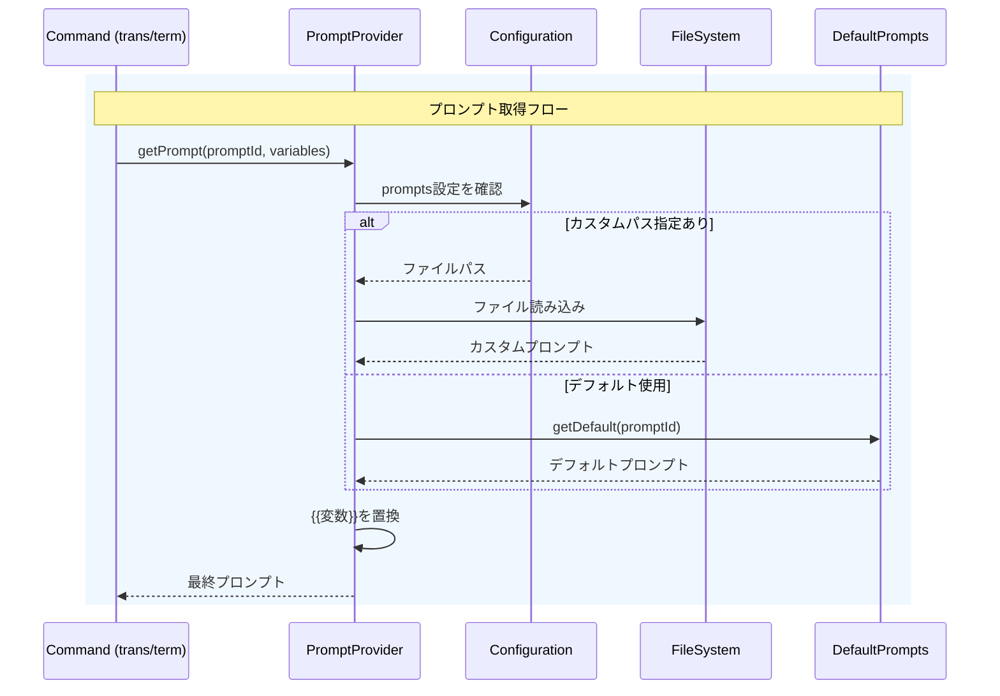

# 作業チケット: システムプロンプト外部注入機能

## 1. 概要と方針

デフォルトプロンプトを`src/prompts/`に一元管理し、ユーザーが`mdait.json`で外部ファイルパスを指定してプロンプトを上書きできる構成とする。プロンプト内では`{{variable}}`形式のプレースホルダーをサポート。

## 2. シーケンス図

## 3. 考慮事項

- デフォルトプロンプトは`src/prompts/defaults.ts`にJSDocコメント付きで定義
- 外部ファイルが存在しない場合はエラーログを出力しデフォルトにフォールバック
- 変数置換は単純な文字列置換（`{{key}}`→`value`）
- 設定スキーマ更新：`prompts`セクション追加

## 4. 実装計画と進捗

- [x] `src/prompts/defaults.ts` - デフォルトプロンプト定義（JSDocでIn/Out記載）
- [x] `src/prompts/prompt-provider.ts` - PromptProviderクラス実装
- [x] `src/prompts/index.ts` - エクスポート
- [x] `schemas/mdait-config.schema.json` - promptsセクション追加
- [x] `src/config/configuration.ts` - prompts設定読み込み対応
- [x] `src/commands/trans/translator.ts` - PromptProvider使用に変更
- [x] `src/commands/term/term-detector.ts` - PromptProvider使用に変更
- [x] `src/commands/term/term-expander.ts` - PromptProvider使用に変更
- [x] `design/prompt.md` - 設計ドキュメント更新
