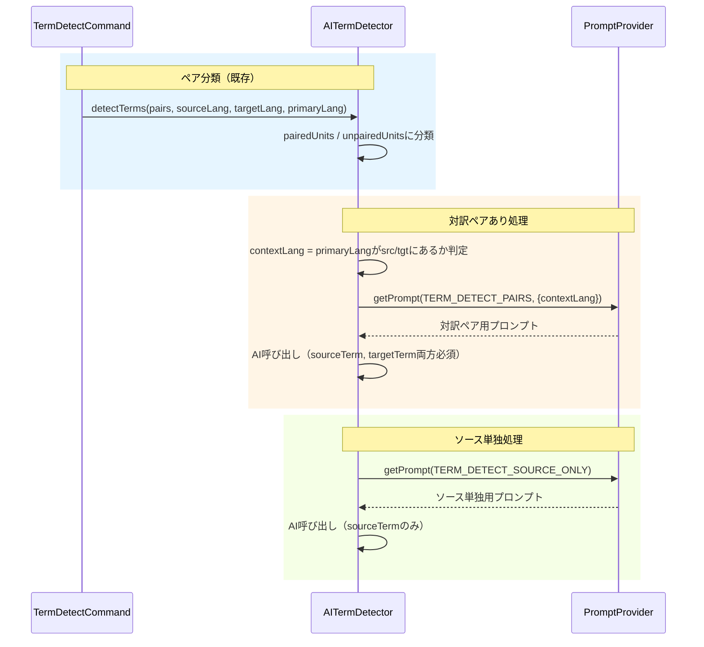

# 作業チケット: TERM_DETECTプロンプト分割

## 1. 概要と方針

現在の `TERM_DETECT` プロンプトは `hasPairs` 分岐や `primaryLang` の「preferred」指定など、LLMに不要な判断を委ねている。これをコード側で事前判定し、対訳ペアあり/なしで別々のプロンプトを使用することで安定性を向上させる。

## 2. シーケンス図

## 3. 考慮事項

- `primaryLang` が `sourceLang` でも `targetLang` でもない場合は `sourceLang` をフォールバック
- プロンプト分割により出力形式が明確化され、パース処理も簡潔に
- 既存テストへの影響確認

## 4. 実装計画と進捗

- [x] `PromptIds` に `TERM_DETECT_PAIRS` と `TERM_DETECT_SOURCE_ONLY` を追加
- [x] `DEFAULT_TERM_DETECT_PAIRS` プロンプト作成（contextLang明示、両term必須）
- [x] `DEFAULT_TERM_DETECT_SOURCE_ONLY` プロンプト作成（sourceTermのみ）
- [x] 旧 `TERM_DETECT` を削除し `DEFAULT_PROMPTS` を更新
- [x] `AITermDetector.detectTerms` を分岐処理に修正
- [x] コンパイル確認
