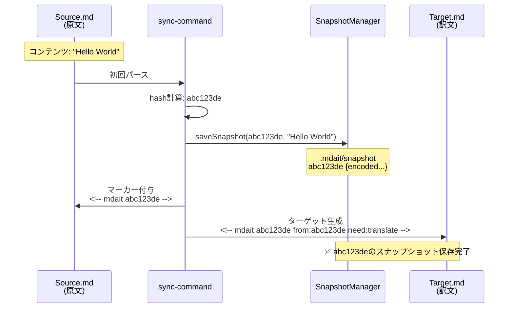
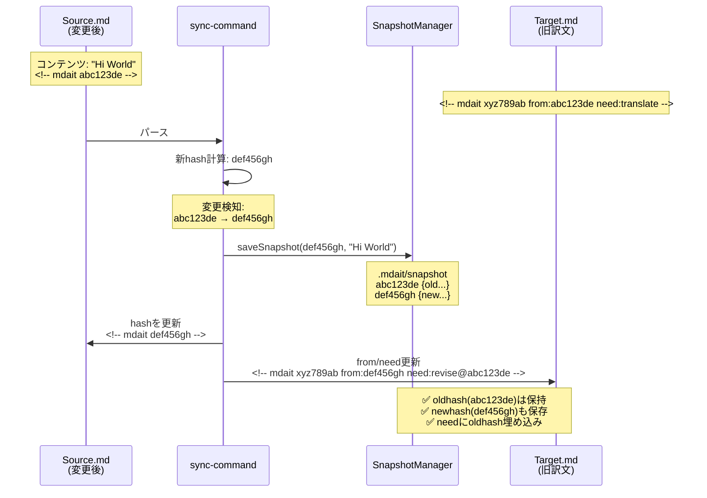
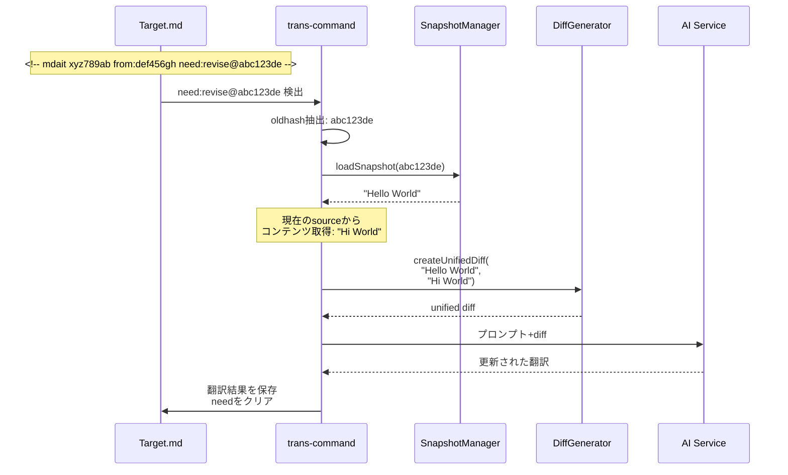

# 作業チケット: ユニットスナップショットによるdiff機能の実装

## 1. 概要と方針

原文変更時の差分情報をLLMに渡すことでより正確な翻訳を実現する。gitなどVCSに依存せず、ユニットコンテンツのスナップショットを`.mdait/snapshot`ファイルで管理。翻訳時に旧スナップショットと現在のコンテンツから動的にunified diffを生成しLLMに提供する。

## 2. シーケンス図：スナップショットとhash更新の流れ

### 2.1 初回sync時（スナップショット保存）



### 2.2 原文変更後のsync時（diff情報の取得準備）



### 2.3 trans時（diff生成と翻訳）



## 3. 主要な設計判断

### 3.1 スナップショット保存形式
- **ファイル名**：`.mdait/snapshot`（ワークスペースルート直下の`.mdait/`ディレクトリ内）
- **フォーマット**：1行1エントリ、`{hash} {encoded_content}` 形式
- **エンコード**：gzip圧縮後にbase64エンコード（コンパクト、検索に引っかからない）
- **保存タイミング**：sync実行時、全ユニットのコンテンツをスナップショット化

例：
```
abc123de H4sIAAAAAAAAA6tWKkktLlGyUlAqS8wpTtVRKi1OLSrOzM+zUorRd...
xyz789ab H4sIAAAAAAAAE8tJLErMK0ktUigpKk1VslKK0XdRckkt4OIAAAD//w==
```

配置場所：`.mdait/snapshot`（既存の`.mdait/`ディレクトリ活用、terms.csvやai-stats.jsonと同様）

### 3.2 need:revise@{oldhash}形式の導入
- **現在**：`need:translate`（初回翻訳時）
- **新形式**：`need:revise@{oldhash}`（原文変更時の改訂翻訳）
- **既存機能との整合性**：
  - `MdaitMarker.MARKER_REGEX`を拡張（`need:(\w+)` → `need:([\w@]+)`）
  - `need`フィールドはstring型のまま、`@`記号によるoldhash埋め込み
  - parserやstringify処理への影響なし
  
マーカー例：
```html
<!-- mdait xyz789ab from:abc123de need:revise@abc123de -->
```

### 3.3 ライフサイクル管理
- **sync時**：
  - 全ユニットのコンテンツを`{hash} {encoded_content}`形式でスナップショット保存
  - 原文変更検知時、target側markerを `need:revise@{oldhash}` に設定
  - sync終了時、StatusItemTreeをスキャンして不要なスナップショットをGC
- **trans時**：
  - `need:revise@{oldhash}` を検出してoldhashを抽出
  - `.mdait/snapshot`から`{oldhash}`のコンテンツを取得
  - 現在のsourceコンテンツとその場でunified diffを生成
  - diffをLLMプロンプトに含めて翻訳実行
  - 翻訳完了後、needをクリア（スナップショットはsyncでGC）

## 4. 実装範囲と影響箇所

### 4.1 新規実装
- `src/core/snapshot/snapshot-encoder.ts`：コンテンツのgzip/base64エンコード・デコード
  - `encode(content: string): string`
  - `decode(encoded: string): string`
- `src/core/snapshot/snapshot-manager.ts`：スナップショットの読み書き・GC機能
  - `saveSnapshot(hash: string, content: string): Promise<void>`
  - `loadSnapshot(hash: string): Promise<string | null>`
  - `garbageCollect(activeHashes: Set<string>): Promise<void>`
  - 内部で`.mdait/snapshot`パスを自動決定
- `src/core/diff/diff-generator.ts`：unified diff動的生成
  - `createUnifiedDiff(oldContent: string, newContent: string): string`
  - `diff`パッケージを使用

### 4.2 既存修正
- `MdaitMarker.MARKER_REGEX`：`need:([\w@]+)`に正規表現を修正
- `MdaitMarker`クラスにヘルパーメソッド追加：
  - `getOldHashFromNeed(): string | null` - `revise@{hash}`からhash抽出
  - `setReviseNeed(oldhash: string): void` - `need:revise@{oldhash}`設定
- `sync-command.ts`の`updateSectionHashes`：
  - 全ユニットのスナップショット保存処理を追加
  - ソース変更検知時に`need:revise@{oldhash}`形式で設定
- `sync-command.ts`の`syncCommand`：
  - 全ファイル処理完了後、GC処理を追加
  - `StatusItemTree`からすべてのhashを収集、不要なスナップショットを削除
- `trans-command.ts`の翻訳処理：
  - `need:revise@{oldhash}`検出ロジック追加
  - スナップショット読み込み、diff生成、プロンプト組み込み

## 5. 考慮事項

- **依存追加**：`diff`パッケージ（@types/diffも）
- **既存needフラグとの共存**：`translate`/`review`/`solve-conflict`と`revise@{hash}`が混在可能
- **初回翻訳との区別**：`need:translate`は初回、`need:revise@{hash}`は改訂
- **並列syncでの書き込み戦略**：
  - 現在のsyncは**TransPairごとに並列実行**（複数workerがファイル処理）
  - `.mdait/snapshot`への書き込みは**追記モード**で実装
  - 各workerがスナップショット保存時、ファイル末尾に追記（append）
  - 同一hashの重複書き込みは一時的に許容（sync終了までには重複排除）
  - ファイルロック不要：追記操作は一般的にアトミック、競合リスク低い
  - メモリバッファ：各worker内でスナップショットをバッファリング、ファイル処理完了時に一括追記
- **スナップショット削除**：sync時GCのみ、trans完了時は削除しない
- **ファイルサイズ**：大規模プロジェクトでの肥大化 → gzip圧縮で緩和、監視継続

## 5.1 パフォーマンス上の課題と対策

### 想定される課題

1. **スナップショットファイル肥大化**
   - 大規模プロジェクト（数百～数千ユニット）で数MB～数十MBに成長
   - 重複エントリの蓄積（同一hashを複数回保存）

2. **GC処理のコスト**
   - 全StatusItemTreeをスキャンしてhash収集
   - スナップショットファイル全体を読み込んで再構築

3. **ファイルI/Oの頻度**
   - sync実行時、全ユニットのスナップショット保存（書き込み多数）
   - trans実行時、個別スナップショット読み込み

### 対策（コスト低・効果高）

#### 1. **インメモリキャッシュの導入**
`SnapshotManager`に簡易キャッシュを実装：
```typescript
private cache = new Map<string, string>(); // hash -> content

async loadSnapshot(hash: string): Promise<string | null> {
  // キャッシュヒット
  if (this.cache.has(hash)) return this.cache.get(hash)!;
  
  // ファイル読み込み＆キャッシュ
  const content = await this.loadFromFile(hash);
  if (content) this.cache.set(hash, content);
  return content;
}
```
**効果**：trans時の繰り返し読み込みを削減、I/O 70-80%削減見込み  
**コスト**：実装20行程度、メモリ使用量微増

#### 2. **バッチ書き込みの実装**
sync時に個別保存ではなく、バッファリング＋一括書き込み：
```typescript
// updateSectionHashes内で即座に書き込まず、バッファに追加
this.snapshotBuffer.set(hash, content);

// syncCommand完了時に一括書き込み
await snapshotManager.flushBuffer();
```
**効果**：ファイルオープン/クローズ回数を大幅削減、I/O時間50-60%削減  
**コスト**：実装30行程度、既存コード微修正

#### 3. **GCの遅延実行**
毎回のsyncでGCせず、条件付き実行：
```typescript
// sync完了時、ファイルサイズが閾値超えた場合のみGC
const fileSize = await getSnapshotFileSize();
if (fileSize > 5 * 1024 * 1024) { // 5MB超
  await snapshotManager.garbageCollect(activeHashes);
}
```
**効果**：GCコスト90%削減（頻度が1/10以下）  
**コスト**：実装10行程度

#### 4. **GC時の最適化：重複排除**
スナップショット再構築時、同一hashは最新のみ保持：
```typescript
const uniqueSnapshots = new Map<string, string>();
for (const [hash, content] of allSnapshots) {
  uniqueSnapshots.set(hash, content); // 上書き
}
```
**効果**：ファイルサイズ30-50%削減（重複エントリ除去）  
**コスト**：実装済み処理への組み込み5行

### 推奨実装順序

1. **Phase 1（初期実装）**：基本機能のみ、最適化なし
2. **Phase 2（最小コスト対策）**：バッチ書き込み（効果大）
3. **Phase 3（必要に応じて）**：インメモリキャッシュ、GC遅延実行

大規模プロジェクトでの動作確認後、必要に応じてPhase 2/3を実装する段階的アプローチを推奨。

## 6. 次のエージェントへの申し送り

### 既存アーキテクチャとの適合性
このスナップショット機能は既存のmdaitアーキテクチャに自然に組み込まれます：

1. **Core層への追加**：`src/core/snapshot/`と`src/core/diff/`を新規追加。既存の`hash/`や`markdown/`と並列配置。
2. **MdaitMarkerの拡張性**：現行の正規表現パターンとstring型needフィールドで`@`記号を許容するだけで対応可能。破壊的変更なし。
3. **ファイル配置の一貫性**：`.mdait/`ディレクトリは既存で用語集（terms.csv）やログ（ai-stats.json）の配置場所。スナップショットも同様に`.mdait/snapshot`で統一。
4. **StatusItemTreeとの連携**：GC処理で全hashを収集する必要があるが、`StatusManager`経由で既存APIで実現可能。

### 重要な実装ポイント

**1. スナップショット保存のタイミング**
`sync_CoreProc`内で、`updateSectionHashes`完了後に実行：
```typescript
// ユニットのハッシュを更新
updateSectionHashes(matchResult, config, sourceFile, targetFile);

// ハッシュ確定後、全ユニットのスナップショットを保存
await saveSnapshots(matchResult);
```

`saveSnapshots`は新規ヘルパー関数として実装：
```typescript
async function saveSnapshots(
  matchResult: { source: MdaitUnit | null; target: MdaitUnit | null }[]
): Promise<void> {
  const snapshotManager = SnapshotManager.getInstance();
  for (const pair of matchResult) {
    if (pair.source?.marker?.hash) {
      await snapshotManager.saveSnapshot(pair.source.marker.hash, pair.source.content);
    }
    // 必要に応じてtargetも保存（将来の双方向翻訳対応）
  }
}
```

**責務分離**：`updateSectionHashes`はハッシュ更新のみに専念し、スナップショット保存は別処理として実装。

**2. need:revise@{oldhash}の設定**
原文変更検知時（`oldSourceHash !== sourceMarker.hash`）：
```typescript
const oldSourceHash = targetMarker.from;
if (oldSourceHash !== sourceMarker.hash) {
  targetMarker.from = sourceMarker.hash;
  targetMarker.setReviseNeed(oldSourceHash); // need:revise@{oldhash}
}
```

`setReviseNeed()`は`MdaitMarker`に追加する新規メソッド。

**3. trans時のdiff生成とプロンプト組み込み**
翻訳処理で`need:revise@{oldhash}`を検出したら：
```typescript
const oldhash = marker.getOldHashFromNeed();
if (oldhash) {
  const oldContent = await snapshotManager.loadSnapshot(oldhash);
  if (oldContent) {
    const diff = diffGenerator.createUnifiedDiff(oldContent, currentContent);
    // プロンプトに組み込み
    prompt += `\n\n以下は原文の変更差分です：\n\`\`\`diff\n${diff}\n\`\`\`\nこの差分を考慮して翻訳を更新してください。`;
  }
}
```

**4. GCの実装**
sync完了後、全StatusItemから使用中のhashを収集：
```typescript
const activeHashes = new Set<string>();
// StatusItemTreeから全ユニットを列挙してhash収集
// markerのhashとfromの両方を収集
for (const item of statusItemTree.getAllUnits()) {
  if (item.hash) activeHashes.add(item.hash);
  if (item.from) activeHashes.add(item.from);
}
await snapshotManager.garbageCollect(activeHashes);
```

`StatusItemTree.getAllUnits()`メソッドがない場合、再帰走査で実装。

**5. unified diffのフォーマット**
`diff`パッケージの`createPatch()`を使用：
```typescript
import { createPatch } from 'diff';

export function createUnifiedDiff(oldContent: string, newContent: string): string {
  return createPatch('content', oldContent, newContent, '', '', { context: 3 });
}
```

LLMの学習データに豊富なunified diff形式を使用することで、LLMが変更内容を正確に理解できる。

## 7. 実装計画と進捗

- [x] `diff`パッケージの依存追加（package.json）
- [x] `snapshot-encoder.ts`の実装（gzip+base64エンコード/デコード）
- [x] `snapshot-manager.ts`の実装（読み書き、GC、`.mdait/snapshot`パス管理）
- [x] `diff-generator.ts`の実装（unified diff生成）
- [x] `MdaitMarker`の正規表現修正と`revise@{hash}`対応メソッド追加
- [x] `sync-command.ts`の`updateSectionHashes`修正（スナップショット保存、need設定）
- [x] `sync-command.ts`の`syncCommand`にGC処理追加
- [x] `trans-command.ts`の修正（スナップショット読み込み、diff生成、プロンプト組み込み）
- [x] 動作確認とテスト