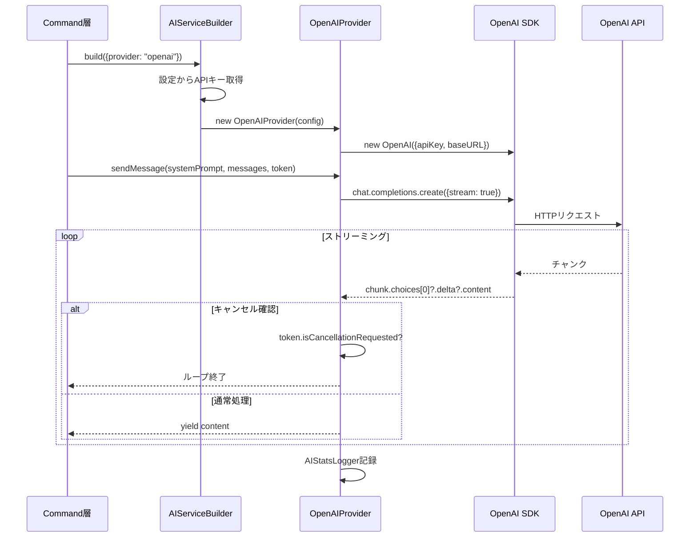

# 作業チケット: OpenAI API対応

## 1. 概要と方針

OpenAI APIをAIプロバイダーとして追加し、既存のAIServiceインターフェースに統合する。シンプルなストリーミング実装のみを行い、公式SDKの`openai`パッケージを使用する。

## 2. シーケンス図

## 3. 考慮事項

- **セキュリティ**: APIキーは環境変数`${env:OPENAI_API_KEY}`から読み込み
- **エラーハンドリング**: 認証エラー、レート制限、ネットワークエラーを適切にキャッチ
- **統計ログ**: 既存のAIStatsLoggerを使用してトークン使用量を記録
- **キャンセル対応**: VSCodeのCancellationTokenに対応
- **既存実装との互換性**: DefaultAIProvider、OllamaProvider、VSCodeLMProviderと同様の実装パターン

## 4. 実装計画と進捗

- [x] `openai`パッケージをpackage.jsonに追加
- [x] `src/api/providers/openai-provider.ts`を実装
- [x] `AIServiceBuilder`にopenaiケースを追加
- [x] `schemas/mdait-config.schema.json`にopenai設定を追加
- [x] `src/config/configuration.ts`の型定義にOpenAI設定を追加
- [x] `design/api.md`にOpenAIプロバイダーの記載を追加
- [x] `tasks/wishlist.md`から該当Wishを削除
- [x] **追加対応**: AbortControllerによる適切なキャンセル処理を実装
- [x] **追加対応**: temperature、maxTokens、timeoutSec設定を追加

## 5. コードレビュー後の改善 (260111)

外部エージェントからのコードレビューを受け、以下の改善を実施：

### 第1回改善
1. **AbortController対応**: `isCancellationRequested`チェック+`break`ではなく、`AbortController`と`signal`でHTTPリクエストそのものを中断
2. **設定パラメータの追加**: `temperature`、`maxTokens`、`timeoutSec`を設定可能に
3. **エラーハンドリング改善**: AbortErrorを明示的に処理、lint エラー（any使用）を修正

### 第2回改善（最終版）
1. **Responses APIへ移行**: OpenAI公式が推奨する新API（Chat Completions APIからResponses APIへ）
   - `instructions`でシステムプロンプトを指定
   - `input`で会話履歴を指定  
   - `response.output_text.delta`でテキストデルタを受信
   - `reasoning: { effort: "low" }`で推論制御
   - `max_output_tokens`で出力長制限
2. **設定の簡素化**: `temperature`を設定から削除、コード内で固定値（0.7）を使用
3. **プライバシー設定**: `store`オプションを追加（デフォルト`false`でサーバー保存なし）

### 参考
- [Responses API公式ドキュメント](https://platform.openai.com/docs/api-reference/responses)
- [Chat Completions API公式ドキュメント](https://platform.openai.com/docs/api-reference/chat)
