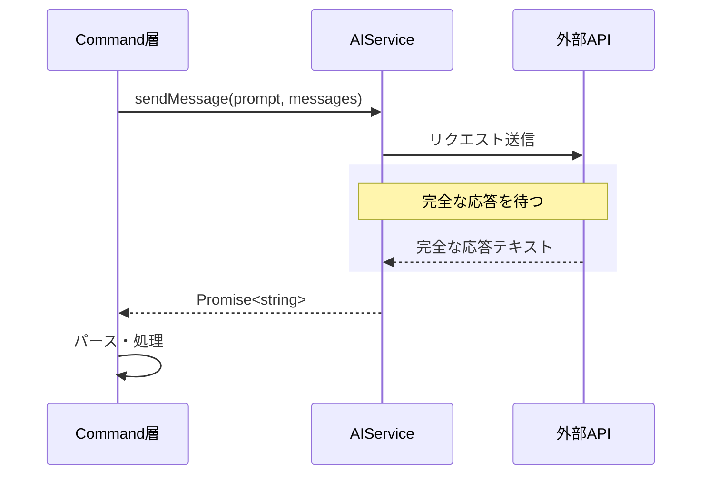

# 作業チケット: AIServiceストリーミング廃止による簡素化

## 1. 概要と方針

現在AIServiceインターフェースはストリーミング応答（AsyncIterable<string>）を返す設計だが、実際のUXには影響していない。全てのコマンドで応答を完全にバッファリングしてから処理しているため、ストリーミングの利点が活かされていない。これを廃止し、シンプルな`Promise<string>`を返す設計に変更することで、コードの複雑性を削減し保守性を向上させる。

## 2. 現状分析

### 現在の問題点

```typescript
// 現在：ストリーミング型
async *sendMessage(...): MessageStream {
    for await (const chunk of stream) {
        yield chunk;
    }
}

// コマンド側：結局全部バッファリング
const stream = aiService.sendMessage(...);
let response = "";
for await (const chunk of stream) {
    response += chunk;  // UX改善なし
}
```

### UXへの影響
- **現状**: ストリーミングしてもバッファリングするだけ、UIには即座に反映されない
- **変更後**: 直接文字列を返すため、実装がシンプルになり、パフォーマンスも向上

## 3. 設計変更

### インターフェース変更

```typescript
// Before
export type MessageStream = AsyncIterable<string>;
export interface AIService {
    sendMessage(...): MessageStream;
}

// After
export interface AIService {
    sendMessage(...): Promise<string>;
}
```

### プロバイダー実装変更

各プロバイダーで以下の変更が必要：

#### OpenAIProvider
- Responses API: `stream: false`に変更
- イベントループを削除し、完全な応答を待つ
- 内部バッファリング処理を削除

#### OllamaProvider
- `stream: false`に変更
- `for await`ループを削除
- 完全な応答を直接返す

#### VSCodeLMProvider
- ストリーミングを内部でバッファリング
- 完全な応答を返す

#### DefaultAIProvider（モック）
- ジェネレーター関数を通常の非同期関数に変更

### コマンド側の簡素化

```typescript
// Before
const stream = aiService.sendMessage(systemPrompt, messages);
let response = "";
for await (const chunk of stream) {
    response += chunk;
}

// After
const response = await aiService.sendMessage(systemPrompt, messages);
```

## 4. シーケンス図



## 5. 考慮事項

### メリット
- **コード簡素化**: AsyncGeneratorが不要になり、実装が直感的に
- **パフォーマンス**: 不要なバッファリングループがなくなる
- **保守性**: 理解しやすいコードになる
- **エラーハンドリング**: Promise-basedで統一され、扱いやすい

### デメリットと対策
- **長時間応答**: タイムアウト設定で対処（既に実装済み）
- **将来の拡張性**: 本当にストリーミングUIが必要になったら再設計

### 破壊的変更
- AIServiceインターフェースが変わるため、全プロバイダーの修正が必要
- 既存のテストコードも修正が必要

## 6. 実装計画と進捗

- [x] `src/api/ai-service.ts`のインターフェース変更
  - [x] `MessageStream`型を削除
  - [x] `sendMessage`の戻り値を`Promise<string>`に変更
  
- [x] プロバイダー実装の変更
  - [x] `OpenAIProvider`: Responses APIを`stream: false`に
  - [x] `OllamaProvider`: `stream: false`に変更
  - [x] `VSCodeLMProvider`: 内部バッファリングに変更
  - [x] `DefaultAIProvider`: 通常の非同期関数に変更
  
- [x] コマンド層の簡素化
  - [x] `translator.ts`: `for await`ループ削除
  - [x] `term-detector.ts`: `for await`ループ削除
  - [x] `term-expander.ts`: `for await`ループ削除
  
- [x] 設計ドキュメント更新
  - [x] `design/api.md`: ストリーミング記述を削除
  
- [x] テストの修正（必要に応じて）
  - [x] ビルド確認
  - [x] 既存テスト確認（既存失敗テストは今回の変更とは無関係）

## 7. 将来の拡張性

もし将来的にリアルタイムプレビュー機能が必要になった場合：
- オプショナルな`sendMessageStream`メソッドを追加
- 既存の`sendMessage`はそのまま維持
- コマンド側で必要に応じて使い分け
